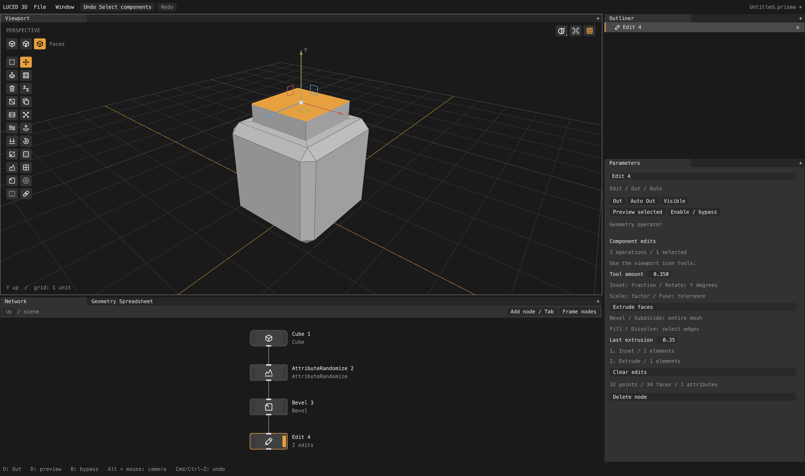

# luced-3d

A native procedural 3D editor built with `luce-ui`, `luce-3d` and `luce-gpu`.
The neutral greys and `#E7A03F` orange match `luced-2d`.

```sh
luc install dymokomi/luced-3d
# Or, from a development checkout:
luc run --release
```

Use the current installed Luce toolchain and sibling checkouts. `luc build --release`
creates `build/Luced 3D.app` on macOS. `luc run -- --smoke` renders three frames
and exits. Runtime code is Luce for the editor and Luce Base for its libraries.

For large-file performance, use the optimized build above. The latest
[engine audit](docs/ENGINE_AUDIT_2026-09-27.md) records the retained Metal/Vulkan
geometry path, OBJ crash fix, camera surface comparisons, large-car tests and
remaining STEP/tessellation limitations. No full-CAD or cross-platform performance
parity is implied by the current subset.

The [trim-grid follow-up](docs/CAD_TRIM_GRID_2026-09-27.md) records cross-patch
row continuation, UV cell clipping, final camera wireframes and measured
quality/performance tradeoffs. It is not a universal all-quad CAD mesher.
The [seam-flow follow-up](docs/CAD_SEAM_FLOW_2026-09-27.md) separates hard-edge
stitching from interior row flow, with native wireframe captures and regression
results for G0 creases and incompatible smooth trims.
The [endpoint and layout correction](docs/CAD_ENDPOINT_LAYOUT_2026-09-27.md)
supersedes the later phase-mismatch workaround: it fixes erroneous spline-end
wrapping, reconciles mapped/clipped rows together, and records four new native
camera close-ups plus topology and surface-distance checks.
The [affine rail checkpoint](docs/CAD_IMPORT_UNCERTAINTY_RAILS_2026-09-28.md),
[notched cut-chart correction](docs/CAD_NOTCHED_CUT_OWNERSHIP_2026-09-28.md)
and [physical curved-row admission](docs/CAD_CURVED_FLOW_ADMISSION_2026-09-28.md)
record the latest local engine changes, matched large native captures,
native/C regressions and the remaining crowded rows and import blockers.
The [circular endpoint checkpoint](docs/CAD_CIRCULAR_ENDPOINTS_2026-09-28.md)
adds a complete, watertight Camera 2 cook with an explicit File tolerance of
0.02; its original tolerance failure and remaining density issues are documented.
The [mapped-count feasibility correction](docs/CAD_COUNT_FEASIBILITY_2026-09-28.md)
stops a proved cyclic constraint, reducing Camera 2 polygons by 20.9% while
preserving closed topology; it includes matched captures and remaining defects.
The [wire-depth correction](docs/CAD_WIRE_DEPTH_2026-09-28.md) fixes broken
coplanar wire overlays with slope-aware Metal/Vulkan fill depth, preserving
actual mesh edges and checking foreground occlusion with real GPU pixels.
The [lazy query-index checkpoint](docs/CAD_LAZY_QUERY_INDEX_2026-09-28.md)
removes repeated spatial-index builds from unqueried intermediate meshes, with
concurrent-reader and allocation-failure checks and unchanged patch diagnostics.
The [local dissolve checkpoint](docs/CAD_LOCAL_DISSOLVES_2026-09-28.md)
removes repeated whole-patch rebuilds during optional trim-sliver cleanup,
preserving the existing merge decisions and display surface.
The [spherical chart-fit checkpoint](docs/CAD_SPHERICAL_CAP_FIT_2026-09-28.md)
gets Car 2 through a full cook at an explicit File tolerance of 0.000025;
the report also records its substantial remaining tire/fold and density defects.



## Projects and workspace

File → New/Open/Save/Save As uses `.prisma` documents through `luce-prism`.
Cmd/Ctrl-N, O, S and Shift-S are supported. Projects retain the authored node DAG,
nested Groups, output/enabled/visibility flags, parameters, Edit recipes, camera,
and network pan/zoom. External geometry paths are relative to the project when
possible; geometry is referenced, not embedded. Save changes before moving files.
New/Open/Quit protects unsaved changes with Save/Don't Save/Cancel.

Window size, dock splits, tab order/selection, floating panels, shading, grid and
normal display persist in `~/.luced-3d/ui.prisma`. Window → Reset Panel Layout
restores the default arrangement. Tests and captures do not read or write this
user preference file. See [project schema and persistence](docs/PROJECTS.md).

## Try modeling

1. Focus the Network pane. Press **Tab**, type `Transform`, and press Enter.
   The new node connects to the selected node and becomes the viewport output.
2. Change its Translation, Rotation or Scale in Parameters, or drag an XYZ
   handle in the viewport to translate it.
3. In Network, **Tab**, type `Edit`, Enter. The viewport gains point/edge/face
   selection buttons and a tool strip at the left.
4. Choose Faces (**3**), then click a face. Shift-click adds/removes components.
   Press **E** or click Extrude. Repeat to keep extending the selected cap.
5. Set **Next distance** before extrusion; **Last distance** changes the most
   recent extrusion. The Edit node lists the operations it owns.
6. Choose Move (**M**) and drag an XYZ handle to move selected points, edges or
   faces. **Q** returns to selection; **1 / 2 / 3** change component type.
7. **Cmd/Ctrl-Z** undoes; **Cmd/Ctrl-Shift-Z** redoes. A scrub or handle drag is
   one step; Escape cancels a handle or node drag.

## Network

- Drag empty space, middle-drag, or Space-drag to pan. Touchpad scrolling
  pans; the mouse wheel, Cmd/Ctrl-scroll and pinch zoom around the pointer.
- Drag node bodies to move them. Home or **Frame nodes** fits the network.
- Nodes use compact Houdini-inspired bodies, top inputs and bottom outputs.
- Drag or click-click from a geometry output to an input (or the reverse) to connect or replace
  a wire. Alt-click an input disconnects it. Outputs can feed multiple nodes.
- Node types are available in Tab/right-click search: primitives, modeling,
  transforms, copies, groups and attributes. Merge has two geometry inputs for
  joining branches. Cycles are rejected. See [capabilities](docs/MODELING.md).
- Tab or right-click opens a menu at the pointer, kept inside the window.
  Browse categories/submenus or type to filter; arrows and Enter choose.
- File imports OBJ, raw mesh-local FBX, and a bounded STEP subset. Browse or enter
  a path, then Reload for disk changes. STEP remains analytic: use Transform for
  scale and Tessellate for explicit polygon conversion. CAD surfaces appear
  automatically with patch boundaries using cached, disposable viewport meshes;
  no Tessellate node is needed just to see them. The File inspector contains only
  name, path, Browse/Reload, geometry summary and actual import errors. STEP/STP
  adds **STEP tolerance / 0 = file**: zero uses the source uncertainty; a positive
  value overrides it in source units. This per-node setting is saved in projects,
  supports undo, and reloads the analytic model off-main when changed. OBJ and FBX
  do not show this setting. It is separate from tessellation density. See the precise
  [import contracts and viewport research](docs/VIEWPORT-AND-IMPORTS.md).
  Shared-edge CAD tessellation now supports planar holes, circular bands and
  ruled spline faces, with quads where suitable; see the
  [STEP validation and research notes](docs/CAD_TESSELLATION.md).
- Tessellate's **Target edge length / 0 = off** refines boundaries and inserts
  interior grids. Smaller positive values give denser geometry; quads are used
  where suitable. Meshes include corner normals and STEP face colors as `Cd`.
- STEP product/occurrence and solid names become primitive group paths such as
  `Camera - 6/Lens:1/Phone Camera Lens v3:1/LensShell`. File, Transform, Merge,
  Tessellate and Blast preserve these paths. The Outliner shows their hierarchy
  beneath exposed nodes, with collapsible assembly branches.
- **Blast** deletes named groups; enable **Delete non-selected / isolate** to
  keep them instead. Exact parent paths include descendants. Use `*`/`?` globs,
  quotes around paths with spaces, and `^pattern` to subtract from a preceding
  selection (for example `* ^*/LensShell`). Empty selection means all geometry.
  CAD remains analytic when blasted before Tessellate. This is named primitive
  selection, not Houdini's complete expression/attribute-selection language.
- Click or hold the top-right grouped viewport square for Wireframe, Flat +
  Wireframe, Flat, Shaded, and Shaded + Wireframe. **Show normals** adds face-center
  normal guides. Rendered is visibly unavailable until a render engine exists.
- Clicking a node selects its properties. **O** and the right-hand strip toggle
  Out; multiple results can be exposed. **D** toggles isolated preview without
  changing outputs. The left-hand strip toggles bypass (**B**).
- The **Outliner** shows exposed results and nested Groups. Double-click a Group
  to enter its local network; Up returns to the parent. Groups have hierarchical
  transforms and visibility. See [output rules and limits](docs/OUTLINER.md).
- Disabling Transform, Edit or Merge passes its first input through.
  Disabling Cube produces empty geometry. Delete/Backspace in Network deletes
  the selected node and disconnects its consumers.
- Edit tools appear when the selected Edit node is enabled and displayed.
  Display it with D before modeling. Incomplete nodes show an error instead of
  stale geometry; connect their inputs or undo the change.

## Viewport

Maya-style: **Alt-left-drag** orbits, **Alt-middle-drag** pans, and
**Alt-right-drag** dollies (Option on macOS). Scroll/pinch also zooms.
Ordinary left-click is reserved for tools and selection.
**F** frames the displayed geometry; **G** toggles the grid. Component picking
ignores occluded points, edges and faces, with orange hover previews before
selection. Viewport tools use shared LuciaOS SVG icons with hover labels,
rendered by luce-ui's cached luce-svg pipeline.
Grid spacing is one unit; +Y is up.

## Implementation and limits

The lower dock also contains **Geometry Spreadsheet**. It follows the selected
node, independently of the viewport output, or can be pinned. Switch between
points, vertices (polygon corners), primitives (faces), and detail (whole mesh).
Filter attributes or rows, click headers to sort, and click rows to select
components on the displayed Edit node. Numeric scalar/vector attributes survive
topology operations; `Cd` affects rendering and corner `uv` supports seams.

Edit's scrollable icon shelf includes inset, delete, reverse, triangulate,
duplicate, split, fuse, smooth, peak, flatten, rotate, scale, snap, noise,
subdivide, bevel, fill and dissolve, alongside extrusion and XYZ movement.
Set **Tool amount** in Parameters before applying a tool. Hover icons for names.

The graph has stable node IDs, geometry ports, shared cached results, downstream
invalidation and demand-driven evaluation of exposed outputs or preview. Edit nodes
store ordered operations against immutable mesh snapshots. A 64-bit topology
hash guard rejects incompatible upstream changes instead of applying edits to
wrong IDs. Results are cached by content stamp (docs/COMPUTE-AND-GIZMOS.md).
Undo covers graph changes, nested deletion, parameters, Out/visibility/preview/bypass, selections and modeling;
history retains 64 transactions.

Geometry storage, transforms, merge, triangulation, ray intersections and region
extrusion live in `luce-3d`'s `PolygonMesh`. Editor state, graph evaluation,
commands and tools stay in this project. Rendering uses `luce-gpu`; geometry
preparation is still on the CPU.

This is an experimental modeling foundation. Extrusion currently operates on
face regions with a boundary, not isolated vertices/edges or an entire closed
surface. Transform/Group gizmos support Move, Rotate, Scale and compensated Pivot;
Cube supports corner resizing. Shift snaps and +/- changes gizmo size.
Limits include 128 nodes, 8,388,608 points/faces and 33,554,432 corners per mesh;
individual operators and importers can have tighter safety budgets. General
typed attribute sockets and a path tracer are not implemented. CAD tessellation
still has known difficult trims and poorly distributed regions under active work.

## Verification

```sh
python3 tests/run.py
python3 tools/preview.py --scene edit  # macOS desktop / Metal capture
python3 tools/profile.py             # CPU phase timings
python3 tools/profile.py native      # native orbit frame intervals
```

Tests cover topology and concave triangulation, region extrusion, ray picking,
branching DAGs, invalid links, caching, bypass, topology guards, transactions,
Tab search, actual wire and parameter gestures, face picking, extrusion,
translation handles and resized UI rendering.

See [DESIGN.md](docs/DESIGN.md) for module boundaries and architectural references.
See [PERFORMANCE.md](docs/PERFORMANCE.md) for measured timings and shared-library proposals.

## Licenses

Code: MIT OR Apache-2.0. Rounded icons by
[Dy Mokomi / luciaos-assets](https://github.com/dymokomi/luciaos-assets),
[CC BY 4.0](https://creativecommons.org/licenses/by/4.0/), including new modeling
and shading glyphs contributed in the same style. Third-party test fixture
attribution is in `tests/fixtures/README.md`; Desktop CAD models are not included.
