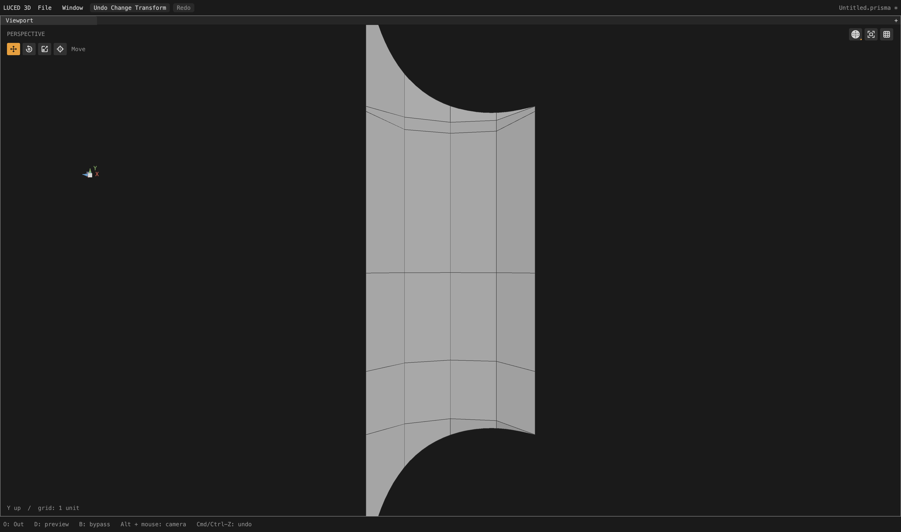
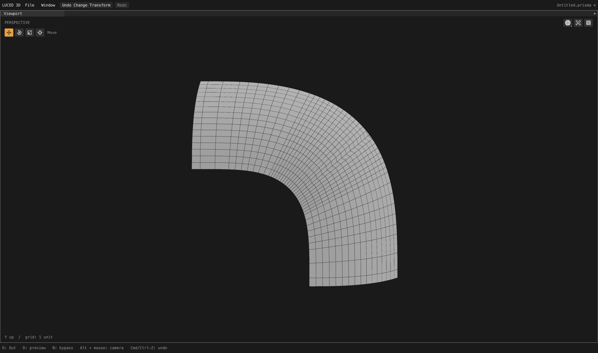

# Trim incidence and boundary-adjacent spacing

Local checkpoint following late planar flow admission. The ongoing camera
audit remains active; this is not a claim that its tessellation is finished.

## Retained changes

`trim_alignment.lucb` owns the existing crossing alignment and a small second
incidence pass. A projected endpoint can sit about 1.3e-12 beside a grid line,
while its next trim point is aligned to that line later in the traversal. The
resulting cell boundary could be unbalanced. The second pass runs after all
crossings are aligned, admits only 16 numerical-incidence units beside an
already aligned neighbor, and retains the physical snap budget. It rejects
orientation reversals, intersections and independently moved seam aliases.
Canonical CAD positions and IDs never move. The extracted clipping-policy
helper also explicitly excludes support kinds without a cut-chart strategy.

Clipped spacing now detects a boundary-to-first-row gap larger than twice the
largest interior gap. A tiny Boolean-cut end interval remains excluded. A
proposal need not wait for a quad to exceed the 20:1 diagnostic threshold.
Existing topology, orientation, shape-cost, worst-gap and sampled display-error
guards still control every accepted movement; trim endpoints stay fixed.
The synthetic cases exercise the new end-gap trigger directly. The four real
camera changes also involve removal of the stretched-20 prerequisite; they do
not demonstrate that all of the user's boundary-gap examples are corrected.

## Rejected experiments

Moving cut-chart ownership before opposite-side count equalization cleaned
the oblique ends of fillets 606/607: worst opposite-edge ratios fell from
55.94/22.08 to about 1.497. But formerly mapped patches 1092, 1096, 1102, 1106
and 1163 fell back to constrained meshes, and other regions worsened. The
incidence repair fixes 1092/1096's open cells, but their candidate display
triangles still fail the surface-deviation check. **Early count decoupling is
not retained.** Keep independent curvature requirements, and validate the
actual clipped display triangles before accepting that strategy change.

Physical-aspect admission on every refined NURBS chart changed 73 records and
improved several strips, but worsened individual cut quads on frame corners
2358/2386/2406. **That experiment is not retained.** Its numerical evidence is
in `/private/tmp/camera-surface-admission.*`. Future admission must account for
cut-cell shape and neighboring phases, not only full support rectangles.

## Full assembled camera

Divisions 16, edge size 0; native and C agree on all 2,710 quality records.

- Alignment alone preserves the preceding records exactly. Spacing changes
  only patches 400, 1425, 2528 and 2531, without topology or strategy changes.
- 631,632 points; 591,457 polygons: 547,200 quads, 9,859 triangles and 34,398
  n-gons. Strategies: 2,208 mapped / 463 clipped / 39 constrained.
- Zero boundary, nonmanifold, inconsistent-edge and folded-display flags;
  Euler characteristic 46. Stretched-20 and skewed-0.1 counts are unchanged.
- Patches 2528/2531 retain 16 quads + 8 cut polygons each. Worst edge ratio
  drops from 9.8131 to about 9.5565; opposite-edge ratio increases from 1 to
  2.5747, and minimum corner sine is about 0.963. This is a small spacing/shape
  tradeoff, not a uniformly rectangular-grid claim. Patch 1425's minimum sine
  changes from 0.9774 to 0.8154, with no skewed-0.1 quads or count changes.
- Actual display area: 65,662.60305118366; signed volume: 74,393.20854426081.
- Fixed 4,096 OBJ-to-STEP samples: maximum remains 0.0259126; mean squared
  4.68832e-6 (previously 4.68814e-6). STEP-to-OBJ maximum remains 0.0235092;
  mean squared 4.53362e-6. Sampled comparisons are not certified bounds or
  evidence of an accuracy improvement.
- `sign`, `1p5inR`, `33mm_angle`: exported positions and polygons are exactly
  unchanged from the preceding checkpoint.

## Tests and native captures

96 near-grid cases cover three offsets, both axes/windings and all eight loop
origins. Checks cover alignment, unchanged canonical positions, preserved IDs,
directed trim coverage, positive triangles and area. Disabling the second pass
fails the traversal-order assertion. Eight added spacing cases cover large end
gaps on flat/curved supports with both axes/windings; disabling detection fails
them. Existing tiny-cut, hole, curvature and fixed-boundary tests still pass.

Base contracts pass native optimization levels 0–3 and C debug/release. The
released-Luce application suite passes all 28 groups on native and C. Temporary
fixture-ID diagnostics and rejected prototype implementations were removed.
No compiler, GPU, UI or luced-2d code changed in this checkpoint.

Both actual shaded-wire captures are 4,400 × 2,604 pixels and isolate geometry
only after the full production cook. Patch 2528: rotation X 0, yaw 0.785,
pitch 0, zoom 0.5. Patch 1425: rotation X 0, yaw/pitch 0, zoom 0.75. Both use
neutral material. The matching prior strip capture remains local at
`/private/tmp/camera2528-spacing-baseline.png`. The improvement is modest;
dense fillets 403/418/606 and other outstanding regions retain their prior state.

Evidence: `/private/tmp/camera-alignment-gap{.obj,-topology.log,-delta.log}`,
`camera-alignment-gap-c.txt`, `camera-boundary-gap.txt`, and
`alignment-gap-{tests-native,tests-c,base-*}.log`. Main app rebuilt with released
Luce 0.8.18 and pinned Base; native `--smoke` exits 0. This is a local app/kernel
checkpoint, not a new registry release.
