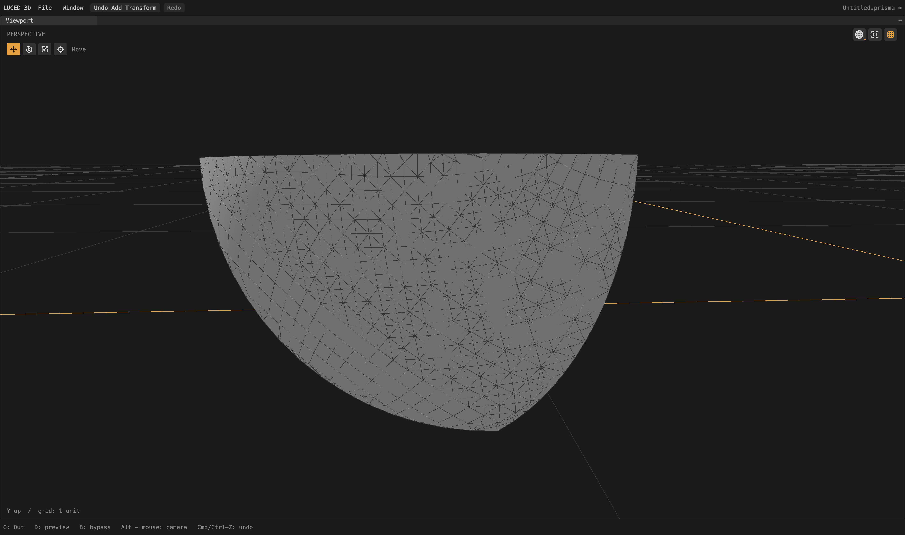

# Canonical retraced seams and preserved diagnostic normals

This checkpoint advances broader-file robustness; it does not establish pristine
quad flow or successful full car imports. File tolerance is not silently relaxed.

## Canonical seam constraints

Car2 face 1290 is a spherical `Car/ShellFrontLeftWing` patch. Its loop traverses
CAD edge 2864 forward and backward to an authored pole. Rotating the chart away
from that pole turns the seam into a retraced interior slit. Treating every
coincident segment as invalid rejected legitimate topology; simply accepting
the overlap would let later meshing erase or independently split the seam.

The trim identity API now accepts reversed coincident segments in one loop only
when both exact chart coordinates and canonical endpoint IDs agree. A borrowed
constraint table protects these segments through grid insertion, diagonal
improvement, quad pairing and CAD surface refinement. Distinct periodic chart
images remain distinct; mere coincidence with different IDs is still rejected.
Ordinary boundaries retain their existing one-face-incidence protection and do
not allocate a persistent seam table.

A synthetic spherical octant exposed a second failure: greedy clipping could
strand a roundoff-width spike along a slit extension. A bounded partition now
connects the slit tip to a visible interior diagonal before clipping each side.
It checks intersections, interior membership, conditioning and positive areas.
Every authored segment is retained. This is not a general intersecting-PSLG or
field-aligned quad solver, and arbitrary overlaps have not been legalized.

## Normal-preservation correction

The new OBJ corner-normal export exposed an older diagnostic flaw:
`MeshOps.compact` called an arbitrary-edit path which discarded `N`. Face
filtering did the same. The previous planned/full regression compared two
extracted meshes that had both lost normals, so its normal comparison was not
evidence of authored-normal preservation.

Compaction now retains all attributes, source face/corner order and display
indices; pure face filtering also keeps surviving normals. Point edits and
winding changes still invalidate them. The planned-face regression now compares
N values and displayed normals directly against the **original full cook**, not
only against another extracted mesh. Blast has a direct original-corner test too.

Patch OBJ export writes one `vn` per corner and `v//vn` references. The exported
1290 patch has 3,049 corners and 3,049 unit normals with valid sequential indices.
OBJ does not serialize custom nonplanar n-gon display triangulation; use native
assembled captures for such polygons. Face 1290 contains triangles and quads.

## Validation

- Final native opt-2 and C release suites: **33 PASS groups**, exits 0.
- The separate luce-3d Base and two Luce consumer suites also pass native opt-2
  (geometry/allocation failures, UI composition, custom geometry/material and
  error/lifetime behavior).
- Trim contracts: 324 positive scale/plane/winding/start/grid cases and 162
  mismatching-identity rejections, preserving all positions, original segments,
  incidence, area and winding. Disabling the fixed-constraint lookup in an
  isolated negative control fails with “meshing removed or split an authored seam.”
- Spherical seam contract: 20 radius/winding/start combinations in a rotated,
  translated frame. Every original seam interval has two incident faces;
  points remain on the sphere and display triangles agree with analytic normals.
- Direct compaction tests preserve deliberately non-flat authored corner
  normals through point reindexing and repeated compaction, preserve a point
  attribute, and retain display indices. Separate tests check normal invalidation
  after point movement and face reversal.
- Car2 planned face 1290 cooks at the original tolerance: 584 points,
  91 quads + 895 triangles, 89 open patch-boundary edges, no nonmanifold or
  inconsistent edges, Euler characteristic 1. This is one selected final face
  using the full shared plan, **not a successful full car cook**.
  Native and C quality records agree exactly, including zero folded display
  triangles with the now-preserved analytic normals.
- The final full camera audit has all **2,710** patch-quality records exactly
  equal to the 10:40 checkpoint. This seam/normal work does not claim improved
  camera quad spacing; it avoids regressing the existing mesh.

Native 4,400 × 2,604 shaded-wire capture, yaw 1.5, pitch 0.2, model X rotation 0,
zoom 0.013. This verifies the formerly rejected patch is present. It also shows
unfinished triangle-heavy topology and interrupted wire visibility in the tiny
offset close-up. Do not present it as clean all-quad output. Retained GPU float
precision/depth behavior needs a separate audit; no edges were hidden to improve
this capture.

## Next car2 failure: face 1307

The default full cook reaches a NURBS boundary-projection failure at face 1307.
The final source recheck confirms the same first failure in
`/private/tmp/car2-canonical-final.log`; it does not publish a partial mesh.
Planned-face reproduction gives residual **1.051942327151215e-5** against the
file's **1e-5** tolerance. Temporary diagnostics (removed from source) place it
at normalized UV `(0.043940493074499737, 0.39465425162466422)` on a 15 × 167,
degree-3 × degree-3 net. Residual components along normalized numerical tangents
are about 3.1e-15 and 7.9e-16. This supports a stationary local closest fit, not
proof of the global minimum or proof that every STEP entity is correctly read.

An explicitly labeled diagnostic override `--tolerance 0.000011` cooks face
1307 as 1,340 quads, 6 triangles and 207 cut n-gons, with zero folded display
flags. It still has 181 stretched-20 and 5 skewed-0.1 quads, maximum ratio about
250,147. Thus the override demonstrates the tolerance control works, **not** that
the patch quality is satisfactory. No default, user project or source file was
changed. Camera_2 and car1 tolerance/assembly issues remain unresolved.

## Local evidence

Logs: `/private/tmp/canonical-seam-final-{native,c}.log`,
`/private/tmp/car2-face1290-authored-normals.{obj,log}`,
`/private/tmp/car2-face1290-authored-wire.{png,log}`,
`/private/tmp/car2-face1307-projection-diagnostic.log`,
`/private/tmp/car2-face1307-tol11.{txt,log}`.
Negative control: `/private/tmp/canonical-seam-negative.JLtxnh/`.
Desktop models remain read-only and untracked. No package was published for this
checkpoint; remaining camera spacing, fallback fans and corpus failures keep
the goal active.

## Application checkpoint

`build/Luced 3D.app` rebuilt at **11:16:48 PDT** using released Luce 0.8.18;
native `--smoke` exited 0. Logs:
`/private/tmp/canonical-seam-final-app-{build,smoke}.log`.
This supersedes the 10:40 and intermediate 11:02/11:12 builds.
