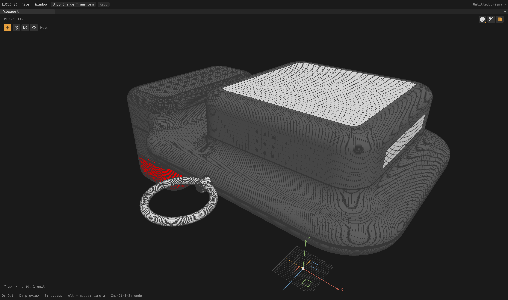
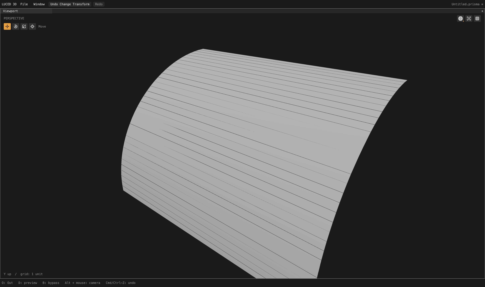

# Circular endpoint agreement and Camera 2 compatibility

Local follow-up to the [curved-row and button-strip checkpoint](CAD_CURVED_FLOW_ADMISSION_2026-09-28.md).
The goal remains active. Camera 2 now completes a full cook with an **explicit
File tolerance of 0.02**. Its source-authored 0.01 tolerance still fails a
boundary projection; neither the importer nor this fix silently raises it.

## Two failures, one inconsistent planning contract

Camera 2 face 96 previously failed with `collapsed trim edge`. A generated
station was only 5.90e-12 source units from an existing endpoint. The circular
family copied an almost identical angular anchor through a separately fitted
arc frame. Subsequent UV snapping mapped the two samples onto one chart point.

An initial guard at the angular-anchor precision passed face 96 but exposed
the same class of failure on face 341. Its nearly quarter-circle edge has
sweep 1.5707963276328964 rather than exactly pi/2. A copied station at fraction
0.99999999946651275 was 4.19e-10 units from the authored end. Both projected
onto the same support corner even before UV snapping.

The planner already accepts circular coverage differences of 1e-9 of the arc
span. It now uses that same limit when deciding whether a transferred station
is an agreed endpoint, additionally capped at **1% of the File/CAD tolerance
in physical arc length**. The authored 0/1 samples and CAD vertex identities
remain exact. This prevents a redundant generated sample; it does not weld
different authored endpoints, remove faces, loosen projection acceptance, or
disable the trim triangulator's collapsed-edge rejection. Distinct circular
seams beyond the coverage margin still transfer normally.

## Complete-model checks

Camera 2, divisions 16, target edge length 0, explicit tolerance 0.02:

| Measurement | Result |
| --- | ---: |
| Analytic faces / shared edges | 618 / 1,371 |
| Mesh points / polygons | 497,099 / 484,776 |
| Quads / triangles / boundary n-gons | 461,440 / 7,585 / 15,751 |
| Open / nonmanifold / inconsistent edges | 0 / 0 / 0 |
| Euler characteristic | 4 |
| Folded display-triangle flags | 0 |
| Stretched-20 / skewed-0.1 quads | 130,502 / 1,962 |
| Actual display area | 72,015.78081834469 |
| Signed display volume | 185,882.57006373804 |

All 618 printed patch-quality records agree between native and C. Full native
meshing took approximately 6.6–7.1 seconds while other tests were running;
these are observations, not an isolated or cross-platform benchmark.

Face 341 now has 32 mapped quads. Face 96 has 12,936 quads and 24 boundary
n-gons, with 8,982 stretched-20 quads: it clearly needs density work. Completion
and watertightness are not evidence that every patch has good topology.

The original camera is unchanged: the entire OBJ serialization, including
point coordinates, polygon indices and actual renderer area/volume, is
identical to the previous checkpoint after excluding the elapsed-time header.
It retains 707,404 points, 655,405 polygons, zero open/nonmanifold/inconsistent
edges and Euler 46. This does not resolve its remaining crowded rows.

At 4,096 deterministic samples per direction against `camera_2.obj`:

- STEP mesh to OBJ: maximum 0.0231549, mean squared 1.11862e-5.
- OBJ to STEP mesh: maximum 0.0710477, mean squared 1.33399e-5.

The largest sampled OBJ-to-mesh discrepancy lands on face 100 (`Body8`). These
compare the actual display triangulations, not analytic Hausdorff bounds or
a guarantee that tessellation deviation equals File import tolerance. The
comparison tool now accepts an optional third argument for explicit File
tolerance, using exactly the same importer setting rather than changing it
automatically. Desktop STEP and reference OBJ files remain read-only.

## Regression coverage

The new pure-Base contract has 48 configurations: three physical scales, two
rotated frames, both sweep directions, two near-endpoint fit discrepancies,
tight physical tolerance, and closed circular rails with distinct seams.
It checks exact end parameters, retained density, ordered stations and the
survival of meaningful or out-of-tolerance cuts.

Three independent negative controls fail as expected: disabling endpoint
filtering, removing its physical cap, and removing its angular-coverage cap.
All temporary mutations and traces are removed. The 33 reported regression
groups pass on native opt-2 and C, including the internal Base contracts.
The restored final Base contracts also pass unoptimized native.

The smaller corpus files retain their previous counts: sign 9,437 points /
6,841 polygons; 1p5inR 4,553 / 4,117; 33mm_angle 4,932 / 4,144. Counts alone
are not geometry-equivalence proofs.

## Native viewport and app checkpoint

Captures use the real GPU renderer at 4,400 x 2,604 pixels, following the full
background graph cook. Patch isolation happens afterward; it does not bypass
global edge planning or skip failing face jobs during verification.

The whole model still has dense bands, and the extreme isolated close-up has
faint/broken wire fragments that also warrant a depth-overlay check. Neither
capture is presented as a pristine mesh or renderer result. A prior overview
prepared the full mesh with 554 live UI frames over 9.92 seconds; that is a
background-preparation observation, not an orbit FPS benchmark.

`build/Luced 3D.app` was rebuilt using the released compiler at **13:13:26 PDT
on September 28** and its native GPU `--smoke` exits zero. Logs are
`/private/tmp/coverage-endpoint-app-{build,smoke}.log`. This is a local,
unpublished checkpoint, not a new registry release.

## Remaining work

- Camera 2 source tolerance 0.01: face 81 reports projection residual
  0.0102655. The user can explicitly choose 0.02 in File to inspect the new
  complete mesh; the authored default remains honored.
- Camera 2 still has substantial oversampling and boundary/flow quality
  problems, especially Body8. Its first successful cook is a starting point.
- The original camera's remaining hard-stop, button and frame cases remain
  on the active goal.
- car1's source endpoint disagreement and repeated assembly occurrences,
  and car2's support projection on face 1307, require separate general fixes.

Evidence in `/private/tmp`: `camera2-coverage-endpoint{.txt,.obj,-c.txt}`,
`camera2-coverage-endpoint-topology.log`, `camera-coverage-endpoint.obj`,
`camera2-coverage-delta-final.log`, `coverage-endpoint-{native,c,corpus}.log`,
`coverage-{endpoint,physical,angular}-negative.log`, and the face-96/341
diagnostic logs. The interim `circular-endpoint-*` files document the narrower
first attempt; `coverage-endpoint-*` is the retained implementation.
