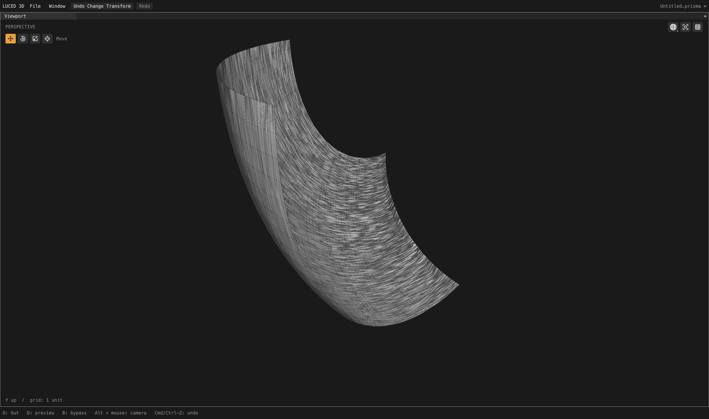
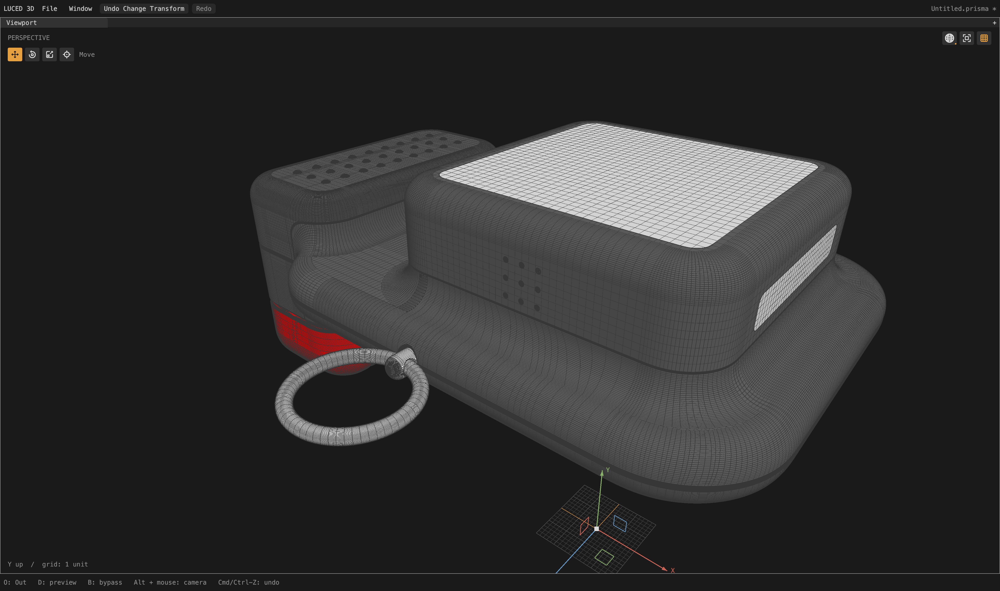

# Mapped interval feasibility and Camera 2 density

Local follow-up to [circular endpoint agreement](CAD_CIRCULAR_ENDPOINTS_2026-09-28.md).
The goal remains active. This checkpoint corrects a proved count contradiction,
not every remaining crowding, trimming or rendering defect.

## Why the band kept growing

Camera 2's Body8 band contains a compound mapped side whose opposite sides
reduce to **N = N + K**, with K strictly positive. Shared smooth-flow edges and
single-coedge opposite sides identify the same interval-count variable. Raising
the shorter side therefore sends extra intervals around a cycle rather than
reaching agreement. A fixed iteration bound limits the damage but does not
solve the constraint.

The new pure-Base `layout_feasibility` pass joins those equal-count variables,
cancels coefficients in compound-side equations, and detects nonempty sums with
only one sign. Such equations cannot have positive interval counts. It gives
one conflicting face to the alternative cut/fallback path, rebuilds the
constraints, and repeats only if another contradiction survives. It does not
change seam classifications, existing stations, CAD vertex identities, source
tolerance, or boundary geometry. Cut ownership survives later local chart
selection and is respected by count, phase and circular-family propagation.

This is a conservative proof for a specific class of impossible constraints,
not a general integer interval optimizer. Only supported plane/cylinder/cone/
NURBS cut-chart kinds opt in; sphere and torus charts do not. For this model,
face 94 is the single rejected mapped constraint. Its cut chart still does not
pass admission, so its actual final method is constrained fallback (255 quads,
74 triangles), **not** a successful clipped-grid patch.

Face 97's circular rails start with 16 curvature intervals. Previously the
count iterations ended at disagreeing 34/36, circular agreement chose 36, and
late balancing grew them to 405. They now settle at 34 through the remaining
planning stages. Only patch-quality records 89–106 change.

The approach is consistent with the need for global mapped-side constraints
described by [Sandia CUBIT interval matching](https://www.sandia.gov/files/cubit/15.6/help_manual/WebHelp/mesh_generation/interval_assignment/interval_matching.htm).
Sandia's [integer interval-assignment work](https://www.sandia.gov/research/publications/details/incremental-interval-assignment-by-integer-linear-algebra-with-improvements-2023-05-01/)
is broader; this implementation is neither a port nor a substitute for its
general solver.

## Full-model results

Camera 2, divisions 16, target edge length 0, explicit **File tolerance 0.02**:

| Measurement | Before | After |
| --- | ---: | ---: |
| Points | 497,099 | 398,918 |
| Polygons | 484,776 | 383,445 |
| Quads | 461,440 | 366,322 |
| Triangles | 7,585 | 1,330 |
| Boundary n-gons | 15,751 | 15,793 |
| Stretched-20 quads | 130,502 | 36,867 |
| Skewed-0.1 quads | 1,962 | 1,494 |
| Open / nonmanifold / inconsistent edges | 0 / 0 / 0 | 0 / 0 / 0 |
| Euler characteristic | 4 | 4 |
| Folded display-triangle flags | 0 | 0 |
| Display area | 72,015.78081834469 | 72,015.96665911116 |
| Signed display volume | 185,882.57006373804 | 185,882.72421509243 |

Polygons fall by 20.9%. Faces 96 and 98 each fall from 12,936 quads to 1,064
quads, retaining 24 boundary n-gons; stretched-20 quads fall from 8,982 to zero.
Their worst edge ratio falls from 39.09 to 2.42. Face 97 still has long quads:
its worst ratio improves from about 1,798 to 110, which is not a finished result.
Some patches' worst quad ratio increases as fallback triangles become quads;
there is no claim that every quality metric improves on every face.

Native and C produce identical printed quality records for all 618 patches.
Observed native meshing is approximately 4.7 seconds, compared with 6.6–7.1
seconds before; these runs overlapped other jobs and are not controlled timing
benchmarks or cross-platform performance claims.

At 4,096 deterministic samples per direction against the read-only reference
OBJ, the actual display-mesh comparison is:

- STEP to OBJ: maximum 0.0219807, mean squared 1.45251e-5.
- OBJ to STEP: maximum 0.0221445, mean squared 1.03667e-5.

The fixed OBJ-to-mesh samples improve from maximum 0.0710477 and mean squared
1.33399e-5. STEP-side samples move when tessellation changes, so their aggregate
is not a pointwise comparison. Neither direction certifies analytic Hausdorff
error or makes File tolerance a tessellation-deviation guarantee.

The original camera's entire OBJ serialization, including point coordinates,
polygon indices, display area and volume, is identical after excluding only
the elapsed-time header. It retains 707,404 points, 655,405 polygons, zero
open/nonmanifold/inconsistent edges and Euler 46. Its existing defects are not
claimed fixed by this Camera 2 correction.

## Regressions and actual viewport captures

The new Base contract tests 96 loop configurations: six coedge rotations, both
windings, hard/flowing seams, impossible positive cycles, feasible mixed-sign
equations, exact cancellation, and unsupported cut-chart kinds. It checks
unchanged stations/flow flags, idempotence and real count/phase propagation.
A separate test ensures local rectangular chart selection retains preexisting
cut ownership. Four independent negative controls fail as expected: disabling
the proof, ignoring cut ownership in count propagation, ignoring it in phase
propagation, and overwriting it during chart selection. All are restored.

All 33 regression groups pass on native opt-2 and C. The final Base layout
contracts also pass native opt-0. No temporary tracing remains in production.
The small corpus retains its previous counts: sign 9,437 points / 6,841
polygons, 1p5inR 4,553 / 4,117, and 33mm_angle 4,932 / 4,144. The larger files'
default-tolerance failures are unchanged; they are not counted as passing.

These are real GPU captures at 4,400 x 2,604 pixels. The complete background
cook precedes patch isolation. The paired face-96 views use the same camera,
shading and zoom; the before view disables only the count-feasibility proof.

The rectangular-looking boundary region and dotted/broken wire fragments are
visible in both images and require separate investigation. They are not hidden
or presented as pristine output.

`build/Luced 3D.app` was rebuilt with the released compiler at **13:37:33 PDT
on September 28**. Its actual native GPU `--smoke` exits zero. Build and smoke
logs are `/private/tmp/count-feasibility-app-{build,smoke}.log`.

## Outstanding work and evidence

- Camera 2 still needs better long-row distribution and boundary/display work.
- Its authored 0.01 File tolerance still rejects face 81 at residual 0.0102655;
  this checkpoint requires the user's explicit 0.02 setting, never an automatic
  tolerance increase.
- Original-camera button, outer-frame, hard-stop and crowded-row cases remain
  part of the active goal.
- car1's endpoint disagreement/repeated assembly occurrences and car2's
  face-1307 projection remain separate compatibility work.

Evidence under `/private/tmp`: `camera2-count-feasibility{.txt,.obj,-c.txt}`,
`camera2-count-feasibility-{topology,delta}.log`,
`camera-count-feasibility.obj`, `count-feasibility-{native,c,corpus}.log`,
`count-{proof,propagation,owner}-negative.log`,
`phase-propagation-negative.log`, and `camera2-face97-{layout,feasible}.obj`.
This is a local, unpublished checkpoint.
