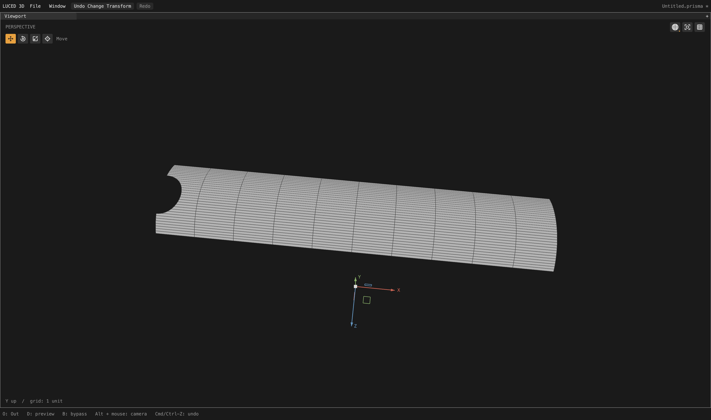
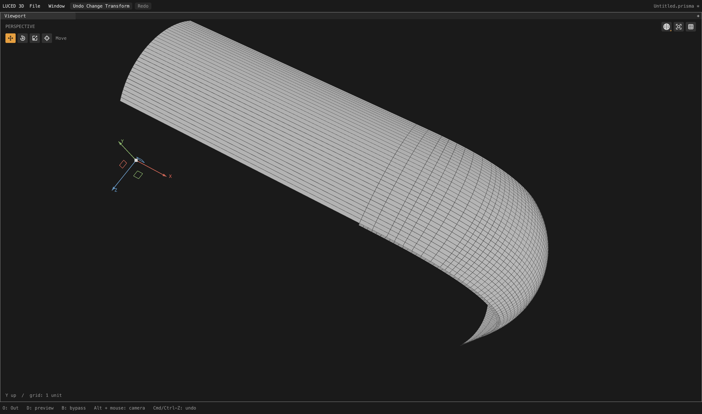
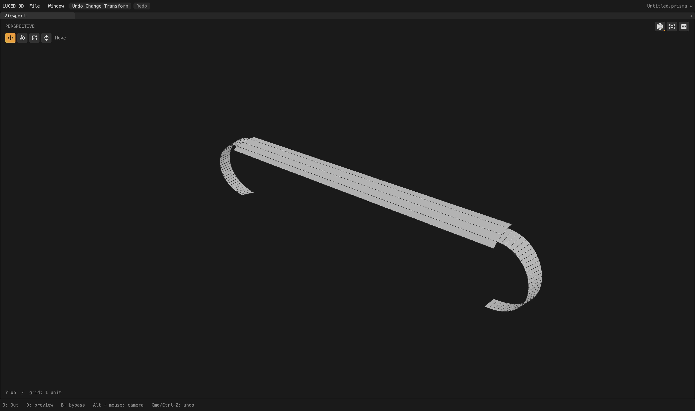

# Physical spacing for late curved rows and trim slivers

Local checkpoint following [notched cut-chart ownership](CAD_NOTCHED_CUT_OWNERSHIP_2026-09-28.md).
The tessellation goal remains active. This is a focused improvement to the
camera frame, not a claim that every patch or other STEP file is solved.

## What caused the frame crowding

Tracing frame patch 2363 distinguishes a correctly stopped hard trim from
competing rows on its smooth neighbors. Its 20 x 2, degree 3 x 1 support is an
affine extrusion. Curvature planning seeds 35 U and 11 V stations. Late smooth
seam reconciliation previously increases that to 57 U stations, inserting
closely adjacent phases rather than useful subdivisions. The curved hard
trim, shared with a cylindrical neighbor, already has its flow flag disabled.

For proven affine extrusions, late flow admission now measures spacing along
the physical profile, not raw UV distance. An optional station is declined
when it would make an affected cell exceed 20:1 and more than double that
same cell's previous aspect estimate. Existing curvature/size stations remain;
canonical edge cuts and their point identities are not removed or moved.
Useful physical midpoints are still admitted. Four-segment profile lengths
are bounded layout estimates, not certified surface-error bounds. Final
surface and normal validation remain in force.

## Boundary cleanup without propagating another row

The row correction initially worsened one tiny corner cell on patch 2386:
its worst quad ratio rose from 69 to 184 even though the rest of its grid
improved. Independently fitted trim and support samples differed within the
File tolerance, leaving a skewed boundary sliver. The old cleanup only admitted
area/length below 5% of the tolerance.

The additional cleanup path admits only boundary-adjacent triangles/quads
with severe aspect and angle distortion. Every lifted vertex must actually
lie within the File/CAD tolerance of the longest side's line. Area/length is
only an early-out estimate. Healthy narrow rectangles and larger features do
not qualify. Requiring actual strip width excluded an initially proposed
merge on lens patch 709; it correctly remains unchanged.

The existing merge rules also require a much larger neighbor, exactly one
shared internal side and no other shared vertices. The union becomes a real
boundary n-gon, retaining all point IDs and positions. This is a polygon
topology operation, not wire hiding. Dissolve preserves the source display
triangles; subsequent lifting still validates/rebuilds display triangles as
needed. The 128-operation per-patch budget remains unchanged.

## Full-camera result

Divisions 16, edge size 0, file-authored tolerance (0.01). Before is the
12:10 notched-cut checkpoint; after includes both corrections above.

| Measurement | Before | After |
| --- | ---: | ---: |
| Points | 711,080 | 707,402 |
| Polygons | 659,166 | 655,405 |
| Quads | 612,501 | 608,715 |
| Triangles | 3,204 | 3,184 |
| Boundary n-gons | 43,461 | 43,506 |
| Stretched-20 quads | 33,802 | 32,783 |
| Skewed-0.1 quads | 1,978 | 1,957 |
| Open / nonmanifold / inconsistent edges | 0 / 0 / 0 | 0 / 0 / 0 |
| Folded display flags | 0 | 0 |
| Euler characteristic | 46 | 46 |

| Original CAD patch | Worst quad edge ratio before | After |
| --- | ---: | ---: |
| 2280 | 138.02 | 13.08 |
| 2284 | 346.27 | 13.08 |
| 2363 | 264.38 | 15.05 |
| 2383 | 232.49 | 13.08 |
| 2384 | 402.15 | 15.78 |
| 2385 | 232.49 | 13.08 |
| 2386 | 69.02 | 4.34 |

All seven patches now have zero stretched-20 or skewed-0.1 quads. Forty patch
quality records change overall; all 2,710 records match between native and C.
Three already well-shaped patches have small worst-ratio increases as their
polygon partition changes: 2273 (2.845 -> 2.862), 2410 and 2415 (3.674 ->
3.705). Quad metrics do not evaluate boundary n-gons, and the remaining 1,957
skewed quads elsewhere are not claimed resolved.

The assembled display area is 65,662.42332063339 and signed volume is
74,392.88339108709. These are the renderer's actual triangulation, not an
invalid fan measurement over concave n-gons. The full-cook probe reports
10.29 seconds while other validation jobs were running; this is not a paired
performance benchmark.

At 4,096 samples in each direction, OBJ-to-STEP maximum distance is unchanged
at 0.0259126 (mean squared 4.56508e-6). STEP-to-OBJ maximum is 0.0218962 (mean
squared 3.96264e-6). These compare tessellated surfaces, not analytic
certificates; STEP-side sample positions change when the mesh indexing does.

## Regression and visual checks

- 48 late-flow cases cover physical scale, UV-axis swaps, reversed loops,
  linear/nonlinear parameter speed, useful versus crowding stations, and
  survival of every directed canonical trim segment after clipping.
- 192 sliver configurations cover triangles, skewed quads, healthy narrow
  rectangles, physical/UV scale, reversed/rotated placement, actual width
  above/below tolerance, and interior versus boundary cells. They assert
  exact point identity and the oriented display-triangle multiset.
- Disabling late-flow admission fails its spacing contract. Disabling the
  new sliver path fails its contract; weakening only its actual width guard
  also fails. All temporary mutations are removed.
- All 33 reported regression groups, including internal Base contracts,
  pass on optimized native and C backends. Final Base contracts also pass
  unoptimized native.
- `sign`, `1p5inR` and `33mm_angle` still import/tessellate: respectively
  6,841, 4,117 and 4,144 polygons. Counts alone are not geometry-equivalence
  or topology proofs.

Actual 4,400 x 2,604 native shaded-wire captures, after a full background cook
and then isolated by original CAD face ID. No image edits alter the geometry.
The strip pair has matched framing (X rotation 0, yaw 0.1, pitch 1.2, zoom 0.65).

The corner and its mesh-edge neighbors show the result in context (X rotation
0, yaw 0.5, pitch 1.2, zoom 0.55). Near-coincident sliver details also have
separate high-zoom before/after captures under `/private/tmp`.

Evidence under `/private/tmp`: `camera-curved-sliver-width.txt` (final native
stats), `camera-curved-flow-final-c.txt`, `camera-curved-flow-final.obj`,
`camera-curved-flow-final-topology.log`, `curved-flow-final-{native,c}.log`,
`curved-flow-layout-opt0.log`, `curved-flow-final-corpus.log`,
`curved-flow-negative.log`, `curved-sliver-negative.log`, and
`curved-sliver-width-negative.log`.

The app was rebuilt at **12:38:24 PDT on September 28** and its native GPU
smoke test exits zero. Logs are `curved-flow-app-{build,smoke}.log`; sampled
distances are in `camera-curved-flow-final-delta.log`. This is a local app
checkpoint, not a new registry publication.

## Remaining work

STEP tolerance is already format-specific on File: zero uses the file's
uncertainty (fallback 1e-6 if absent), positive values explicitly override it.
It survives projects, undo and background-worker cache invalidation. It is
not silently increased to make a failing file pass, and remains separate
from tessellation quality/edge-size controls.

The wider compatibility failures remain: camera_2 first misses its authored
tolerance at a support projection; an explicitly looser import reaches a
collapsed/self-intersecting trim. car1 has an endpoint tolerance failure and,
with an explicit override, unsupported repeated assembly occurrences. car2
still has the documented support-projection residual on face 1307. These
need general import/projection/topology fixes, not camera-specific exceptions.
Further camera/button/trim audits and these models remain on the active goal.

## Follow-up: single-span button strip

Patch 1464, beside the previously corrected rounded button ends, still had
two quads with one microscopic row. Its worst edge ratio was 25,114:1. The
support is a degree-elevated 4 x 4 bicubic plane, provably affine in both
directions. Its long side boundaries are hard stops; the short end seams
carry a late row at approximately 0.999334766 of each rail.

Three general layout guards prevented redistribution:

1. A transverse profile with only one span was excluded despite having a
   well-defined physical pitch. Single-span profiles now qualify.
2. Independent line fits differ from the exact support direction by roughly
   0.3–0.5e-6 source units. The classification cap is now one part per million
   of rail length, still limited by File tolerance apart from the existing
   1e-10 relative arithmetic floor. Projection/deviation tolerances do not
   change, and clearly oblique or shifted rails remain ineligible.
3. Coverage was measured along the approximate line direction. Its tiny fit
   error was amplified across the wide profile. Coverage now projects onto
   the proven support translation instead.

The strip now contains one quad and one six-corner boundary polygon, with
the interior row at its physical midpoint. Worst quad ratio is 33.414:1.
Every original point occurrence in the complete mesh remains exactly present;
only two midpoint vertices are added. Those also become boundary corners in
the two neighboring end patches. Only patch 1464's printed quality record
changes; unchanged records do not imply unchanged corner lists in its neighbors.

Full camera: 707,404 points, 655,405 polygons, 608,714 quads, 3,184 triangles
and 43,507 n-gons. Open/nonmanifold/inconsistent edges remain 0/0/0, Euler 46,
and display-fold flags remain zero. Actual display area is 65,662.42301666569,
signed volume 74,392.88340055797. Native/C agree on all 2,710 quality records.

The mapped-extrusion contract now covers 960 combinations, including one/eight
profile spans and wide flat profiles with noisy rails. Restoring each of the
three old guards independently fails the spacing contract. All mutations and
temporary traces are removed. All 33 reported native/C regression groups pass;
the final Base contracts also pass native opt-0. The three smaller corpus
files retain their previous point/polygon counts.

Fixed OBJ-to-STEP samples remain max 0.0259126, mean squared 4.56508e-6.
STEP-to-OBJ is max 0.0248495, mean squared 3.7685e-6; these source samples change
with mesh indexing and do not establish a point-for-point improvement.

Matched full-production, 4,400 x 2,604 native shaded-wire captures, including
the strip's mesh-edge neighbors (X rotation 90, yaw 0.7, pitch 0.5, zoom 0.65):

The fresh camera_2 test with an explicit File tolerance of 0.02 now passes
the old face-95 failure and stops at **face 96: collapsed trim edge**. This
advance was present before the single-span change, from intervening earlier
fixes. Face 96 is a four-edge NURBS patch in `Camera - 2/Body8`, beside faces
95, 97, 107 and 142. Its collapsed chart and the original source-tolerance
failure still require diagnosis; no successful whole-camera_2 cook is claimed.

Evidence: `/private/tmp/camera-single-span-support{.txt,.obj,-topology.log}`,
`camera-single-span-c.txt`, `camera-single-span-delta.log`,
`single-span-{native,c,corpus,negative}.log`, `support-direction-negative.log`,
`fit-cap-negative.log`, `single-span-final-opt0.log`, `camera2-current.log`,
and `camera2-face96-topology.txt`.

The follow-up app was rebuilt at **12:51:44 PDT on September 28**, using the
released compiler, and passes native `--smoke` with exit zero. Build/smoke logs
are `single-span-app-{build,smoke}.log`. The goal remains active and these are
local, unpublished changes.
