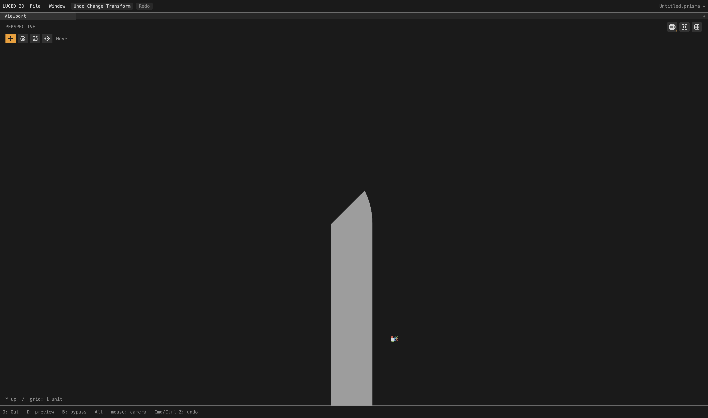
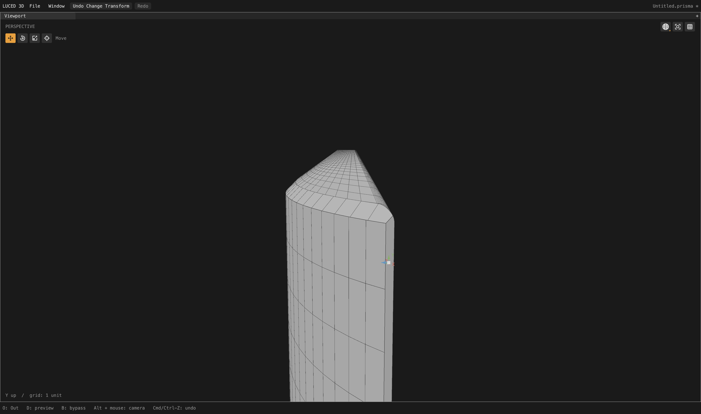
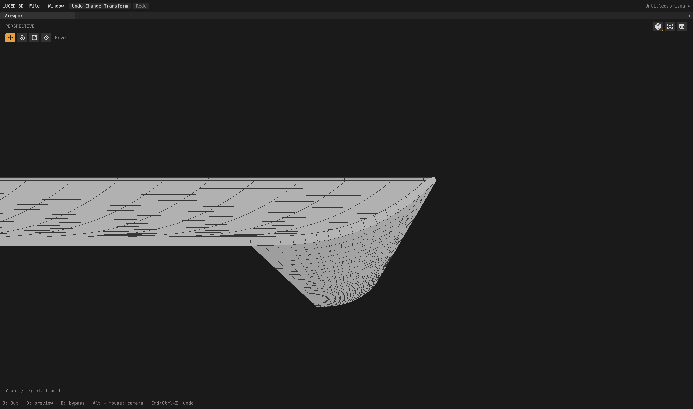

# Thin-triangle distance and false fillet fallback

Verified local checkpoint after planar preflight. Two more camera patches
retain their cut polygons instead of falling back to a fan mesh. Twenty-five
constrained patches and the broader spacing/hard-edge audit remain unfinished.

## Root cause

The retained-display deviation check correctly tests real triangles against
the CAD support. Its low-level point/triangle distance primitive, however,
solved barycentrics through the Gram determinant `aa*cc - ab*ab`. Nearly
parallel sides cancel significant digits in that subtraction and in the
barycentric numerators. A positive determinant did not establish accuracy.

For patch 252, a point almost on a very short triangle edge was reported
0.0146823 units away. For patch 269, a point near the interior of a long, thin
triangle was reported 0.0113294 away. Both exceeded the unchanged 0.01 model
budget. Independent 100-digit arithmetic on the same binary64 inputs gives
distances approximately 2.60e-15 and 2.15e-14 respectively. These were false
rejections, not evidence that those triangles required more curvature rows.

`luce-3d/geometries/distance.lucb` now uses cross-product signed subareas,
anchored opposite the longest triangle side. It tests all three subareas
directly and compares the normal-distance candidate against the three real
boundary segments. Degenerate triangles retain point/segment behavior.
The implementation is pure Luce Base with constant work and no allocations.
No deviation threshold, support geometry, normal guard or shared boundary was
relaxed. This is cancellation-resistant floating-point arithmetic, not an
exact-arithmetic certificate for arbitrary magnitudes.

The distinction between mathematical Gram identities and numerical robustness
is also discussed in David Eberly's
[point/triangle distance paper](https://www.geometrictools.com/Documentation/DistancePoint3Triangle3.pdf)
and [robust implementation notes](https://github.com/davideberly/GeometricTools/blob/master/GTE/Mathematics/DistPointTriangle.h).
Those were checked as primary references; no donor C++ was added to the project.

## Assembled camera

Divisions 16, edge size zero, full global cook before patch isolation. All
2,710 native/C quality records match. Exactly two patch records change:

| Patch | Previous output | Corrected output |
| --- | --- | --- |
| 252 | 17 quads + 558 triangles | 15 cut polygons |
| 269 | 16 quads + 569 triangles | 1 cut polygon |

The cut polygons retain every canonical trim vertex. Their display triangles
are still validated for winding, support normals and sampled deviation; display
diagonals are distinct from actual polygon edges. These are narrow trimmed
supports, not a claim that large curved regions can become one coarse face.

- 676,179 points; 631,670 polygons: 590,885 quads, 5,353 triangles and
  35,432 n-gons. Compared with the previous checkpoint: 495 fewer points,
  1,144 fewer polygons and 1,127 fewer triangles.
- Strategies: 2,208 mapped / 477 clipped / 25 constrained (was 27 constrained).
- Zero boundary, nonmanifold, inconsistent-edge and folded-display flags;
  Euler characteristic 46. Actual retained-display area 65,662.6014284649;
  signed volume 74,393.20759790188.
- Stretched-20 and skewed-0.1 quad counts unchanged: 49,994 and 2,089.
  The other 2,708 patch quality records are unchanged. Quad-only diagnostics
  do not certify the shape quality of every n-gon.
- Fixed 4,096 OBJ-to-STEP samples: maximum 0.0259126, mean squared
  4.68832e-6, unchanged at printed precision. STEP-to-OBJ: maximum 0.0245208,
  mean squared 4.37099e-6. The latter samples depend on mesh indexing and the
  distance primitive also changed; this is not a paired accuracy improvement
  or a certified deviation bound.
- `sign`, `1p5inR` and `33mm_angle` have exact exported vertex/face equality
  with the prior checkpoint and pass closed-topology audits.

## Gates and app

The new primitive regression runs 4,334 queries, including all six triangle
orders, scales 1e-6/1/1e6, offsets, three coordinate planes, width ratios down
to 1e-10, known interior/boundary/exterior projections and degenerate cases.
The old implementation fails the observed near-edge case. Both observed
cancellation cases are protected independently of the camera fixture.

`luce-3d` passes its Base and two Luce consumers at native optimization levels
0–3 plus C debug/release. The complete application suite passes all 28 groups
on native and C. The app was rebuilt using released Luce 0.8.18 and pinned Base
at 06:33:58 local, September 28; native smoke exits zero. No GPU, UI, compiler
or luced-2d changes. Temporary source traces and the rejected global
intersection-dedup experiment were removed. This is not a new registry release.

The full-camera shaded-wire orbit check (4,400 × 2,604, 300 callbacks after
35 warm-up frames) measured 2.46949 ms mean / 4.036 ms worst, with 12.2838 s
background preparation. The previous checkpoint's single run was 2.25277 /
3.019 ms and 11.9314 s. These are callback measurements, not GPU completion or
input-to-display latency. The current run is slower; single runs do not establish
whether the difference is systematic. Log: `camera-stable-distance-orbit.log`.

## Native visual inspection

Images are actual 4,400 × 2,604 shaded-wire frames. The matched patch-269
detail uses rotation X 0, yaw pi/2, pitch 0, zoom 0.025, target
(48.92, 13.68, 4.15). It shows the end of the narrow support, not its entire
27-unit length. The patch-252 neighbor views show clean cut edges from two
angles; they do not certify every camera region.

## Next defect, not included in this fix

Plane 722 remains constrained. Its exact edge/grid root is found, then a
physical-distance dedup filter drops it beside an existing cut. For edge 1797,
root `t=0.999774500498` sits near existing `t=0.999789129749`; the boundary
therefore crosses the last grid row without a vertex on that row. Earlier
endpoint-discrepancy suspicion was not the immediate cause.

Removing every distance filter globally was rejected: it introduced extremely
close cuts elsewhere and made camera face 103 fail triangulation. That
experiment is not in the app. The next correction must distinguish a required
incidence from redundant numerical roots without welding canonical topology.

Evidence: `/private/tmp/camera-stable-distance{.txt,-c.txt,.obj,-topology.log,
-delta.log}`, `triangle-distance-{negative.log,tests-final.log}`,
`stable-distance-app-{tests-native.log,tests-c.log,build.log,smoke.log}` and
`camera722-intersection-trace.txt`. The temporary diagnostic traces are only
in external logs, not production source.
