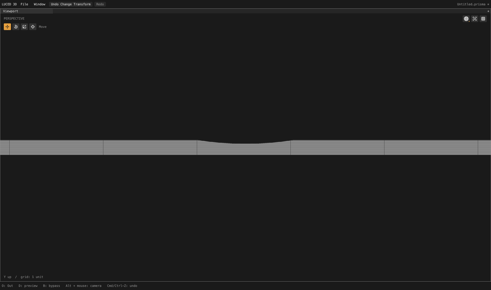
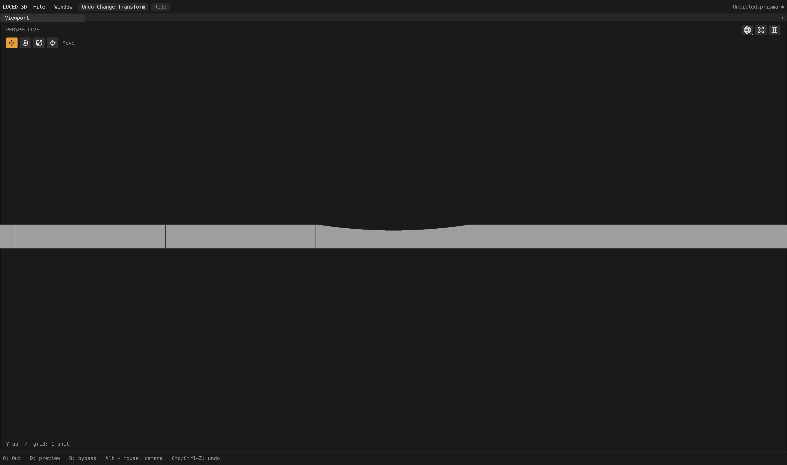
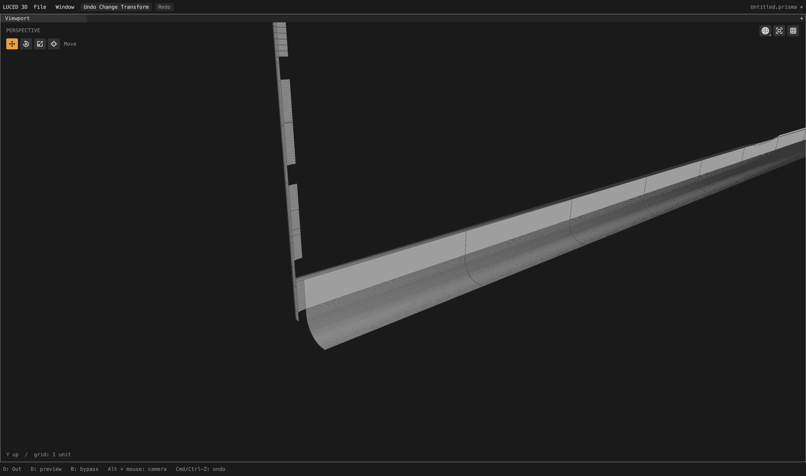

# Endpoint-only smooth joins

Local checkpoint following shallow-crossing repairs. The active camera audit
continues; this is not a claim of pristine tessellation or a new package release.

## Evidence and implementation

The earlier report attributed the many rows on planar strips 421/422 to inherited
flow. Instrumentation disproved that **at initial seeding**: each chart contained
only four stations per axis (two trim limits and two exterior guards). Its smooth
rails had only two endpoint samples. Merely finding an eligible smooth rail was
blocking the physical-pitch policy, so a long narrow plane still received equal
U/V interval counts.

`layout_density.fill_plane` now checks for actual stations inside the trim
envelope. Endpoint-only rails do not suppress proportional physical axis counts.
Real interior stations—including endpoints of constituent coedges that lie
inside the overall chart—retain the previous coupled-density policy. Compact
planes also retain that policy. No existing station is removed or moved.

This separates eligibility for smooth continuation from an actual imposed row
phase. It does not change seam classification, canonical curve sampling, fitting
tolerances or the later curvature refinement.

A tested alternative checked only whether an individual rail had more than two
samples. That was too broad: compound rails can impose interior phases through
their coedge endpoints. It reduced counts but worsened long faces 2341/2344 and
2507/2511. That version is **not retained**. The final version examines the
assembled station families, not just individual coedge lengths.

The topology probe now lists all incident neighboring CAD faces for each edge,
including support kind and source path. This is diagnostic-only and does not add
an application-facing CAD API.

## Camera result

Same full-model production cook, divisions 16 / edge size 0:

- Patches 421/422: each changes from 286 quads + 1 triangle + 6 cut n-gons to
  **32 quads + 2 cut n-gons**. Stretched-20 quads fall from 267 to 15; skewed-0.1
  quads from 2 to 0. Maximum edge ratio remains 250.061: the remaining thin row
  is real and unresolved, not hidden by the better aggregate count.
- Patches 427/435, ledge 796, the four frame corners and the four previously
  improved lens bands retain their preceding quality records.
- 60 of 2,710 quality records change, including affected neighbors. NURBS
  neighbors 403/418 change from 1,200 to 720 quads each; their worst edge ratio
  stays about 55.7/55.9 but stretched-20 counts increase from 98 to 130. This is
  a remaining coupled-spacing problem, not an all-patch quality improvement.
- Whole model: **631,668 points / 591,493 polygons** (6,333 fewer polygons):
  547,234 quads, 9,861 triangles, 34,398 n-gons.
- Strategies unchanged: 2,208 local mapped, 463 clipped, 39 constrained.
- 52,692 stretched-20 quads / 2,095 skewed-0.1 quads (previously 53,233 / 2,105).
  N-gons are outside these quad-only metrics.
- Zero boundary, nonmanifold, inconsistent-edge and folded-display flags;
  Euler characteristic 46. Native/C quality records agree exactly.
- Actual display-triangle area 65,662.60299829619; signed volume
  74,393.20887116849.

The fixed 4,096 OBJ-to-STEP reference samples retain maximum 0.0259126 and mean
squared distance 4.68814e-6 at reported precision. STEP-to-OBJ maximum 0.0278163,
mean squared 4.64188e-6; those source samples change with mesh topology and cannot
be treated as a like-for-like error improvement. Neither direction certifies a
global error bound. Observed cook 9.3 s with concurrent checks is not a benchmark.

`sign`, `1p5inR` and `33mm_angle` retain identical generated vertex/face dumps and
zero topology flags compared with the preceding checkpoint.

## Captures and remaining cause

Native shaded-wire captures are 4,400 × 2,604 actual pixels. The first pair uses
identical camera settings, isolating patch 421 after the complete assembled cook.
The third includes its directly stitched neighbors; other CAD patches are
deliberately absent from this diagnostic subset.

The strip is visibly simpler, but the junction capture remains dense. A later
shared-edge insertion creates a row at world Y=-8.110000119 next to the trim at
Y=-8.1: roughly 0.01 units apart, running through cells about 2.5 units long.
This accounts for the fifteen remaining high-aspect quads. The straight short
rail uses CAD edge 1218 and meets NURBS patch 418. The long smooth rail uses edge
1224 and meets NURBS patch 606. These are diagnostic IDs only; the implementation
contains no camera-specific branches.

Next investigate provenance/admission of late shared cuts. Canonical seam
vertices must remain shared even when they are unsuitable as interior rows.
Preserve genuine curvature support and useful smooth flow; do not globally drop
rows or hide wire edges. The densely sampled neighboring fillets also remain
unfinished.

## Verification and build

- Four Base support-fill contracts cover swapped axes, exterior guards,
  endpoint-only rails, and a real inherited interior station which must remain
  fixed and retain coupled support density.
- Sixteen application-facing notched-strip cases cover two lengths, two chart
  orientations, both windings, and isolated versus coplanar endpoint-only joins.
  Checks include strategy, quad aspect/count, unchanged authored corners, area,
  normals and picking inside/outside the notch.
- Restoring the old “any smooth rail” gate fails the joined-case aspect test.
  Restored final source passes again; no diagnostic or negative-control switch
  remains.
- Full native opt-2 and C-release suites: 28 PASS groups each. Base contracts
  also pass native opt-0/1/3 and C-debug.
- Released Luce 0.8.18/pinned Base: `luc build --release` 20 s, main native
  `--smoke` exit 0. The rebuilt `build/Luced 3D.app` is available for inspection.

Evidence: `/private/tmp/camera-endpoint-flow{,-c}.txt`,
`/private/tmp/camera-endpoint-flow-{topology,delta}.log`,
`/private/tmp/camera421-{adjacency.txt,endpoint.obj}`,
`/private/tmp/endpoint-flow-{native,c,negative,restored}.log`, and
`/private/tmp/luced-endpoint-flow-{build,smoke}.log`.
