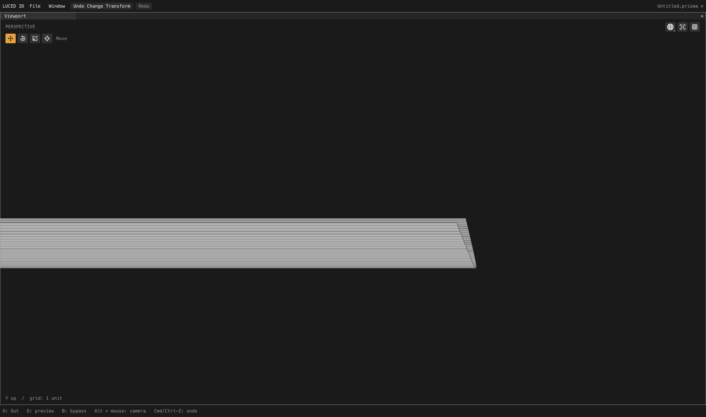
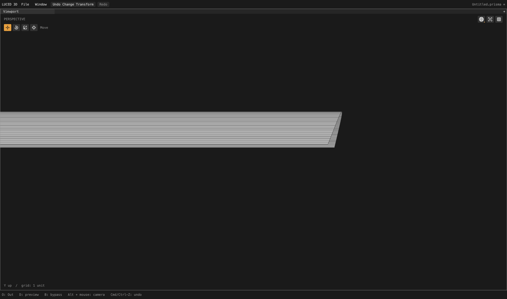

# Stopped endpoints on affine extrusions

Verified local checkpoint after trim incidence/end-gap work. The ongoing camera
audit is not complete; this addresses the oblique-end wedge on fillets 606/607.

## Cause and scope

Patch 606 is a cubic-by-linear NURBS extrusion. Its two straight rails end on a
stopped oblique trim at V = approximately 0.349397 and 0.351655. Both coordinates
were being inherited as rows across the entire patch. Removing only the lower
trim-envelope station did nothing: rail inheritance inserted both endpoints
again. That generated an unnecessary thin, tapered strip beside the real trim.

`layout_envelope.lucb` distinguishes endpoint-only boundary constraints from
interior stations. The retained change is deliberately restricted to a proven
affine control-net structure within numerical tolerance: degree one, two
controls, matching weight pairs and a constant translation across the net.
Only this straight direction can omit a rail endpoint ending at a stopped,
non-isoparametric coedge. Actual intermediate rail samples, smooth adjoining
coedges, isoparametric neighbors and uncertain UV aliases retain their contract.
Guard cells still enclose the trim, which cuts the support grid; canonical edge
positions are unchanged. No face IDs, object names or fixture values occur in
the implementation.

Broad omission on all NURBS cut charts was rejected. It improved several
fillets but introduced very thin frame quads (including aspect ratios above
2,000), and still broader variants triggered constrained fallbacks. Those
experiments are not in the app. Curved directions retain their existing policy
until cut-cell shape and neighboring row phases can be handled safely together.

## Full assembled camera

Divisions 16, edge size zero; native and C agree on all 2,710 quality records.

- 631,502 points; 591,327 polygons: 547,068 quads, 9,859 triangles and 34,400
  cut n-gons. This is 130 fewer polygons than the preceding checkpoint.
- Both target fillets change from 1,026 quads + 62 n-gons to 961 quads + 63
  n-gons. Worst opposite-edge ratios improve from 55.94 / 22.08 to
  1.0001885 / 1.0002446; minimum quad corner sines improve from about
  0.00143 / 0.00132 to 0.99999995 / 0.99999993.
- Their maximum long-to-short edge ratios remain 294.56 / 294.55. The quads
  become rectangular, but remain too long. Do not call this finished spacing.
- Adjacent planes 421/422 lose one redundant quad each, retaining maximum
  aspect 6.2516, opposite ratio 1 and minimum corner sine 1.
- Only those four quality records change. Exact polygon-coordinate comparison
  additionally finds one removed collinear boundary subdivision on each of
  planes 365/392: both removed points lie exactly on the surviving straight
  boundary. All other 2,704 patches' ordered polygon coordinates are identical.
- Zero boundary, nonmanifold, inconsistent-edge and folded-display flags;
  Euler characteristic 46. Strategies remain 2,208 mapped / 463 clipped /
  39 constrained. Stretched-20 count is 52,534; skewed-0.1 count is 2,095.
- Actual display area: 65,662.60303747584; signed volume: 74,393.20854155063.
- Fixed 4,096 OBJ-to-STEP samples: maximum 0.0259126, mean squared 4.68831e-6
  (preceding mean 4.68832e-6). STEP-to-OBJ: maximum 0.0213736, mean squared
  4.28657e-6. The latter samples depend on mesh indexing, so their reduction
  is not evidence of improved surface accuracy. These are sampled checks,
  not certified deviation bounds.
- `sign`, `1p5inR` and `33mm_angle` retain exactly identical exported vertices
  and polygons to the preceding checkpoint.

## Tests and native inspection

The new Base contract includes 18 scaled/transposed control-net classification
cases, 192 endpoint cases covering loop winding/origin and smooth/hard and
rectangular/oblique neighbors, plus 24 actual reconciliation/clipping cases.
The integration cases retain canonical endpoints, exact trimmed area and
positive display triangles. Disabling endpoint suppression fails with
`hard-trim endpoint propagated through an affine extrusion`.

Internal contracts pass native optimization levels 0–3 and C debug/release.
The released-Luce application suite passes all 28 groups on native and C.
The main app was rebuilt with released Luce 0.8.18 and pinned Base and its
native smoke test exits zero. No compiler, GPU, UI or luced-2d changes.

Actual shaded-wire captures are 4,400 × 2,604 pixels, isolated only after the
full production cook, with neutral material. Rotation X and yaw are zero;
zoom 0.018. Patch 606 uses pitch -0.78 and target (49.85, -8.62, 2.3); 607
uses pitch 0.78 and target (49.85, 8.62, 2.3). These are close-ups of the
oblique end, not a claim about the whole camera. The matched prior 606 image
is `/private/tmp/camera606-envelope-before.png`.

Evidence: `/private/tmp/camera-extrusion-{endpoints.txt,endpoints-c.txt,
endpoints.obj,topology.log,delta.log}`, `extrusion-tests-{native,c}.log`,
`extrusion-contract-*.log` and `cad-extrusion-negative.log`.
This is a local kernel/app checkpoint, not a registry release.
