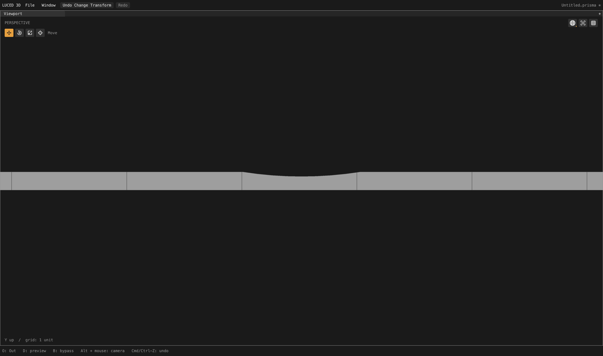
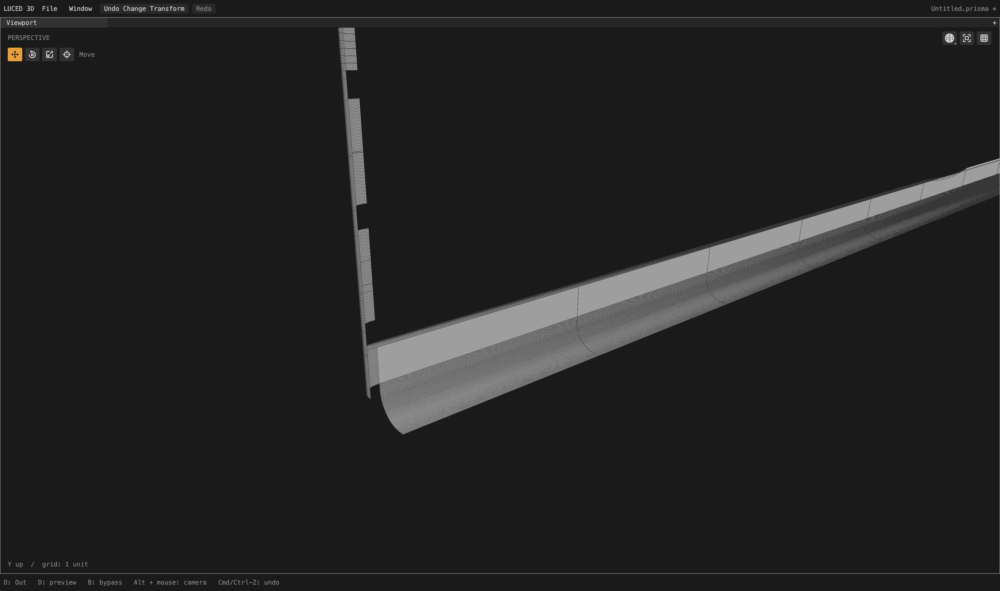
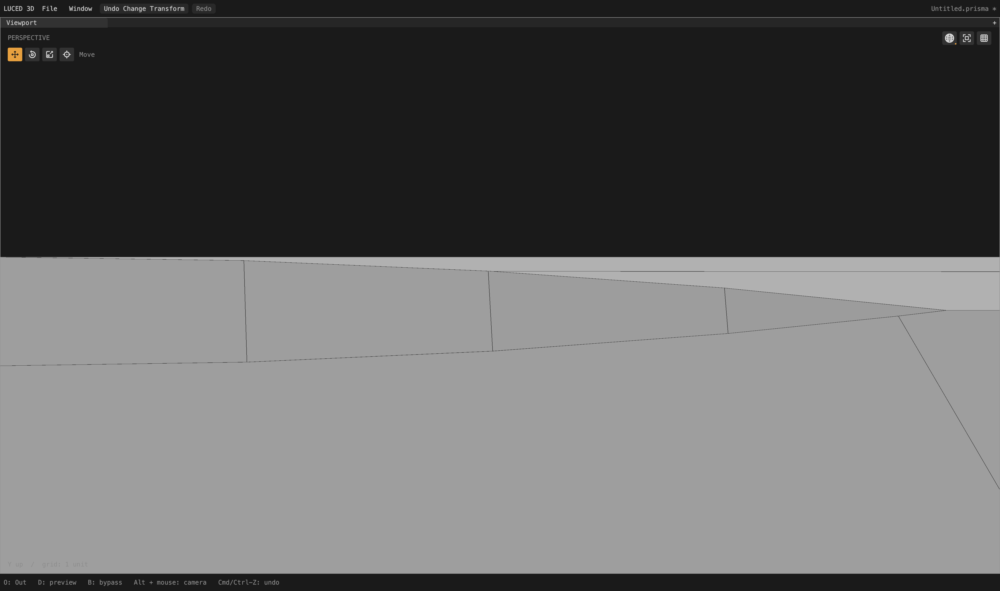

# Late seam cuts versus interior rows

Local checkpoint after endpoint-only initial spacing. The ongoing camera audit
is still active. These kernel changes are local, not a new registry release.

## Cause and policy

The remaining thin row on planar camera strips 421/422 arrived **after** their
initial grids were built. On strip 421, NURBS neighbor 418 imported V=0.883582
through another seam, then published its intersection on CAD edge 1218 at
approximately Y=-8.11. The plane's trim is at Y=-8.1. The planner unconditionally
turned that shared boundary cut into a full row, making roughly 2.5-by-0.01
quads. This was not required by the flat support's curvature.

`flow_admission.lucb` now distinguishes an exact shared cut from an optional
interior row on **initially independent narrow planar charts**. A late split is
stopped when its worst full-grid rectangle would exceed 20:1 and be more than
twice as stretched as the rectangle it splits. Real trim bounds exclude
exterior guard intervals from that test. Useful splits remain admitted.

The original shared cut stays on the canonical CAD edge and becomes a polygon
corner. Rejected transport does not generate new intersections on the opposite
edge. No existing station is removed or moved, curvature/size refinement is
unchanged, and no wire edge is hidden. Initially coupled charts and nonplanar
supports retain their current policy. Smooth-seam classification is unchanged:
compatibility permits continuation, but need not compel poor interior flow.

An experiment applying this gate to every planar chart changed 76 camera
records and worsened some unrelated mapped families. It is **not retained**.
The narrow policy changes only five of the 2,710 camera quality records.
There are no fixture-specific IDs or diagnostic branches in implementation.

## Full assembled camera result

Same production cook, divisions 16 and edge size 0:

| Each strip 421/422 | Before | After |
| --- | ---: | ---: |
| Quads | 32 | 14 |
| Cut n-gons | 2 | 3 |
| Stretched-20 quads | 15 | 0 |
| Worst quad edge ratio | 250.061 | 6.25160 |
| Worst quad corner sine | 0.151726 | 1.0 |

The only other changed records are neighboring patches 276, 419 and 420.
Patch 276 loses two triangles. Each conic 419/420 keeps eight polygons, but
one five-corner cut polygon becomes a four-corner cut polygon because the
extra crossing is no longer generated. Its pre-existing shallow angle now
enters the **quad-only** skew metric. Vertex-by-vertex comparison shows this
is not a newly sheared interior grid; it is also not a new regular quad.
The neighboring conical cut remains visibly tapered and needs no invented
extra vertex merely to avoid appearing in the quad statistics.

- Whole model: **631,632 points / 591,457 polygons**, 36 fewer of each.
- 547,200 quads, 9,859 triangles, 34,398 n-gons.
- 52,662 stretched-20 quads, 2,097 skewed-0.1 quads. The latter rises by two for
  the cut-polygon classification reason above; n-gons are outside this metric.
- Strategies unchanged: 2,208 local mapped, 463 clipped, 39 constrained.
- Zero boundary, nonmanifold, inconsistent-edge or folded-display flags;
  Euler characteristic 46. Native/C quality records match exactly.
- Actual display area 65,662.60309479806; signed volume 74,393.20887590473.
- Fixed 4,096 OBJ-to-STEP samples retain maximum 0.0259126 and mean squared
  4.68814e-6 at reported precision. STEP-to-OBJ maximum 0.0235092, mean squared
  4.53446e-6; those samples change with mesh topology, so this is **not** a
  like-for-like improvement claim or a certified surface-error bound.

The approximately 9.3-second observed cook ran beside other checks and is not
a performance benchmark. No viewport/GPU changes were made in this checkpoint.

## Native visual checks

Actual captures are 4,400 × 2,604 pixels. The first matches the prior strip
camera exactly. The others show directly adjacent patches after the full
assembled cook, not independently remeshed or filtered-before-planning models.
These are diagnostic subsets, not the complete camera silhouette.

Strip capture: patch 421, rotation X 0, yaw/pitch 0, zoom 0.12,
target (24,-8.3,2.15). Neighbor capture: patch 421 plus neighbors, yaw -0.7,
pitch 0.35, zoom 0.08, target (11.5,-8,2.25). Conic capture: patch 419 plus
neighbors, yaw 0, pitch -0.78, zoom 0.012, target (24.65,-8.13,2.2).
All use neutral material and real shaded-wire display.

The adjacent NURBS fillets are still much too crowded. Patches 403/418 and 606,
the four frame corners, lens bands and ledge 796 retain their preceding quality
records. This repair does **not** resolve their overlapping inherited phases.
Continue there next, without applying a planar aspect rule blindly to curved
supports or reducing required curvature support.

## Verification

- 48 synthetic late-cut cases: three scales, both chart orientations, both
  windings, useful versus crowded rows, and independent versus coupled charts.
  Tests check accepted row counts, exact canonical cuts, unchanged boundary
  positions, every boundary segment used once, positive display triangles and
  exact planar area. A separate case retains an improving long-cell split.
- Disabling admission fails the crowded-row contract. The final policy is
  restored; no negative-control switch remains.
- Full native opt-2 and C-release application suites: 28 PASS groups each.
  Expanded Base contracts pass native opt-0/1/2/3 and C-debug/release.
- `sign`, `1p5inR`, and `33mm_angle` vertex/face dumps are byte-for-byte identical
  to the preceding checkpoint and retain zero topology flags.
- Released Luce 0.8.18 / pinned Base: main release app rebuilt in 19 seconds;
  native `--smoke` exit 0. `build/Luced 3D.app` contains the change.

Evidence: `/private/tmp/camera-independent-admission{,-c}.txt`,
`camera-flow-admission-{topology,delta}.log`, `camera-flow-admission.obj`,
`camera419-flow-admission.obj`, `flow-admission-tests-{native,c}.log`,
`flow-admission-negative.log`, `flow-admission-base-*.log`, and
`luced-flow-admission-{build,smoke}.log` under `/private/tmp`.
