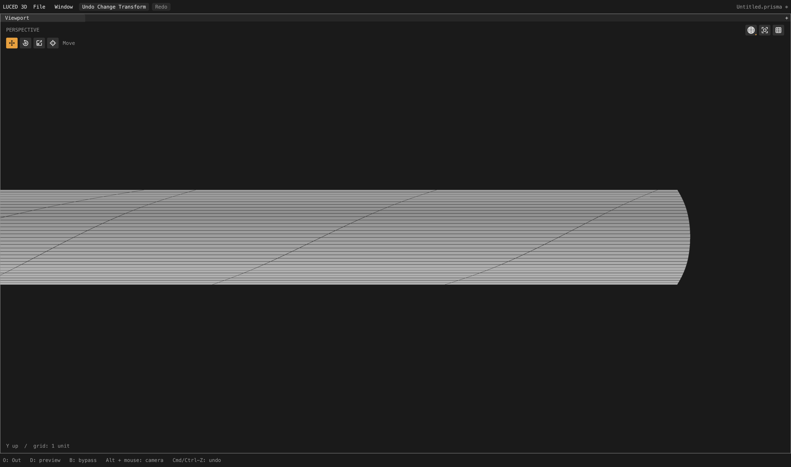

# Mirrored affine strip and import uncertainty

Local checkpoint after [mapped affine strips](CAD_MAPPED_EXTRUSIONS_2026-09-28.md).
The tessellation goal remains active; this is not an all-model quality claim.

## Diagnosis and repair

Camera patch 2513 has the same degree-elevated affine support as its mirrored
fillet, but an independently authored line endpoint differs transversely by
1.49e-8 source units. The old parallel-rail gate allowed only about 2.08e-9.
Consequently it kept mismatched row phases despite the complete control net
proving an affine extrusion.

Rail classification now considers the model's import tolerance (the File
node's STEP setting), capped at 1e-7 times rail length. Its existing numerical
floor remains 1e-10 times length. This is classification only: no endpoints,
curves, shared cuts, projection limits or imported tolerance are changed.
Unequal projected coverage, real obliqueness, warped control nets and budgets
still reject the optional regularization. Curved row families stay unchanged.

The Base contract now covers 384 scaled, swapped, reversed and rotated cases,
including within-tolerance noise, noise just above tolerance, and a loose File
setting that must not admit materially oblique rails.

## Verification

All 33 application test groups and the internal Base contracts pass on
optimized native and C backends. All 2,710 full-camera patch-quality records
agree exactly across the backends. Only three camera records change: patch
2513 and additional boundary corners on its neighbors 2484 and 2520.

| Patch 2513 measurement | Before | After |
| --- | ---: | ---: |
| Quads | 1,248 | 4,056 |
| Boundary n-gons | 0 | 72 |
| Stretched-20 quad flags | 279 | 0 |
| Skewed-0.1 quad flags | 64 | 0 |
| Worst quad edge ratio | 70.8115 | 15.9266 |
| Minimum quad corner sine | 0.09361 | 1 |

The complete mesh has 710,009 points and 658,401 polygons (+2,880 polygons):
611,500 quads, 3,453 triangles and 43,448 boundary n-gons. It retains zero open,
nonmanifold and inconsistently oriented edges, Euler characteristic 46, and
zero folded-display flags. Quad-only metrics do not evaluate boundary n-gons.
Actual display area is 65,662.53532048962 and signed volume 74,393.22699050249.

Fixed 4,096 OBJ-to-STEP samples retain maximum distance 0.0259126 and mean
squared distance 4.63001e-6. STEP-to-OBJ reports maximum 0.0191051 and mean
squared distance 4.24561e-6; these sample locations change with mesh indexing.
Neither direction is a certified error bound or a substitute for exact-support
checks. Reference Desktop files were not modified.

Matched actual 4,400 x 2,604 native shaded-wire captures use neutral material,
patch 2513 isolated after the full background cook, X rotation 0, yaw 0,
pitch -0.78, zoom 0.04 and target (30.1, -6.94, 1.94).

The app was rebuilt at 11:54:54 PDT on September 28 and its native GPU smoke
test exits zero. It contains this verified repair, not subsequent experiments.
This remains a local kernel checkpoint, not a new registry release.

Evidence in `/private/tmp`: `noisy-rail-suite-{native,c}.log`,
`camera-noisy-rail{,-c}.txt`, `camera-noisy-rail.obj`,
`camera-noisy-rail-{topology,delta}.log`, `noisy-rail-app-{build,smoke}.log`,
and `camera2513-noisy-rail-{before,after}.png`.

## Separate CI observation

The released luced-3d correctness runs 36384734096 and 36384677699 are green.
The newer [backup snapshot run](https://github.com/dymokomi/luced-3d/actions/runs/36458791241)
on `snapshot/codex-2026-09-28` fails on both macOS and Linux: its bootstrap
manifest pins tessellator revision `73e9ced21ea612bc49cc63d64a41069f19ed434e`,
which lacks `tests/trim_predicates_contract.lucb` required by the newer test
runner. This is not a failure of the release branch or the local suite.
No test was skipped and no remote pin was changed. A future coherent release
must commit and pin the required dependency revisions together.
The newer luce-ui snapshot correctness and Windows x64 runs are both green.

Next: inspect the many-coedge lens strip (patch 276) and remaining camera trim
artifacts. The camera_2/car1/car2 import, projection and assembly blockers
remain unresolved; this repair does not claim to address them.
