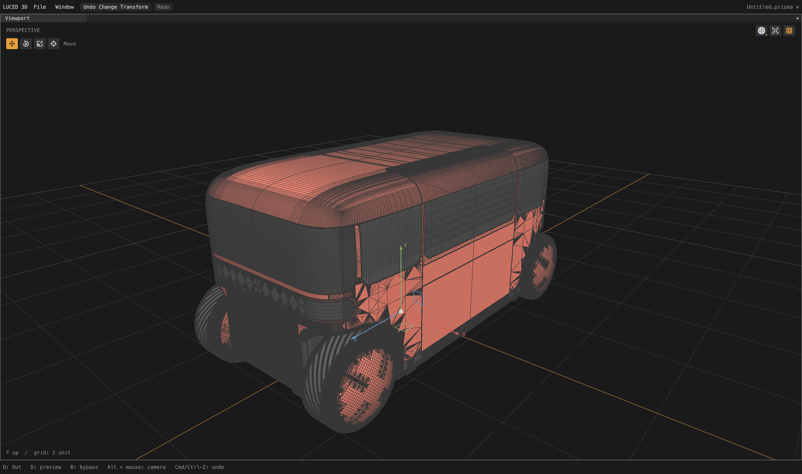

# Lazy polygon query indexes

This checkpoint removes unnecessary spatial-index construction from intermediate
CAD meshes. It does **not** change sampling, File tolerance, patch layout, trim
boundaries, normals or triangulation, and does not resolve car2's shape defects.

## Change

`luce-3d` previously built a triangle BVH inside every `PolygonMesh` constructor.
Clipping, refinement and sliver dissolves repeatedly made meshes that were never
used for picking or distance queries, yet paid that construction/allocation cost.

A small cache now lives with the shared immutable topology. First query, or an
explicit `prepare_queries()`, builds the index once. A mutex serializes first
construction; release/acquire publication makes later borrowed native queries
allocation-free and mutex-free. Failed construction leaves the cache retryable.
Attribute snapshots share it; the final owner frees it before the topology.
ARC owner operations remain confined to their owning thread.

Ray queries are now fallible, like distance queries, because first construction
can exhaust memory. A failed build must not be reported as a geometric miss.
The app warms detached final products inside `ComputeChannel.mesh` on its compute
worker, then checks cancellation before publishing. A first UI click therefore
does not trigger a large index build for those products.

## Observed result

The same full car2 statistics probe used 16 divisions, target edge length 0, and
explicit File tolerance **0.000025** in source units:

| Index construction | Measured tessellation time |
| --- | ---: |
| Eager, before this change | 89.692 seconds |
| Lazy | 75.392 seconds |

That is about 16% less time in this local pair, not a cross-platform or repeated
benchmark guarantee. Some regression compilation overlapped the latter run.
All **5,015 patch-quality records match exactly**, including 4,118,090 total
polygons. Existing stretched/skewed quads and folded-display flags remain;
unchanged diagnostics are not an endorsement of their quality.

Evidence: `/private/tmp/car2-query-eager-baseline.{txt,log}` and
`/private/tmp/car2-query-lazy.{txt,log}`. The timing excludes STEP parsing and
viewport preparation. It must not be presented as file-open latency or frame time.

## Regression coverage

- Ten allocation cutoffs cover unsuccessful initialization, rollback and retry.
  Warmed queries must work with all further allocation refused, including after
  closing the original owner while a snapshot remains alive.
- Eight rounds of eight simultaneous first readers on detached native meshes,
  with 100 repeated query sets each. All workers join before mesh destruction;
  the synchronized allocation tracker reports no retained allocations.
- Two deliberate nonplanar-quad diagonals give different known ray hits. Both
  remain exact through snapshots and detached copies, proving the query cache
  uses retained display triangles rather than retriangulating the polygons.
- Worker integration queries the completed product after handoff to the UI heap.
- The 3D Base/Luce suite passes native optimization 0–3 and C debug/release.
- Complete application suites pass all 33 groups in native opt-2 and C release.
- An isolated negative-control copy restores eager initialization and fails the
  new lazy-cache assertion. Production sources are never toggled for this test.
- The main app was rebuilt at 14:42:33 PDT and its native smoke check exits 0.

## Remaining profiling lead

A one-second full-car background-cook sample at approximately 83 seconds no
longer contains intermediate `TriangleIndex` construction. It still shows
projection/refinement and substantial sliver cleanup, including repeated
`TopologyTools.dissolve` copying/rebuilding whole patch meshes. This suggests a
local/batched cleanup strategy to investigate while preserving exact display
triangles and canonical boundaries. A sample is not a full time attribution.

Sample: `/private/tmp/car2-lazy-query-preview.sample`.

## Whole-car background path

With the capture runtime budget raised from 300 to 480 seconds, the full
background path reaches viewport preparation at 326.925 seconds and completes
worker handoff at **388.283 seconds** (17,470 live UI frames reported). This is
not a 75-second file-open result and is still unacceptable for interactive use.
Increasing the diagnostic timeout is not an application performance fix.

A second one-second sample, after handoff, finds the main thread in
`Renderer.prepare`: reading expanded triangle vertices, transforming normals,
and computing retained smooth/flat colors. This first-render CPU preparation is
another unresolved main-thread cost; it is distinct from the BVH, which was
already warmed on the worker. Rendering/capture completion is tracked separately.
Sample: `/private/tmp/car2-lazy-query-render.sample`.

The complete capture **succeeded**, producing this actual 4,400 × 2,604 native
shaded-wire frame, inspected after the run:

The model reaches the viewport with its imported colors, but densely crowded
window/roof bands and fan-shaped transitions around the lower body are clearly
still present. This is evidence of a full UI handoff/render, not clean topology
flow or verified surface accuracy. The user-requested hard-edge/boolean-trim
and quad-distribution work remains active. No geometry or wire edges were hidden
to obtain the image.

Build/test logs: `/private/tmp/lazy-query-3d-suite.log`,
`/private/tmp/lazy-query-app-native.log`, `/private/tmp/lazy-query-app-c.log`,
`/private/tmp/lazy-query-negative.log`, `/private/tmp/lazy-query-app-build.log`,
`/private/tmp/lazy-query-app-smoke.log`. Capture log:
`/private/tmp/car2-lazy-query-wire.log`. Changes are local; no release was published.
