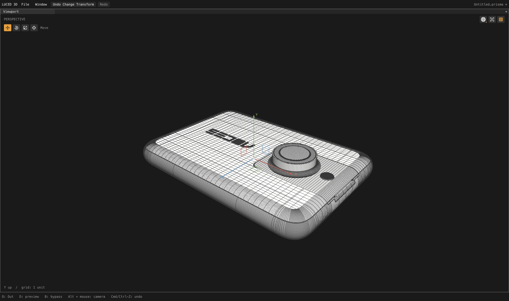

# Local trim-sliver dissolves

This is a performance checkpoint, not a new tessellation policy. It preserves
File tolerance, canonical boundaries, sampling, triangle surfaces and greedy
merge decisions. Car2's folded tire faces and crowded bands remain unresolved.

## Implementation

The previous optional sliver-cleanup loop rebuilt a complete immutable patch
after each of up to 128 edge dissolves. Each step reconstructed adjacency,
copied points and display indices, validated faces and remapped attributes.

`luce-3d` now provides a bounded native `DissolveWorkspace`. It borrows an
immutable source, builds adjacency once, and updates only the two joined faces
and their incident edges. Removed face slots stay inactive; new faces append.
This preserves the scan and tie-breaking order of the previous implementation.
Only the final result is materialized as an immutable polygon mesh.

Every proposed union is validated before publishing it. Repeated boundary
vertices, invalid display triangles and allocation failures leave active
topology unchanged. The original display triangles survive as exact diagonals
inside the merged polygon. Face/corner provenance retains the same attribute
mapping as the existing dissolve operator. The source must outlive the scratch;
no managed owner is stored inside this native workspace.

The CAD code keeps its no-edit fast path and unchanged small-to-large/collapsed
ribbon eligibility rules. Mandatory failed-cell repair remains on the existing
immutable path; this change only accelerates optional sliver cleanup.

## Observations

All runs use 16 divisions and target edge length 0. Car2 uses explicit File
tolerance 0.000025; camera uses its source tolerance.

| Full-model statistics probe | Measured tessellation time |
| --- | ---: |
| Car2, eager query indexes (earlier baseline) | 89.692 s |
| Car2, lazy query indexes | 75.392 s |
| Car2, lazy indexes and local dissolves | 68.495 s |
| Camera, local dissolves | 8.383 s |

The local dissolve pair is about 9.1% faster. These are individual local
observations, with some concurrent regression compilation, not a controlled
multi-run benchmark or cross-platform performance guarantee. They exclude STEP
parsing and viewport preparation.

All **5,015 car2 patch-quality records** match the preceding lazy-index result
exactly, including 4,118,090 polygons. All **2,710 camera records** match the
preceding spherical-cap checkpoint exactly, including 655,405 polygons.
Unchanged diagnostics establish non-regression for these measurements, not
pristine geometry or an exhaustive geometric equivalence proof.

Evidence: `/private/tmp/car2-local-dissolve.{txt,log}`,
`/private/tmp/camera-local-dissolve.{txt,log}` and comparisons against
`/private/tmp/car2-query-lazy.txt` and `/private/tmp/camera-spherical-cap.txt`.

## Regression checks

- Direct native scratch results match sequential immutable dissolves after each
  accepted and rejected edit: point positions, polygon order, normals, display
  indices and numeric attributes in all four domains, including authored `N`.
  Cases cover both windings and planar/nonplanar grids.
- Reciprocal live neighbors, exhausted edit budget, nonmanifold incidence and
  inconsistent edge orientation are checked explicitly.
- 192 injected allocation cutoffs leave no tracked package allocations.
  A failed union-validation allocation leaves the workspace unchanged and a
  subsequent retry produces the expected mesh.
- Both full application suites passed all 33 groups: native opt-2 and C release.
- The final direct Base/Luce suite passes native optimization 0–3 and C
  debug/release. Full car2 C release also matches all 5,015 native quality
  records exactly (`/private/tmp/car2-local-dissolve-c.{txt,log}`).
- `build/Luced 3D.app` was rebuilt at **15:04:58 PDT**, and its native
  three-frame smoke check exits 0. Logs: `/private/tmp/local-dissolve-app-build.log`
  and `/private/tmp/local-dissolve-app-smoke.log`.

Logs: `/private/tmp/local-dissolve-app-native.log`,
`/private/tmp/local-dissolve-app-c.log`,
`/private/tmp/local-dissolve-3d-final.log`.

The first-render CPU preparation seen in the preceding full-car capture is a
separate unresolved cost. This checkpoint does not claim to move that preparation
off the main thread. Changes are local; no package release has been published.

The current complete camera renders in a real 4,400 × 2,604 native shaded-wire
capture. The overview confirms the render path, not a patch-by-patch clean-mesh
certificate; crowded strips and cut-cell defects remain under investigation.

