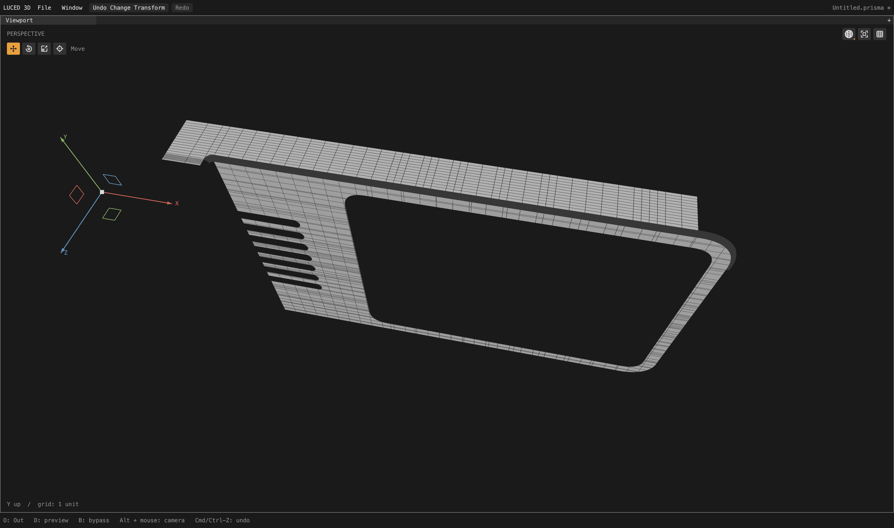

# Even physical rows on mapped affine strips

Local verified checkpoint following [canonical seams and diagnostic normals](CAD_CANONICAL_SEAMS_2026-09-28.md).
The tessellation goal remains active. This is not a claim that the camera,
all trim cells, or the larger Desktop models are pristine.

## Cause and scoped repair

Camera patch 2517 is a 7 × 4 cubic NURBS net, but its long direction is an
affine extrusion. Its independently planned long rails initially have just
their endpoints. Clipped planar neighbors subsequently introduce competing
1/29 and 1/32 station phases. Count-only balancing adds still more stations
without aligning their positions, so a narrow fillet bends between mismatched
rails. Its curved direction already has good physical spacing.

`layout_envelope.affine_axis` checks the complete control net, constant weights
along each rail, and the Greville positions implied by the knot vector. It
recognizes degree-elevated and knot-inserted affine representations; collinear
controls alone are insufficient. The Greville definition follows the
[GSL B-spline documentation](https://www.gnu.org/software/gsl/doc/html/bspline.html#greville-abscissae).
No external meshing code or runtime dependency was added.

The new `mapped_extrusion.regularize` runs after global reconciliation and
before canonical shared vertices are allocated. It requires a mapped four-edge
patch, a proven affine support, exact parallel line rails, equal projected
coverage, and compatible transverse counts. Crowded or excessively long rows
become one even physical phase on both rails. Optional length refinement uses
the existing sixteen-times-mean-transverse-pitch target and bounded axis/joint
budgets. It never reduces the resolved row count.

Every prior shared trim station remains in place. Stations not used as interior
rows become boundary polygon corners through the existing seam-conform path;
they are neither welded nor hidden. Curved station families are unchanged.
No face IDs, paths, model names, or fixture-specific coordinates occur in this
production policy. Import tolerance is unchanged and remains the File node's
format-specific setting, separate from tessellation density.

A broader experiment enabling all existing clipped-layout policies on the new
higher-degree recognition was rejected: 66 camera quality records changed,
including new skew on 2473/2477 and more crowding on plane 2484. Those policies
retain their earlier linear-net restriction. Recognition by itself does not
authorize a different clipping/flow strategy.

## Full camera verification

Divisions 16, edge size 0, file-authored import tolerance. Native and C agree
on all 2,710 per-patch quality records. 335 records differ from the preceding
checkpoint; no patch increases its stretched-20, skewed-0.1, or folded-display
flag count, and no patch changes meshing strategy.

| Measurement | Before | After |
| --- | ---: | ---: |
| Points | 671,178 | 706,965 |
| Polygons | 624,865 | 655,521 |
| Quads | 585,611 | 608,767 |
| Triangles | 3,453 | 3,453 |
| Boundary n-gons | 35,801 | 43,301 |
| Stretched-20 quads | 49,990 | 33,479 |
| Skewed-0.1 quads | 2,118 | 2,065 |
| Open / nonmanifold / inconsistent edges | 0 / 0 / 0 | 0 / 0 / 0 |
| Folded display flags | 0 | 0 |
| Euler characteristic | 46 | 46 |

Polygon cost is +30,656, about 4.9%. Some unchanged boundary quads become n-gons
when new canonical cuts are inserted; quad-only quality totals do not measure
those polygons and are not a universal mesh-quality score.

Target patch 2517: 1,248 quads become 4,054 quads + 74 boundary n-gons. Worst
quad edge ratio improves 70.8156 → 15.9283; opposite-edge ratio 2.1121 → 1.00027;
minimum corner sine 0.36385 → approximately 1; stretched-20 flags 1,115 → 0.
Mirrored patch 2513 does not qualify and remains unresolved: 279 stretched and
64 skew flags. Do not broaden the acceptance test just to force that patch in.

Actual display area: 65,662.53532573064 (previous 65,662.53548709619).
Signed volume: 74,393.22699142969 (previous 74,393.22694267749).
Fixed 4,096 OBJ-to-STEP samples retain maximum distance 0.0259126 and mean
squared distance 4.63001e-6. STEP-to-OBJ gives maximum 0.0187012 and mean
squared 4.17879e-6; its sample locations change with mesh indexing. These are
sampled regression checks against the supplied OBJ, not a certified error bound.

## Other files and tests

- `sign`: exported points and faces exactly unchanged, 6,841 polygons.
- `1p5inR`: 2,645 → 4,117 polygons; stretched quads 173 → 0; maximum quad
  edge ratio 131.71 → 15.50. Its four skewed trim quads remain.
- `33mm_angle`: 3,888 → 4,144 polygons; stretched quads 194 → 88; worst
  ratio 47.56 → 36.02. Its twenty skew flags remain.
- All three retain zero open/nonmanifold/inconsistent edges. The two changed
  models have small display-area/volume changes, recorded in the probe logs.
- 240 Base phase-planning cases cover scale, swapped UV, reversed/rotated
  coedges, warped nets, clipped-layout exclusion, mismatched coverage and atomic
  budget rejection. All original cuts and curved rows are checked unchanged.
- 48 higher-degree control-net cases include nonuniform/repeated knots,
  rational profiles, weight changes, warps and nonlinear collinear controls.
- The application regression exercises production planning on two swapped-UV
  cubic extrusions, checking exact support, all-quads, straight grid lines and
  bounded aspect. Disabling the production call makes that test fail; the
  negative mutation has been removed.
- All 33 application test groups plus Base contracts pass on optimized native
  and C backends. Base contracts also pass unoptimized native. The app was
  rebuilt at 11:41:31 PDT on September 28 and its native smoke test exits zero.
  This is still a local kernel checkpoint, not a registry release.

## Native shaded-wire inspection and cost

These captures are actual 4,400 × 2,604 native frames, isolated only after the
complete camera cook. The detailed view matches the preceding investigation:
neutral material, X rotation 0, yaw 0, pitch 0.78, zoom 0.04,
target (30.1, 6.94, 1.94). The assembled-neighbor view uses yaw 0.2, pitch 1,
zoom 0.6. The target strip's splayed cross-rows are now evenly distributed.

One full-camera shaded-wire orbit run measured 2.56433 ms mean and 3.623 ms
worst over 300 callbacks after warm-up; background preparation completed in
14.2361 seconds. A separate full probe tessellated in 9.95019 seconds.
These are single local measurements, not a paired speedup benchmark, GPU
completion timing, cross-platform result, or input-to-display latency.

Evidence under `/private/tmp`: `camera-mapped-extrusion{,-c}.txt`,
`camera-mapped-extrusion{,-topology,-delta,-orbit}.log`,
`camera-mapped-extrusion.obj`, `mapped-extrusion-final-{native,c}.log`,
`mapped-extrusion-negative.log`, and `*-mapped-extrusion.obj` / `.log`
for the three other files. Reference Desktop files were not changed.

Next: inspect why 2513 fails the affine/coverage qualification, continue the
remaining camera trim/fan cases, and return to the documented camera_2/car1/car2
import/projection/assembly blockers. None of those blockers is claimed fixed here.
