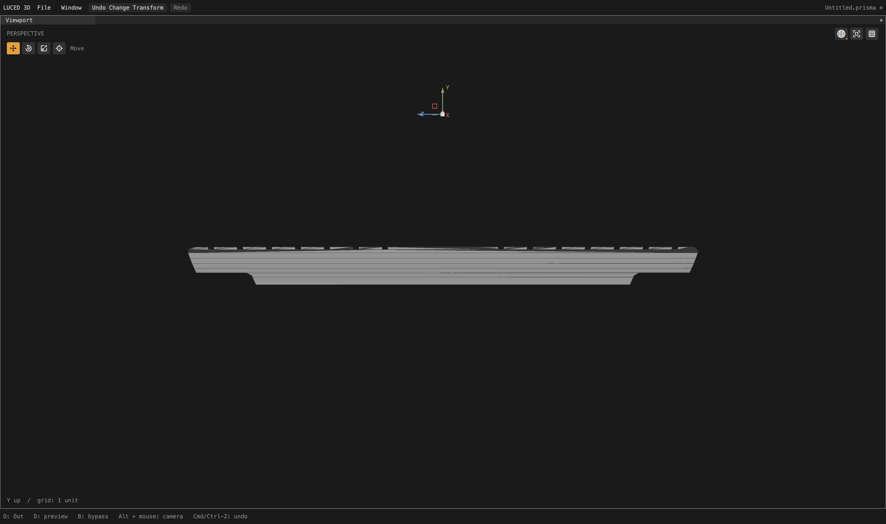
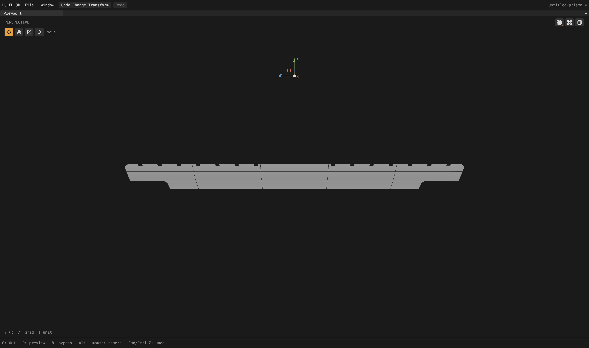
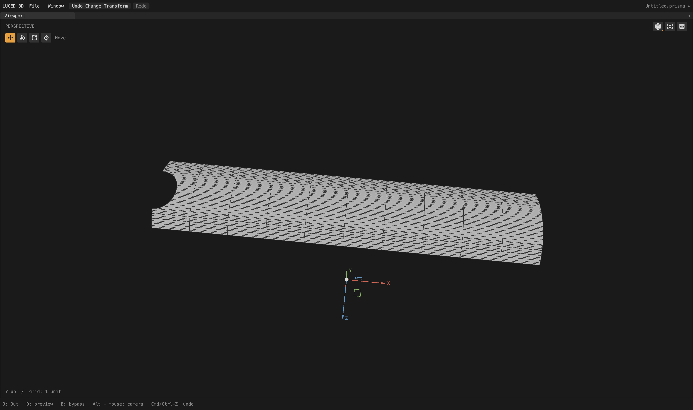

# Cut-chart ownership for notched extrusions

Local checkpoint after [import-uncertainty rail matching](CAD_IMPORT_UNCERTAINTY_RAILS_2026-09-28.md).
The tessellation goal remains active; crowded frame rows and other models'
documented import/projection/assembly failures are not resolved by this change.

## Two causes, two general corrections

Camera face 276 is a notched extrusion with 68 coedges and a 15 x 2 control
net (degrees 7 and 1). It has no four-logical-side mapping. It already falls
back to clipping, but its planner incorrectly leaves `cut_first` false. That
skips the existing physical-pitch and stopped-end policies for affine support
grids. It ends up with 10 U stations and just four V stations, including
guard/envelope rows, and emits many thin triangles along the notches.

Supported faces without four logical sides now own their clipped chart from
the beginning. No fixture names, face IDs or coordinates enter the policy.
Four-sided mapped patches and their periodic fallback rules remain unchanged.
Hard boundary cuts retain their canonical identities rather than becoming
mandatory interior rows. Curvature/error checks are not relaxed.

The broader correction initially exposed a separate numerical-incidence bug
on frame patch 2363. A canonical trim UV coordinate was 1.77e-12 from an
existing grid line. Clipping allocated an extra lifted grid vertex beside it;
the support point differed from the independently fitted canonical 3D point
by about 2e-5 source units, and the resulting five-corner cell could not be
triangulated consistently. The existing alignment pass refused to straighten
that corner because it prohibited an exactly zero turn.

Near-grid alignment now permits collinear, ordered vertices. It still rejects
orientation reversal, collapsed/backtracking segments, intersections and
pinched identities. Its existing incidence, physical movement and File/CAD
tolerance limits remain unchanged. Canonical 3D points and IDs never move.
This removes the spurious extra grid vertex before cell construction, not by
welding away a real boundary vertex or weakening display validation.

## Full-camera comparison

Divisions 16, edge size 0, file-authored tolerance. Native and C produce
identical quality records on all 2,710 patches. Thirteen records change, with
no changed mesher strategy, increased worst quad edge ratio, increased skew
count or folded-display flags.

| Measurement | Before | After |
| --- | ---: | ---: |
| Points | 710,009 | 711,080 |
| Polygons | 658,401 | 659,166 |
| Quads | 611,500 | 612,501 |
| Triangles | 3,453 | 3,204 |
| Boundary n-gons | 43,448 | 43,461 |
| Skewed-0.1 quads | 2,001 | 1,978 |
| Stretched-20 quads | 33,200 | 33,802 |
| Open / nonmanifold / inconsistent edges | 0 / 0 / 0 | 0 / 0 / 0 |
| Folded display flags | 0 | 0 |
| Euler characteristic | 46 | 46 |

The stretched-quad count rises because several extremely long cells become
multiple shorter cells that still exceed 20:1. This is not a universal quality
victory: those rows still need work. On changed strips the worst ratios improve
414 -> 138, 1,039 -> 346, 2,644 -> 264, 697 -> 232, and 1,609 -> 402.
Quad-only metrics also exclude boundary n-gons.

Target patch 276 improves from 23 quads + 249 triangles + 18 n-gons to 15 quads
+ 20 trim n-gons. Worst quad ratio is 12,998 -> 14.56; all 23 skew and stretch
flags disappear. Frame patch 2363 retains clipped cells (516 quads + 24 n-gons)
instead of taking the temporary 273-triangle fallback observed before the
incidence correction.

Actual display area is 65,662.52963611064; signed volume is
74,393.17765702853. Topology is checked on the assembled mesh, not isolated
patches. Reference STEP/OBJ files on Desktop remain read-only.

At 4,096 samples per direction, OBJ-to-STEP maximum distance remains 0.0259126
and mean squared distance is 4.62966e-6. STEP-to-OBJ reports maximum 0.0226694
and mean squared distance 3.87338e-6. The latter sample locations change with
mesh indexing; these are regression samples, not certified error bounds.

## Regression coverage and actual captures

- The notched-extrusion integration test covers swapped UV axes and reversed
  loops. It checks support positions, an empty notch, clipped-grid strategy,
  straight interior lines and bounded longitudinal spacing. Disabling cut-chart
  ownership makes the spacing assertion fail.
- 160 new alignment cases cover loop origin, axis swap, reversal, near-grid
  offsets, an offset outside the allowed incidence, and a proposal that would
  cause backtracking. Canonical positions and distinct trim IDs are retained.
  Restoring the old zero-turn rejection makes the contract fail.
- All 33 application groups and internal Base contracts pass on optimized
  native and C backends. Temporary tracing and negative mutations are removed.
- `sign`, `1p5inR` and `33mm_angle` still import and tessellate, retaining their
  previous counts of 6,841, 4,117 and 4,144 polygons respectively. This count
  check alone is not proof of bitwise geometry equality.

These are actual 4,400 x 2,604 native shaded-wire captures after a complete
background cook, then isolated by original CAD face ID. Patch 276 uses neutral
material, X rotation 90, yaw 1.57, pitch 0.3 and zoom 0.65. The pair has matched
framing; no image edits hide its geometry.

The frame capture uses X rotation 0, yaw 0.1, pitch 1.2 and zoom 0.65. It shows
the retained grid, but also the unresolved crowding in its curved row family.

Evidence under `/private/tmp`: `camera-cut-owner-aligned{,-c}.txt`,
`camera-cut-owner-aligned.obj`, `camera-cut-owner-aligned-topology.log`,
`cut-owner-verified-{native,c}.log`, `cut-owner-negative.log`,
`cut-owner-alignment-negative.log`, and `cut-owner-corpus.log`.

The app was rebuilt at 12:10:53 PDT on September 28 with these corrections;
its native GPU smoke test exits zero. Build/smoke logs are
`cut-owner-app-{build,smoke}.log`; the sampled comparison is
`camera-cut-owner-aligned-delta.log`. This is a local checkpoint, not a new
registry release.

Next: trace the competing curved-row phases on these frame strips, retain
only justified smooth continuation, and keep checking the hard-edge/trim cases
against the user's screenshots. The camera_2/car1/car2 blockers remain on the
goal; no general STEP compatibility claim is made here.
