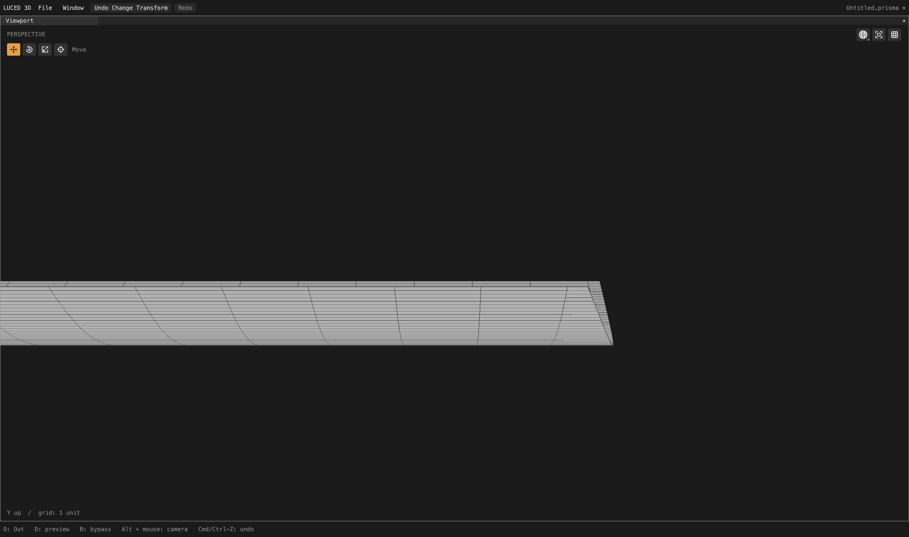
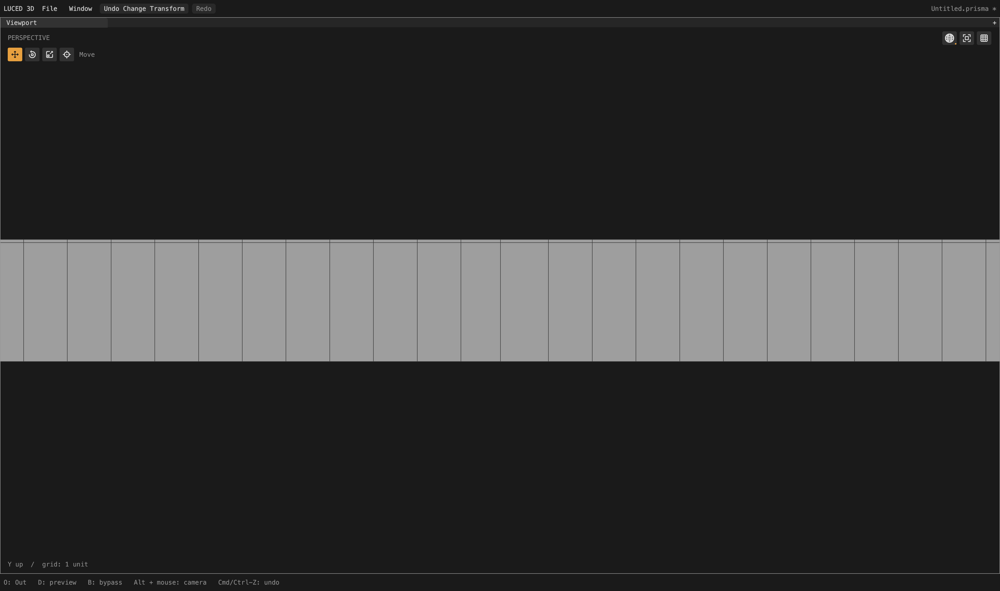

# Physical pitch without competing row phases

Verified local follow-up to the affine-extrusion endpoint checkpoint. The
camera audit remains active; the remaining 39 constrained patches and crowded
curved charts are not declared finished.

## Cause and retained policy

Removing the false oblique-end wedge on fillets 606/607 left rectangular but
extremely long quads: curvature needs many samples across the narrow fillet,
but a straight extrusion direction needs almost none for surface accuracy.
Shape quality therefore needs a separate physical-pitch decision.

`layout_pitch.lucb` only applies to the already proven affine control-net
structure (paired weights, two linear controls, constant translation). It
subdivides each existing straight interval evenly, targeting sixteen times
the mean sampled transverse pitch. It does not move existing rows or change
the curved station family. The complete proposal must fit both per-axis and
joint grid budgets; an over-budget proposal is skipped, not partly inserted.
This mean-pitch target is not a maximum-aspect guarantee on every trim cell.

The refined straight direction then owns its interior phase. Later seam cuts
may split an interval in its middle 40–60%, but a near-parallel competing row
does not extend across the patch. Its exact shared vertex remains a boundary
polygon corner. Curvature rows are not discarded, hard edges do not carry
unnecessary interior flow, and canonical stitching remains unchanged.

The existing independent-plane late-row gate also had a comparison error:
aggregating worst aspects over different transverse rows let an already skinny
cell excuse a newly damaged healthy cell. It now compares each rectangle with
its own split result. This removes the new 27.49:1 sliver in planes 421/422.

Rejected experiments: an 8× pitch target pushed four mapped neighbors into
constrained fallback; a 16× target without phase ownership introduced visibly
bent/bunched rows. Neither variant is retained. No fixture IDs or model names
occur in the production policy.

MoI's public mesh controls distinguish curvature sampling, absolute size and
aspect-oriented quad subdivision. That is a useful conceptual separation,
not evidence about MoI's internal meshing implementation.
[MoI mesh command reference](https://moi3d.com/4.0/docs/moi_command_reference11.htm).

## Full assembled camera

Divisions 16, edge size zero; native and C agree on all 2,710 quality records.

| Patches | Before | Retained result |
| --- | --- | --- |
| 606 / 607, each | 961 quads + 63 n-gons; worst edge ratio 294.56 / 294.55 | 18,004 quads + 1 triangle + 75 n-gons; worst ratio 16.88 |
| 605 / 608, each | 238 quads + 18 n-gons; worst ratio 53.35 | 4,249 quads + 263 n-gons; worst ratio 3.06 |
| 421 / 422, each | 13 quads + 3 n-gons; worst ratio 6.25 | 553 quads + 1 triangle + 13 n-gons; worst ratio 18.96 |

The main fillets retain opposite-edge ratios about 1.0002 and minimum corner
sines about 1. Their 961 stretched-20 quads each become zero. The neighboring
planes have no stretched-20/skewed-0.1 flags, but their worst cut-cell shape is
worse than the prior sparse result; this is not an across-the-board shape win.

- 676,348 points; 635,057 polygons = 590,250 quads + 9,867 triangles +
  34,940 n-gons. Increase: 43,730 polygons, approximately 7.4%.
- Zero boundary, nonmanifold, inconsistent-edge and folded-display flags;
  Euler characteristic 46. Strategies remain 2,208 mapped / 463 clipped /
  39 constrained. Stretched-20 total: 50,136 (was 52,534); skewed-0.1 total:
  2,093 (was 2,095).
- Only nine per-patch quality records change: 276, 419–422 and 605–608.
  Unchanged quality records do not prove identical ordered polygon coordinates;
  shared cuts can subdivide neighboring boundary polygons.
- Actual display area 65,662.60182819141; signed volume 74,393.2084306644.
- Fixed 4,096 OBJ-to-STEP samples: maximum 0.0259126, mean squared 4.68832e-6
  (previously 4.68831e-6). STEP-to-OBJ: maximum 0.0252179, mean squared
  4.54356e-6. The second direction's sample locations change with mesh indexing.
  These are sampled regression checks, not certified deviation bounds or a
  claim of improved surface accuracy.
- `sign`, `1p5inR` and `33mm_angle` have exactly identical exported vertices
  and faces to the preceding endpoint checkpoint; all pass closed-topology
  checks.

## Verification and cost

New Base contracts cover 60 scaled/swapped/reversed pitch cases, including
warped nets, finite extreme lengths, axis-budget and joint-grid-budget rejects;
42 late-phase admission cases; 48 endpoint/reconciliation cases with and
without pitch ownership; and six per-cell planar admission regressions.
Existing endpoint/control-net cases remain. The production integration test
adds a 40-unit obliquely trimmed extrusion and checks rectangular interior
aspect, exact support, iso-lines and two-sided canonical seam usage.

Negative tests confirm both fixes: restoring the old global-aspect comparison
fails `an unrelated skinny rectangle masked damage to a healthy row`; disabling
the production pitch-planner call fails the new extrusion's aspect assertion.
Both negative mutations were removed. Base contracts pass native optimization
levels 0–3 and C debug/release. All 28 application test groups pass on native
and C with the new production integration test.
The main `build/Luced 3D.app` was rebuilt with released Luce 0.8.18 and pinned
Base at 05:55:42 local on September 28; its native smoke test exits zero.

Matched full-camera shaded-wire orbit runs use 4,400 × 2,604 actual pixels,
300 callbacks after 35 warm-up frames. Mean callback time: 2.24785 ms before,
2.31234 ms after (about +0.0645 ms). Worst: 2.693 / 3.036 ms. Background
preparation: 11.3438 / 11.9158 seconds. These single paired runs measure frame
callbacks, not GPU completion or input-to-display latency, and are not a
statistical benchmark. No compiler, GPU, UI or luced-2d edits in this checkpoint.

## Native shaded-wire inspection

These are actual 4,400 × 2,604 native frames, isolated after the complete
production cook. Neutral material; model X rotation and yaw zero.
606 uses pitch -0.78, zoom 0.018, target (49.85, -8.62, 2.3); 421 uses pitch 0,
zoom 0.03, target (15.2, -8.3, 2.15). The first capture matches the preceding
endpoint report's camera. These local views do not certify the whole model.

Evidence in `/private/tmp`: `camera-physical-pitch-{paired.txt,final-c.txt,
final.obj,final-topology.log,final-delta.log}`, `camera-pitch-{baseline,final}-orbit.log`,
`physical-pitch-integration-final-{native,c}.log`, `physical-pitch-final-contract-*.log`,
`physical-pitch-final-c-debug.log`, `cad-pitch-negative.log` and
`pitch-integration-negative.log`. This kernel checkpoint is local, not a new
registry release.
