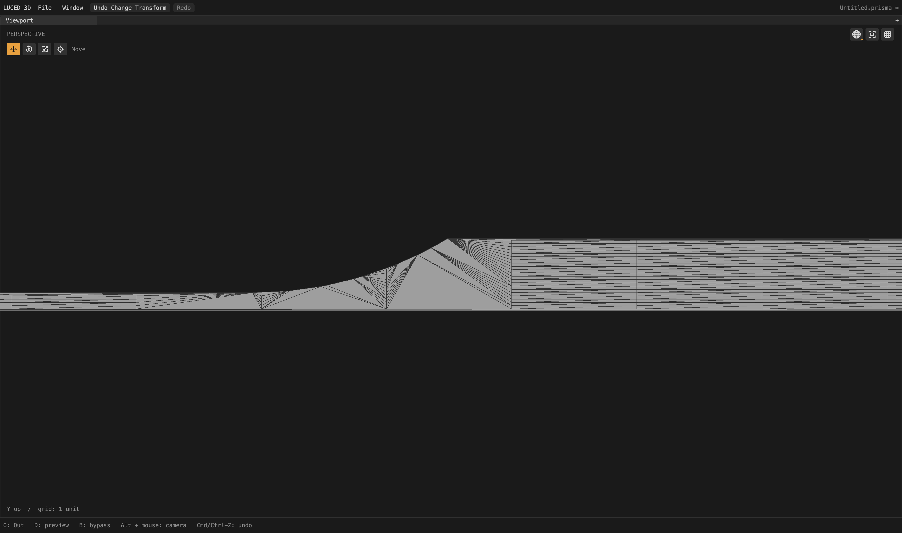
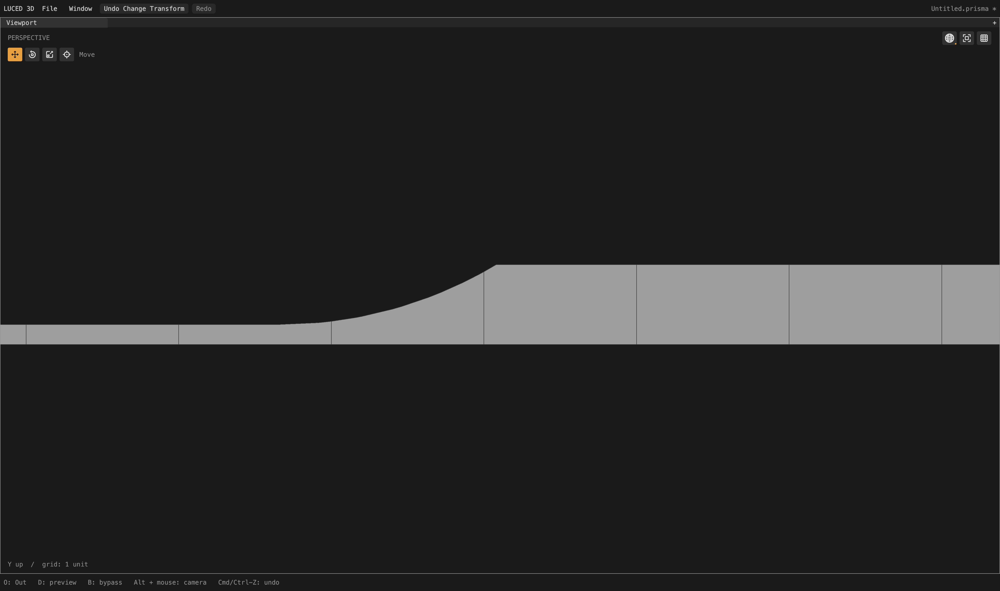
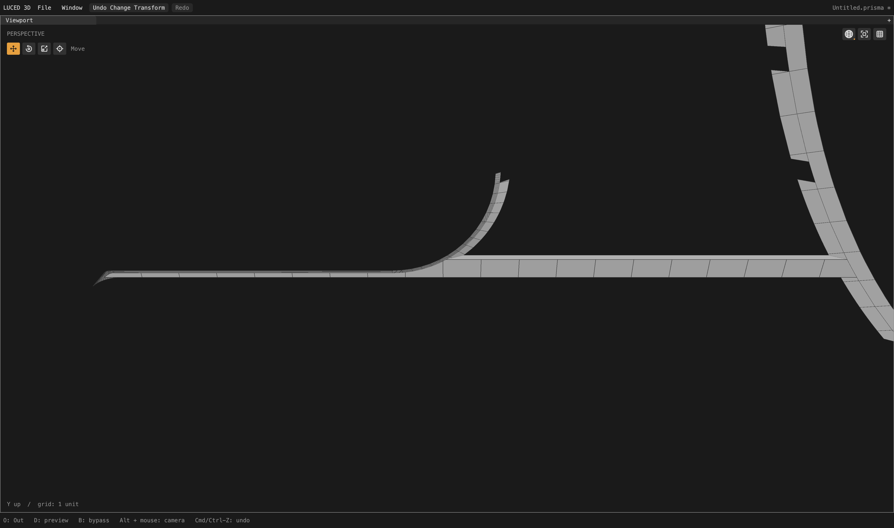
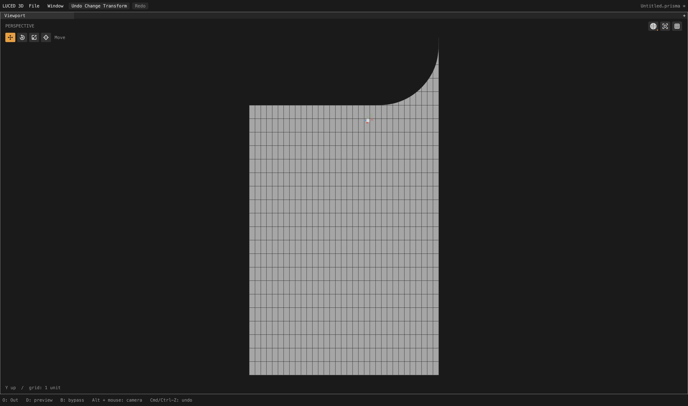

# Planar map preflight and cut ribbons

Verified local checkpoint following physical pitch. This removes the fan
fallback from twelve planar camera patches; 27 constrained patches and the
broader spacing audit remain unfinished.

## Cause and changes

Ledges 334/336/361/363 each have six authored edges but four recognized logical
corners. Planning therefore skipped a clipped layout. The fitted Coons grids
subsequently folded, and the canonical-grid retry had incompatible boundary
counts. At that point shared edge cuts were frozen, so only constrained
triangles remained available. This was not a failure of the Boolean clipper:
it had never been prepared for these faces.

`planar_preflight.lucb` runs the actual mapped mesher on the current face-owned
stations while shared cuts remain mutable. It uses compact temporary samples,
preserves canonical endpoint identity and does not mutate rows. Only a rejected
planar candidate prepares a clipped grid. Successful maps retain their original
strategy. There is no second, approximate Coons-validity test or fixture-specific
face list in production code.

The initial result exposed two frame planes with valid but extremely thin
trim ribbons: one measured 0.04242424 × 5.96047e-9 source units. Their cause was
an almost coincident support-grid line and exact trim, not missing geometry.
`clipped_slivers.lucb` optionally dissolves the internal side of a planar,
boundary-adjacent cell whose chart area/longest-edge ratio is at most 5% of
model tolerance. The existing simple-union guards require exactly one shared
side, two shared vertices, at most 256 union corners and a cell no larger than
one eighth of its neighbor. At most 32 dissolves run per patch. Every point and
canonical boundary edge stays intact, and lifted display validation still runs.
Curved surfaces do not use this optional planar cleanup.

This is a real polygon union, not hidden wire edges. It retains Boolean-trim
corners while avoiding a redundant parallel interior edge. It does not certify
optimal aspect ratios for all resulting n-gons.

## Assembled camera results

Divisions 16, edge size zero. Native and C match on all 2,710 quality records.

| Patch | Before | After |
| --- | --- | --- |
| 334 | 3 quads + 712 triangles | 5 quads + 15 n-gons |
| 361 | 2 quads + 737 triangles | 5 quads + 15 n-gons |
| 336 | 6 quads + 607 triangles | 16 n-gons |
| 363 | 1 quad + 454 triangles | 16 n-gons |
| 2287 / 2323, each | 611 quads + 140 triangles | 639 quads + 40 n-gons |

Both narrow ledge planes have maximum quad edge ratio 7.63 and right-angle
corners. Planes 2287/2323 have maximum ratio 2.36, no stretched-20/skewed-0.1
quads and no triangles. Their rejected intermediate clipped result had ratio
7.1 million; that version is not in the app. The other six converted frame
planes are 2320, 2321, 2324, 2330, 2332 and 2337.

- 676,674 points; 632,814 polygons: 590,918 quads, 6,480 triangles and
  35,416 n-gons. Versus the preceding checkpoint: 2,243 fewer polygons and
  3,387 fewer triangles.
- Strategies: 2,208 mapped / 475 clipped / 27 constrained (previously
  2,208 / 463 / 39).
- Zero boundary, nonmanifold, inconsistent-edge and folded-display flags;
  Euler characteristic 46. Actual display area 65,662.6017720253; signed
  volume 74,393.20844575767.
- Stretched-20 quad total: 49,994 (was 50,136); skewed-0.1: 2,089 (was 2,093).
  No patch gains either flag. Seventy quality records change. These quad-only
  counts do not measure every n-gon's shape and are not a complete certificate.
- Fixed 4,096 OBJ-to-STEP samples: maximum 0.0259126, mean squared 4.68832e-6,
  unchanged at printed precision. STEP-to-OBJ: maximum 0.0258055, mean squared
  4.20894e-6; those sample locations change with mesh indexing, so the latter
  is not a paired accuracy improvement. Neither direction is a certified bound.
- `sign`, `1p5inR` and `33mm_angle`: exact exported vertex/face equality with
  the preceding physical-pitch checkpoint, plus passing closed-topology audits.

## Regression gates

Base adds 48 planar preflight cases (scales, rotations, swapped charts,
winding, valid versus concave maps) and 36 ribbon cases (scale, winding,
thickness and boundary eligibility). They check unchanged stations/positions,
preserved real trim edges, exact area and correctly oriented display triangles.
The application adds 24 four-logical-corner concave-plane cases, including
split authored sides; all require actual clipped strategy, retained CAD
vertices, correct area/winding and an empty concave notch.

Disabling the production preflight call makes the new integration case fail
its strategy assertion. The negative mutation and diagnostic traces were
removed. Full application suites pass all 28 groups on native and C. Base
contracts pass native optimization levels 0–3 and C debug/release. Main app
rebuilt with released Luce 0.8.18 and pinned Base at 06:11:56 local on September
28; native smoke exits zero. No GPU, UI, compiler or luced-2d edits.

The full-camera shaded-wire orbit check (4,400 × 2,604, 300 callbacks after
35 warm-up frames) averaged 2.25277 ms, worst 3.019 ms; background preparation
took 11.9314 seconds. The preceding physical-pitch run with the same view
settings averaged 2.31234 ms, worst 3.036 ms, with 11.9158-second preparation.
These single-run callback measurements show no observed large regression;
they do not measure GPU completion or input-to-display latency and are not a
statistical speedup claim. Log: `/private/tmp/camera-planar-cut-orbit.log`.

## Native visual inspection

All images are real 4,400 × 2,604 native shaded-wire frames, with neutral
material and patch isolation only after the full production cook. The matched
334 detail uses X rotation/yaw/pitch zero, zoom 0.12 and target
(13.55, -4.99, 2.25). The neighboring-patch image uses pitch 0.45 and target
(13.55, -5, 2.25). Frame plane 2287 uses yaw pi/2, pitch zero, zoom 0.65 and
the automatic isolated bounds center.

Evidence in `/private/tmp`: `camera-planar-{coalesce.txt,cut-c.txt,cut.obj,
cut-topology.log,cut-delta.log}`, `planar-cut-tests-final-{native,c}.log`,
`planar-cut-contract-*.log`, `planar-preflight-negative.log` and
`planar-cut-app-{build,smoke}.log`. Source traces used for diagnosis are in
`camera-plane-mapping-trace.txt` and `camera-preflight-stations.txt`; production
contains no tracing. This is a local checkpoint, not a new registry release.
