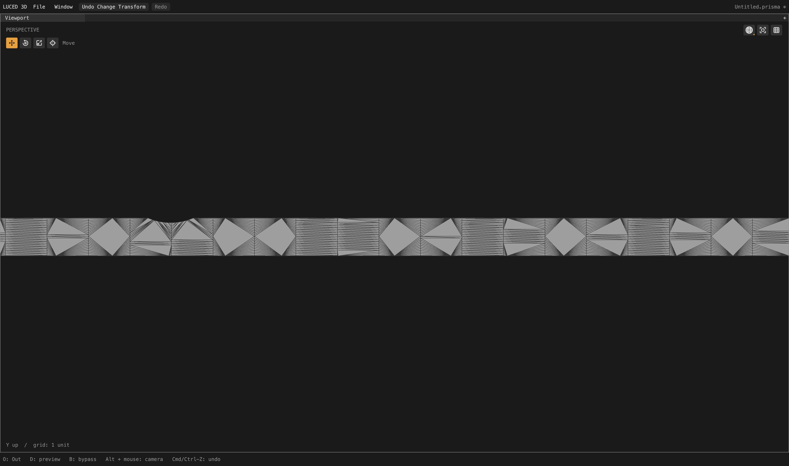
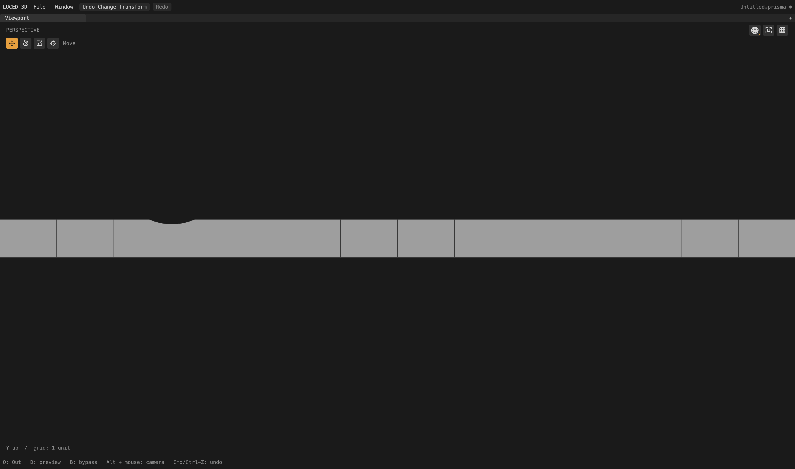
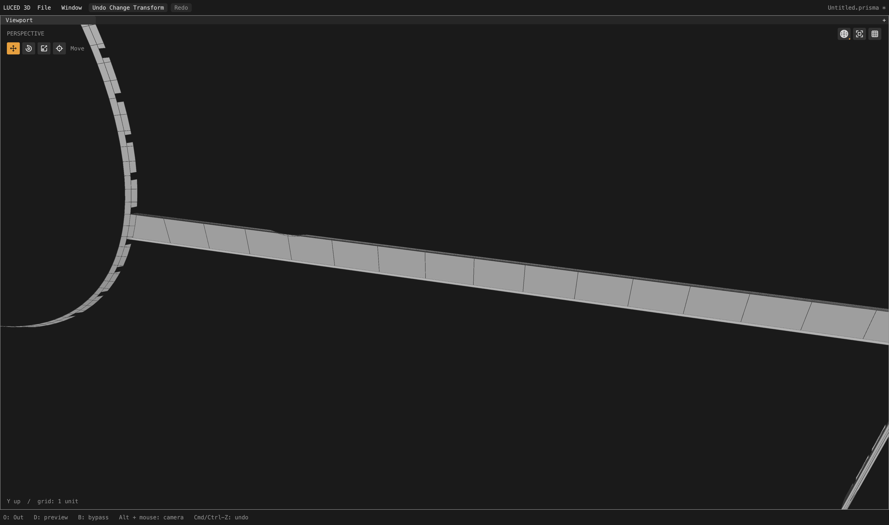

# Shallow crossings and independent planar strips

Local checkpoint after the anisotropic-grid change; not yet a package release.
The camera is not pristine. This pass removes another specific fallback cause
and avoids unnecessarily thin quads on independent narrow planes.

## Cause and changes

Four planar strips (421, 422, 427, 435) were failing UV-cell triangulation and
falling back to dense diamond/fan patterns. The polygon rejection was correct:
the input cells really crossed themselves. A curved trim crossed a grid side by
roughly 4e-8 to 9e-8 chart units near its extremum, but the intersection planner
used the much larger **row-spacing epsilon** to decide whether it crossed at all.
It skipped the two roots and passed an unsplit boundary through that cell side.

`trim_layout.reconcile` now uses incidence-scale precision
`max(1e-13, plan.epsilon*1e-5)` for that decision. The root solver, physical
duplicate guards, canonical shared-edge identities and fitting tolerance are
unchanged. No trim is flattened, no corner is welded away, and the polygon
triangulator's validity checks are not loosened.

Once clipping succeeded, equal U/V interval counts still made the long planar
strips unnecessarily thin. Independent planar charts whose extent ratio exceeds
4:1 now use axis counts proportional to their physical spans. Their orthonormal
charts make that a physical pitch calculation. Compact planes and charts with
inherited smooth-flow rails keep their prior density policy. Curvature/explicit
edge-size refinement still runs after this initial support fill.

A broader experiment applying proportional counts to all planes was rejected:
it reduced total polygons but worsened the already constrained ledge 796 and
several compact clipped patches. The retained rule does not change ledge 796,
the four frame-corner records, or the four previously corrected lens bands.

## Camera results

Same production full-model cook, divisions 16, edge size 0. Patch isolation for
captures occurs **after** the full cook; it does not alter shared planning.

| Patch | Before: quads / triangles / n-gons | After | Remaining limitation |
|---|---:|---:|---|
| 427 | 42 / 959 / 0 | 13 / 0 / 3 | Clean captured strip; boundary samples stay in cut polygons |
| 435 | 41 / 959 / 0 | 13 / 0 / 3 | Same counts and shape metrics as 427 |
| 421 | 6 / 939 / 0 | 286 / 1 / 6 | Still 267 stretched-20 quads; inherited rows need a separate spacing solution |
| 422 | 6 / 943 / 0 | 286 / 1 / 6 | Same spacing limitation as 421 |

Patch 427/435 quads have maximum edge ratio 1.48415, opposite-edge ratio 1 and
minimum corner sine 1. The tiny notch is retained, not replaced with a straight
border. Other independent planar regions change too: 194 of 2,710 camera quality
records differ from the previous checkpoint, including effects on shared edges.
Patch 180 is now 12 quads / 2 triangles / 14 cut polygons, with two skewed cut
quads; it is not an all-quality improvement at every individual cell.

Whole camera:

- 638,209 points; **597,826 polygons** (previously 618,384): 553,213 quads,
  9,882 triangles, 34,731 n-gons.
- 2,208 local-mapped, 463 clipped and 39 constrained patches.
- Zero boundary, nonmanifold or inconsistent edges; Euler characteristic 46.
  Zero folded-display/normal flags across all patches.
- Stretched-20 quad count 53,233 (previously 53,447); skewed-0.1 count 2,105
  (previously 2,104). These counts exclude n-gons and are not a full quality proof.
- Actual retained display-triangle area 65,662.5855933463;
  signed volume 74,393.21233186126.
- Native and C quality records agree exactly for all 2,710 patches.
- Observed native cooks about 8.6–9.4 s while other checks ran. This is not a
  controlled performance benchmark or a claim about GPU frame latency.

Fixed 4,096 OBJ-to-STEP samples: maximum **0.0259126**, unchanged;
mean squared distance 4.68814e-6 (previously 4.68863e-6).
STEP-to-OBJ: maximum 0.0267139, mean squared 4.99364e-6. That direction's sample
locations depend on the generated mesh, so it is not a like-for-like improvement
measurement. Neither sampled metric is a certified surface-error bound.

`sign.step`, `1p5inR.step` and `33mm_angle.step` retain identical vertex and face
dumps to the preceding checkpoint, with zero topology flags.

## Native shaded-wire inspection

All three captures are 4,400 × 2,604 actual pixels, using real polygon edges.
The first two use identical camera settings; the last shows the selected patch
plus its directly stitched neighboring CAD patches, not the entire camera.
No wire edges were hidden to obtain the result.

The strip's large interior is visibly cleaner. Adjacent curved/slender faces and
the inherited-row strips still need quality work. Missing distant surfaces in
the neighborhood capture are the explicit diagnostic subset, not failed faces.

## Verification

- New pure Base intersection contract: twelve shallow circular-crossing cases
  across three offsets, reversed winding and a rotated chart; verifies both
  roots, unchanged trim points, successful clipping, signed triangles and area.
  Reinstating the old row epsilon makes the root-registration assertion fail.
- Eight application-facing planar-spacing cases: two strip lengths, both chart
  orientations and both windings; clipping strategy, bounded quad aspect/count,
  unchanged authored corners, area, normals and positive/negative trim picking.
  Disabling the physical-count rule fails the aspect assertion.
- Full native opt-2 and C-release suites: **28 PASS groups each**.
- Standalone Base layout contracts: native opt-0/1/2/3 and C-debug/release passed.
- Released Luce 0.8.18, pinned Base toolchain; `luc build --release` 19 s;
  native main-app `--smoke` exit 0. Latest binary is
  `build/Luced 3D.app/Contents/MacOS/luced-3d`.

All temporary diagnostics and negative-control switches are removed. Neither
desktop models nor generated OBJ files were added to the repository.

Local evidence: `/private/tmp/camera-strip-final-{c.txt,topology.log,delta.log,obj}`,
`/private/tmp/camera-strip-narrow.txt`,
`/private/tmp/strip-final-{native,c}.log`,
`/private/tmp/strip-incidence-negative.log`,
`/private/tmp/strip-spacing-{negative,restored}.log`, and
`/private/tmp/luced-strip-final-{build,smoke}.log`.

## Next

Continue auditing the remaining 39 constrained patches and the admitted-flow
strips 421/422. In particular, distinguish true crossing failures from suppressed
root insertion, incompatible rail propagation and merely bad physical spacing.
Do not globally lower tolerances or reduce inherited row counts to chase a lower
polygon total. Camera 796 and its neighbors remain dense; frame seam phases and
first-row spacing are still unfinished. Broader camera/car failures remain open.
