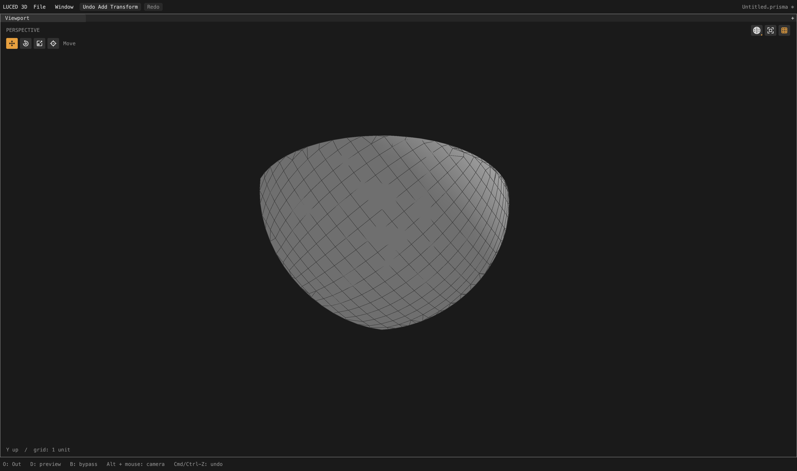

# Density-independent spherical chart fitting

This local checkpoint gets **car2 through a complete 5,015-face cook with an
explicit File tolerance of 0.000025**. It does not establish acceptable car
quality, default-tolerance compatibility, or good performance. The goal remains
active. No default tolerance, user project or Desktop reference was changed.

## Two independent causes

### Stranded polygon ears

Testing car2 at a larger explicit tolerance of 0.0001 exposed a legitimate
seven-corner UV polygon rejected by the generic polygon renderer. Greedy ear
clipping consumed the wide part and stranded the sampled, almost straight trim
chain. A tiny positive turn was enough to choose that path, but the remainder
could not meet the existing area threshold.

`luce-3d` now retries the **original entire polygon**, only on an ear-clipping
stall. A bounded dynamic-programming partition uses visible diagonals and
positive, conditioned triangles. Crossed/touching projected boundaries remain
invalid. The exceptional path is capped at 256 corners with cubic work; the
ordinary ear path is unchanged. No boundary point is moved, merged, omitted or
added, and the caller's area threshold remains unchanged.

This corrects the reproduced polygon defect, **not the whole tire patch**.
Car2 face 1 at tolerance 0.0001 still rejects: the mapped alternative cannot
find support-consistent display triangles, and the other fallback contains a
different nonplanar polygon problem. A larger tolerance is not a universal fix.

### Density-weighted sphere direction

With explicit tolerance 0.000025, car2 previously stopped at face 1772,
`Car/ShellRear`: a spherical fillet with a retraced authored seam. The chart
direction was the average of all sampled boundary directions. Unequal sampling
density biased that average enough to reject a domain which fits a hemisphere.

When the existing average fails, `luce-cad` now performs a bounded convex-hull
closest-point iteration to find a different separating direction. Every result
must still pass the **same 0.05-radius open-hemisphere margin for every sample**.
Genuinely antipodal domains still fail. The sphere, canonical boundary positions,
IDs, File tolerance and seam constraints are unchanged. Already accepted charts
retain their previous basis.

## Results

- Planned face 1772: **377 points, 288 quads, 89 triangles**, no n-gons,
  87 open patch-boundary edges, zero nonmanifold/inconsistent edges, Euler 1.
  Zero stretched-20/skewed-0.1 quads or folded-display flags; maximum edge ratio
  7.7174. Native/C patch-quality records are identical.
- Full car2: **4,118,090 polygons** — 3,376,547 quads, 629,258 triangles and
  112,285 n-gons. All 5,015 native/C patch-quality records are identical.
  One observed native cook took 93.29 seconds while other tests were running;
  this is not a controlled performance benchmark.
- Full assembled topology: **3,893,856 points**, zero open, nonmanifold or
  inconsistent edges, Euler characteristic 88. Actual renderer triangles give
  area 91.33241824900787 and signed volume 3.3950178152264052 in source units.
  Closed topology is not proof of good shape/deviation or support orientation.
- Full-car quality is **not approved**: 556,623 stretched-20 quads,
  179,774 skewed-0.1 quads and **96,268 folded-display triangle flags**.
  Tire bands account for many flags and need a separate support/deviation audit.
- Original camera: all **2,710 patch-quality records exactly unchanged** from
  the count-feasibility checkpoint, after both fixes.
- Source-default car2 tolerance remains 0.00001: the earlier face-1307
  projection mismatch is not silently accepted. Explicit 0.000011 reaches
  face 1408, where residual 0.0000239111 exceeds that setting.
- Car1's repeated-assembly-instance limitation remains unresolved.

## Native visual check

Actual 4,400 × 2,604 shaded-wire frame of the planned patch, exported with corner
normals and reopened through the application OBJ path. This patch contains only
triangles/quads, so no custom n-gon display triangulation is lost in that route.
The full shared CAD plan was used; this is not an independently sampled preview.

The patch is now present and has useful interior quads. Its tiny world-space
size (radius about 0.005) still exposes **interrupted wire visibility near the
center** at this close zoom, despite the earlier slope-depth improvement. The
capture is not evidence of pristine wire rendering. Retained/camera-relative
precision needs further investigation. No wire edges were hidden for the image.

The **whole-car background viewport capture timed out after 300 seconds**;
no full-car image was produced. It must not be reported as a successful UI cook
just because the headless mesh succeeds. A one-second stack sample at about
259 seconds shows all four face workers still active in projection, clipped
meshing, refinement and repeated `TriangleIndex` construction on intermediate
meshes. The UI thread is running/presenting, often waiting for Metal completion.
This is a useful profiling lead, not a measured attribution of the entire delay.
The comparison process was running concurrently. Logs/sample:
`/private/tmp/car2-cap-full-wire.log`, `/private/tmp/car2-cap-preview.sample`.

## Reference units and surface samples

Car2's STEP declares `SI_UNIT($,.METRE.)`; the supplied OBJ has corresponding
coordinates 1,000 times larger (for example 950 rather than 0.95). The first
unscaled comparison is invalid as a tessellation-error measure.
`tools/surface_delta.py` now accepts an explicit fourth positional argument for
the OBJ-to-STEP unit scale. It scales query coordinates/distances, without
copying millions of mesh faces, modifying either file, or fitting an alignment.
For this pair the diagnostic uses **0.001**. All distances are in STEP meters.

There are 4,096 deterministic samples in each direction, including vertices and
display-triangle centroids; this is not an analytic or Hausdorff certificate.
The OBJ contains 5,578,454 polygons. Results are recorded in
`/private/tmp/car2-cap-surface-delta-units.log`.

| Direction | Sampled maximum (meters) | Mean squared distance (meters²) |
| --- | ---: | ---: |
| STEP mesh → OBJ | 0.000178794 | 1.93727e-10 |
| OBJ → STEP mesh | 0.00172794 | 3.38859e-9 |

The largest reverse sample is near tire face 154. These measured mesh-to-mesh
errors are separate from the File node's curve/support agreement tolerance.
The tire region, its support normals and adaptive refinement need further work.

## Regression evidence

- 378 synthetic polygon cases: three scales, three rigid poses, both windings,
  all seven starts, and three signed/zero boundary perturbations. Every original
  boundary interval appears once, interior diagonals twice with opposite use,
  positions/corner order stay exact, and area/winding remain valid.
- 96 allocation-failure injection stages for the new polygon fallback, with
  no retained allocations. Base and Luce consumer suites pass all six compiled
  modes (native optimization 0–3 and C debug/release).
- 48 spherical chart cases vary scale, frame, boundary density and traversal.
  All exact support/boundary checks pass; all 48 biased-antipodal controls reject.
- Separate negative-control copies fail when the new polygon fallback or sphere
  fit is disabled. Production sources retain both fixes, with no trace logging.
- Final application suites: **33 PASS groups native opt-2 and 33 PASS groups C**.

Evidence is local in `/private/tmp/polygon-partition-*`,
`/private/tmp/spherical-cap-*`, `/private/tmp/car2-face1772-cap*`,
`/private/tmp/car2-cap-*`, and `/private/tmp/camera-spherical-cap*`.
No package has been published for this checkpoint.

## Application checkpoint

`build/Luced 3D.app` rebuilt at **14:18:24 PDT** with released Luce 0.8.18.
The actual native GPU `--smoke` test exited 0. Logs are
`/private/tmp/spherical-cap-app-{build,smoke}.log`.
