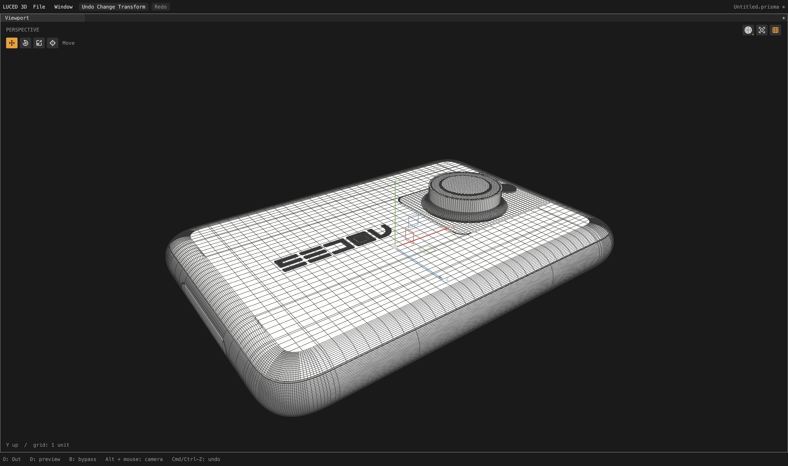
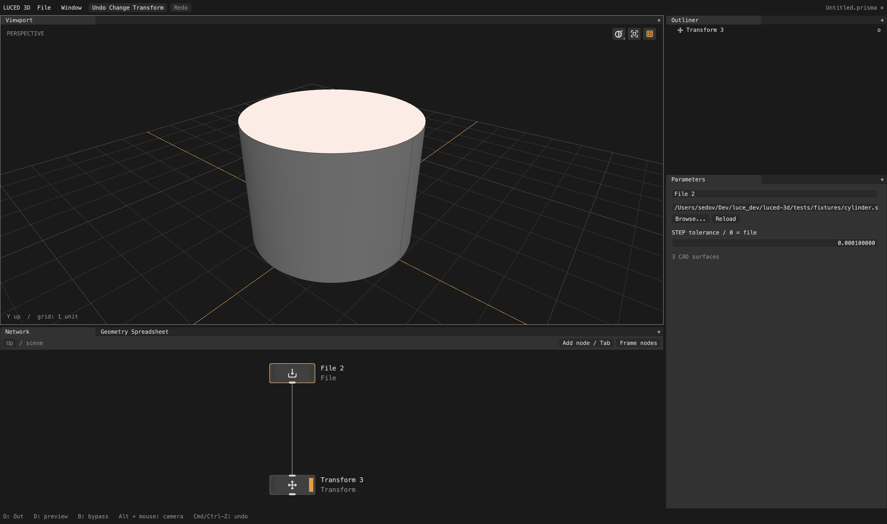
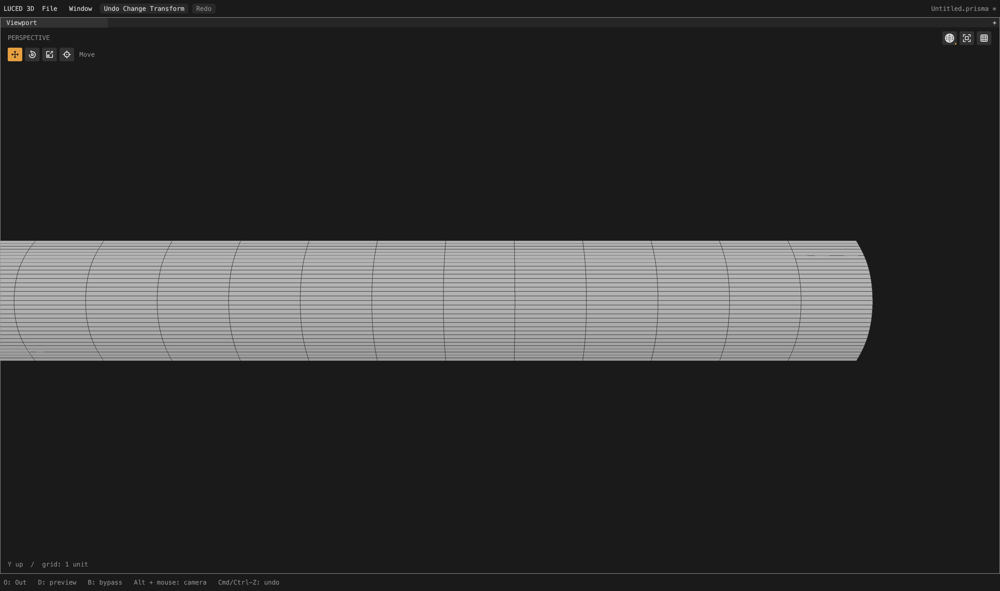

# CAD tessellation reference

How STEP B-rep faces become polygons in luced-3d: the pipeline, the rules the
mesher keeps, the heuristics it uses, how to probe a model, and what is known
not to work. This is a maintained reference; update it with the code.



## Contents

- [Ownership](#ownership)
- [Pipeline](#pipeline)
- [Invariants](#invariants)
- [Edge sampling](#edge-sampling)
- [Charts and seams](#charts-and-seams)
- [Trims and predicates](#trims-and-predicates)
- [Layout: rows, pitch and feasibility](#layout-rows-pitch-and-feasibility)
- [Mapped and clipped patches](#mapped-and-clipped-patches)
- [Slivers, merges and dissolves](#slivers-merges-and-dissolves)
- [Display triangles, normals and wire depth](#display-triangles-normals-and-wire-depth)
- [Tolerances and import uncertainty](#tolerances-and-import-uncertainty)
- [Limits and budgets](#limits-and-budgets)
- [Validation and probing](#validation-and-probing)
- [Known limitations](#known-limitations)
- [References](#references)

## Ownership

| Package | Owns |
| --- | --- |
| `luce-step` | Bounded Part 21 scanner, entity lookup, placements, rational curve/surface data, vertex/edge identity, oriented uses, face bounds, colors and assembly paths. `Step.load_model` / `decode_model` return analytic CAD; tessellate it with `CadModel.tessellate`. |
| `luce-cad` | Format-independent B-rep topology, support validation, one discretization per shared edge, layout planning, seam classification, per-face meshing strategies and assembly. Its `luce_cad/tessellation/` modules (exported as `tessellation`) own rational NURBS evaluation, UV trim triangulation, trim predicates, grid insertion, cell clipping (`TrimGrid`), interior improvement and quad recombination, with no STEP, CAD topology or UI policy. |
| `luce-3d` | Immutable geocore `Mesh`, retained per-face display triangles, polygon triangulation/partition, distance and ray queries, `DissolveWorkspace`, rendering. |
| `luced-3d` | File/Tessellate nodes, the File STEP-tolerance option, background cooking, preview caches and the diagnostic tools under `tools/`. |

All runtime code is original Luce Base. OCCT, Gmsh, Blender, CGAL and the papers
below were studied, not linked or copied. Python files are development tools.

## Pipeline

File outputs analytic CAD, never polygons. The explicit **Tessellate** node is the
only CAD-to-polygon conversion in the DAG. CAD-only outputs still display through
a disposable per-patch preview (`CadModel.preview`, meshing every face's
`preview_face` on luce-cad's worker pool and batching them in face order; cached
in `CadPreview`), drawn with deduplicated analytic patch boundaries; preview
failures report their count and keep boundary curves.

A full tessellation (`CadModel.tessellate(segments, edge_size)`) runs:

1. **Shared edge sampling.** Every B-rep edge is sampled once, by physical arc
   length and curvature, and all incident faces reuse its point IDs.
2. **Planning.** Per face: choose a chart, build
   curvature/size rows (`layout_rows`, `layout_density`, `layout_pitch`), classify
   seams (`seam_flow`), transport rows only through eligible seams
   (`layout_balance`), reconcile opposite logical-side counts (`layout_counts`,
   `layout_feasibility`), intersect grid lines with trims (`trim_layout`) and
   register every exact curve/grid root as a canonical station. Shared cuts are
   frozen before canonical vertices are allocated. Row setup and chart seeding
   run per face on the worker pool; reconcile and balance stay Gauss-Seidel
   over faces in source order, reusing an exact per-face memo of NURBS
   inversions and crossing roots that a parallel pass fills first, and
   skipping faces whose inputs did not change. Output is independent of the
   core count.
3. **Face jobs.** The pool's workers (models with at least 16 faces) mesh
   independent faces from the frozen plans. Each owns scratch and temporaries;
   shared samples are immutable. Results merge in source-face order, so output is
   deterministic. After a failure, no new jobs start; earlier in-flight jobs
   join and the first failing face in source order is reported. No partial mesh
   is assembled.
4. **Strategy per face** (`patch_dispatch`, transactional): local mapped rows,
   support-grid clipping, canonical rows, constrained fallback, baseline plus
   conformity. A rejected strategy rewinds scratch before the next is tried; final
   triangulation validation happens inside that transaction. The primitive
   attribute `cad_mesher` records which one succeeded (1 local rows, 2 clipping,
   3 canonical rows, 4 constrained fallback, 5 baseline plus conformity).
5. **Lifting and validation.** UV results lift onto exact support surfaces.
   Display triangles are checked against analytic corner normals and a sampled
   support-deviation budget.
6. **Output attributes.** Primitive `cad_face` (source face), optional primitive
   RGB `Cd` (STEP styles; explicit face styles override inherited ones), corner
   `N` from rational first derivatives or exact analytic normals, `cad_mesher`,
   `cad_trim_grid` (clipped-grid provenance) and `cad_flow_island` (minimum local
   face ID of a compatible-flow island). Transforms inverse-transpose `N`;
   geometry-changing edits invalidate it.
   On request (`tessellate(..., curvature=true)`, off by default) corner
   `curvature.k1`/`curvature.k2` hold the support's principal curvatures and
   `curvature.d1`/`d2` their directions. `N` and curvature are per corner, so
   polygons of two B-rep faces meeting at a seam keep each face's own values.

Density controls belong to Tessellate: divisions and a target edge length (0 off;
positive values are desired source-unit spacing, **not** a minimum edge length
or a maximum). Import tolerance belongs to File and never changes density.

## Invariants

These hold for every strategy. A change that breaks one is a regression even if
the wireframe looks cleaner.

- **Shared boundaries use identical point IDs**, never independent samples
  followed by approximate welding. Closed periodic seams share IDs too.
  Already-connected CAD topology stitches automatically; disconnected or
  defective shells are not healed.
- **Canonical CAD vertices and trim geometry never move or merge.** Equal
  coordinates alone never authorize merging two vertices; unrelated nearby
  vertices are never welded. Output points evaluate the exact retained curves and
  surfaces.
- **Every clipped input trim segment appears exactly once in the output and every
  interior edge exactly twice.** An omitted boundary or open interior rejects
  the strategy.
- **Share a boundary without necessarily sharing an interior grid.** A canonical
  seam station that is unsuitable as an interior row becomes a boundary polygon
  corner, not a row through the neighbor.
- **No fixture special cases.** No face IDs, object names, model names or
  coordinates occur in production rules; diagnostic IDs belong in tests and
  probe output only.
- **Unsupported input fails loudly.** Unsupported topology and failed faces
  raise errors naming the face or entity; faces are never silently dropped,
  OBJ references are never substituted, tolerances are never inflated to pass.
- **Wires are never hidden** to make a mesh look clean, and display diagonals are
  never promoted to modeling edges.
- **Acceptance is not "more quads".** Preserve exact trim boundaries, surface
  error and watertight topology first; then improve physical spacing and element
  shape. Zero normal flags, fewer fallbacks or a lower polygon count are not
  quality certificates.

## Edge sampling

- `curve_spacing` measures physical arc length once per shared edge. Extra
  intervals on a compound logical side go to its largest physical pitch.
- Spline rows use approximately equal arc length when the sampled chord/turn
  tests accept it; otherwise parameter spacing is kept. At the sample cap an
  alternative distribution is allowed only if its sampled chord error and turn
  are no worse. These are sampled checks, not certified deflection bounds.
- Trimmed parameters are clamped for roundoff **before** periodic wrapping:
  `angle + sweep * fraction` can exceed the last knot by a few ulps and must not
  be mistaken for a seam crossing. Genuine seam-crossing intervals still wrap.
  Trimmed spline-edge intervals are recovered from topology endpoints.
- A closed isocurve's endpoint chord is zero; curvature planning uses a sampled
  extent instead (also for nearly closed isocurves when choosing deflection scale).
- `edge_sampling` uses a bounded bracket search for repeated seams: exactly two
  opposite, oppositely oriented uses of an edge in one single-loop four-coedge
  face, used by no other face. Every returned count passes the original chord and
  angle checks. Other edges keep the dyadic family. Compacting all shared-edge
  counts globally was rejected: it changed shared phases and damaged neighbors.
- Curved patch outlines in preview use 64 samples.

## Charts and seams

- **Continuous branches.** `trim_chains.initialize` carries the projection seed
  between cylinder and cone coedges whether or not an edge repeats; holes start
  in the outer loop's angular chart; refreshing a shared chain keeps its branch.
  Without this, neighbors pick different angular branches and produce fictitious
  long chords across the chart.
- **Repeated-seam loops** project in topological order, retry endpoint branches,
  reject jumps across a closed axis and keep the chosen chart when stations are
  added. A canonical 3D vertex may have two valid images on opposite sides of a
  cut 2D chart; only verified periodic images are separated, and same-image
  pinched vertices keep their explicit identity.
- **Retraced seams.** Reversed coincident segments in one loop are accepted only
  when chart coordinates and canonical endpoint IDs both agree. A borrowed
  constraint table protects them through grid insertion, diagonal improvement,
  quad pairing and surface refinement. A bounded partition connects a slit tip to
  a visible interior diagonal before clipping each side.
- **Spheres.** Small spherical trims may use a rotated local chart around an
  authored pole, chosen before meshing trims that touch the pole. The chart must
  fit one open hemisphere with a 0.05-radius margin for every sample; if the
  averaged boundary direction fails, a bounded convex-hull closest-point search
  looks for another separating direction. Antipodal domains still fail.
- **Open supports** cannot pretend their opposite rails are periodic.
- **Seam classification** (`seam_flow`). Seven interior seam samples test placed
  tangent planes within 0.5 degrees and U/V directors within 5 degrees; one
  consistent direct or swapped permutation must pass along the seam. These are
  planning heuristics, not certified G1 tests.

| Seam | Interior layout | Shared topology |
| --- | --- | --- |
| G0-only crease | Rows stop; boundary n-gons where valid | All canonical edge samples |
| Smooth, aligned U/V | Compatible rows continue | Same point IDs |
| Smooth, swapped or reversed U/V | Continue with compatible directors | Same point IDs |
| Smooth, incompatible directors | Stop and clip; no forced phase | Same point IDs |
| Singular, uncertain or non-manifold | Conservative stop | No welding, no dropped vertices |

- Compatibility permits continuation; it does not compel poor interior flow.
  Hard edges never carry rows into a neighbor's interior (the old curved
  hard-edge `support_rows` override was removed for this reason). Analytic bands
  and NURBS strips with one transverse span keep extra curved hard-boundary
  support rows locally.

## Trims and predicates

- Topological decisions are separate from geometric fitting tolerance.
  `tessellation/trim_predicates` decides segment intersection, ear membership,
  orientation and ray crossing with filtered binary64 signs and bounded
  TwoDiff/TwoSum/FMA expansions for ambiguous orientations. Bounding boxes use
  the same projection as their predicates. Close points stay distinct; true
  crossings and touches stay invalid. User tolerance never controls a sign.
- Grid incidence uses a separate, much smaller tolerance than CAD fitting.
  Crossing detection uses incidence-scale precision
  `max(1e-13, plan.epsilon * 1e-5)`, not the row-spacing epsilon, so shallow
  crossings near an extremum still register both roots.
- Alignment (`trim_alignment`) snaps only actual crossings and roundoff-sized
  corrections using an unmodified neighborhood. A second incidence pass admits
  16 numerical-incidence units beside an already aligned neighbor. Collinear,
  ordered vertices are allowed; orientation reversal, backtracking,
  intersections and moved seam aliases are rejected. Canonical 3D points and IDs
  never move.
- Root deduplication: physical sample deduplication is bypassed
  (`trim_layout.separates_crossings`) when a nearby interior sample separates
  the two sides of a return across a row; monotone runs keep their existing
  representative. Dropping all close roots and keeping all close roots are both
  wrong.
- `layout_bounds` includes analytic projected extrema of planar circle and
  ellipse arcs within their signed sweeps, so the chart envelope contains the
  whole trim. Other families use the guarded sampled envelope.
- `TrimGrid.clip_identified` takes explicit vertex identities; `cut_topology`
  validates their projections and audits boundary multiplicity (a loop may visit
  one CAD vertex twice).
- Ear clipping tracks usable convex corners and refuses a removal that would
  leave none. If a single-loop greedy path still stalls, one area-centroid seed is
  allowed only if it lies on the positive side of every segment with conditioned
  wedges and matching area; holes cannot take this path. `luce-3d` retries a
  stalled polygon with a bounded dynamic-programming partition over visible
  diagonals (at most 256 corners).
- Interior diagonal flips use a relative squared-length guard (1e-30 floor), up
  to 128 sweeps of a floating-point incircle test. This is not an exact
  predicate or guaranteed Delaunay.
- Quad recombination is greedy quality-ranked matching: convex, corner angles
  20–160 degrees, edge ratio at most 10. It is not Blossom or field-aligned.

## Layout: rows, pitch and feasibility

- Each face gets its own curvature-sized rows first (`layout_rows`), sampling
  interior curvature and **both quad diagonals**, not only U/V isocurves. Then
  rows transport only through eligible seams.
- **Opposite logical sides** agree on counts globally before shared edges are
  discretized; a side may contain several STEP edges. Compatible single-circle
  sides also transfer angular positions. Compound circular sides are accepted
  when arcs share an axis/center and cover the opposite side; split endpoints
  become real angular stations.
- **Count feasibility** (`layout_feasibility`) joins equal-count variables,
  cancels compound-side coefficients and detects sums with a single sign
  (N = N + K). Such a cycle has no positive solution; one conflicting face is
  handed to the cut/fallback path and the constraints are rebuilt. Cut ownership
  survives later chart selection and is respected by count, phase and circular
  propagation. Plane/cylinder/cone/NURBS cut charts opt in; spheres and tori do
  not.
- **Circular families.** Fully mapped coaxial circular families agree on one
  angular distribution before canonical sampling: every CAD endpoint is
  mandatory, intervals between them are split evenly at the strongest required
  density with a sagitta floor, and optional quadrant anchors too close to an
  endpoint are omitted. A transferred station within 1e-9 of the arc span of an
  endpoint (capped at 1% of tolerance in physical arc length) is the endpoint.
- **Endpoint-only rails** do not suppress physical axis counts: `fill_plane`
  checks for real stations inside the trim envelope.
- **Independent planar charts** with extent ratio above 4:1 use axis counts
  proportional to their physical spans. Compact planes and charts with inherited
  smooth rails keep coupled density.
- **Late flow admission** (`flow_admission`). On initially independent narrow
  planar charts, and on proven affine extrusions measured along the physical
  profile, a late row is declined when its cell would exceed 20:1 and be more
  than twice as stretched as the cell it splits (each rectangle compared with its
  own split). The exact shared cut stays a polygon corner.
- **Affine extrusions** (`layout_envelope.affine_axis`) are proven from the
  control net: constant translation, matching weights, and Greville positions
  implied by the knots (degree-elevated and knot-inserted forms qualify;
  collinear controls alone do not). On that straight direction:
  - rail endpoints that end on a stopped, non-isoparametric trim are not
    inherited as rows;
  - `layout_pitch` splits each straight interval evenly toward sixteen times the
    mean transverse pitch, within per-axis and joint budgets (all or nothing);
    the refined direction then owns its phase, and later cuts may split only the
    middle 40–60% of an interval;
  - rail classification (`mapped_extrusion`) accepts transverse noise up to the
    import tolerance, capped at 1e-6 of rail length with a 1e-10 relative floor,
    and measures coverage along the proven support translation; single-span
    profiles qualify.
  Curved directions keep their station policy.
- **Metric rails.** Nearly constant rails are classified by physical support
  displacement at every station plus a relative UV straightness guard. Every
  coedge on a dominant rail seeds the initial family.
- Planning and circular phase transfer, deviation refinement and output
  validation are separate modules; `brep_mesh` orchestrates assembly.

## Mapped and clipped patches

- **Mapped (Coons/transfinite) patches.** Suitable planar, NURBS and analytic
  faces with four logical sides get a UV grid lifted onto the exact support,
  reusing boundary IDs; denser samples on one side propagate across the patch.
  UV Jacobian orientation and every lifted display diagonal are checked;
  folded grids rewind to the next strategy.
- **Mapped interior spacing** (`mapped_spacing`) redistributes interior rows by
  physical length, including the gaps next to both fixed boundaries, in at most
  three passes; candidates must improve the worst spacing ratio or normalized
  gap variance, preserve orientation and pass sampled deviation.
  `mapped_extrusion.regularize` gives proven affine mapped strips one even
  physical phase on both rails before canonical vertices are allocated; unused
  stations become boundary corners.
- **Planar preflight** (`planar_preflight`) runs the real mapped mesher while
  shared cuts are still mutable. Only a rejected planar map prepares a clipped
  grid; successful maps keep their strategy. Four-sided repeated-seam NURBS maps
  that fail get a seam-aware cut-chart fallback the same way.
- **Clipped grids.** Hard oblique trims, strongly mismatched rectangular NURBS
  phases, and supported faces without four logical sides own a clipped chart from
  the start (`cut_first`). `TrimGrid.clip` intersects the grid with pre-split UV
  trim polygons: whole cells stay quads, boundary cells stay small polygons,
  holes inside a cell and cells over 256 corners triangulate locally. Analytic
  cylinders and cones use the same grid-first path with exact normals. Clipping
  is tried before the shared-sample mapped fallback.
- **Clipped interior spacing** (`clipped_rows`, `clipped_spacing`). On NURBS
  charts with stretched quads (edge ratio above 20) and interior gap ratios above
  eight, or a boundary-to-first-row gap more than twice the largest interior gap,
  complete grid-line chains are redistributed toward equal physical chords (up
  to three sweeps, backtracking 1, 1/2, ... 1/16). A candidate must lower gap
  variance without raising the worst gap, must not add distortion or
  stretched/skewed quads, must keep orientation and corner-turn signs, and must
  pass display-normal and deviation checks. Tiny boolean-cut end intervals never
  trigger it.
- **Failed cells** fall back individually (`clipped_cells`): a warped cut cell's
  validated UV triangulation replaces that cell only.
- If full-sample constrained meshing fails, the baseline is meshed and extra
  seam samples are inserted into real polygon boundaries (validated).
- Analytic fallback and compound analytic mapped patches get the same bounded
  interior deviation refinement as NURBS (eight passes, one shared split point
  per internal edge).
- Rejected directions worth remembering: early count decoupling before
  opposite-side equalization, physical-aspect admission on every refined chart,
  omitting endpoints on all NURBS cut charts, unconditional UV retriangulation,
  and transferring all compound-circle stations all worsened other patches.

## Slivers, merges and dissolves

- `clipped_merge` merges a failed sliver into a neighbor across exactly one
  internal manifold edge, when the sliver is at most one eighth of the neighbor's
  UV area, with no extra touching vertices, at most 256 union corners and 32
  merges. Boundary vertices, positions and trim segments are unchanged.
- `clipped_triangulation` solves remaining small polygons globally (O(n³),
  256 corners, exceptional cells only): only visible UV diagonals and triangles
  positively oriented against every support normal, with a shape cost.
- Optional sliver cleanup (`clipped_slivers`) dissolves the internal side of a
  boundary-adjacent cell whose lifted area/longest side is below 5% of model
  tolerance (physical measure on curved charts). A second path admits
  boundary-adjacent triangles/quads with severe aspect and angle distortion only
  if every lifted vertex lies within tolerance of the longest side's line.
  Collapsed physical ribbons remove only the chord spanning the whole ribbon.
  Budget: 128 dissolves per patch.
- Dissolves preserve every point ID and the source display triangles
  (`TopologyTools.dissolve`); a bounded native `DissolveWorkspace` updates only
  the joined faces, preserving the previous scan and tie-break order.

## Display triangles, normals and wire depth

- `luce-3d` stores validated per-face display indices independently of polygon
  edges. Rendering, picking and distance queries use them. Copies, attribute
  snapshots, affine/reflected placement, merges and unchanged subsets keep them;
  arbitrary point edits invalidate them. Nonplanar n-gons keep their CAD
  triangulation (OBJ export cannot carry it; use native captures).
- CAD performs bounded local diagonal flips inside convex UV quadrilaterals,
  accepting only a strict decrease in support-normal violations. A still-folded
  clipped cell rejects the strategy. Ill-conditioned triangles count as failures,
  not only reversed ones.
- Display triangles are conditioned against their own extent. Polygon face
  normals use a scale-aware area threshold `max(1e-30, extent² * 1e-14)`.
- The deviation validator checks the assigned triangle, then other retained
  triangles of the **same polygon**, never neighboring faces.
- Point/triangle distance uses cross-product signed subareas anchored opposite
  the longest side (Eberly), avoiding Gram-determinant cancellation that caused
  false rejections on thin triangles.
- Rational surface normals are independent of model, knot and weight scale;
  singular derivatives return zero for the pole handler.
- Wire overlays reserve their screen-width footprint on surface fills using the
  rasterizer depth slope: `Renderer.set_wire_overlay(width)` sets a factor of
  sqrt(2) × half the line width in backing pixels. Depth testing stays on;
  Metal and Vulkan reset the slope on every draw.
- `MeshOps.compact` and face filtering keep all attributes, `N` and display
  indices; point edits and winding changes invalidate `N`.

## Tolerances and import uncertainty

- File shows **STEP tolerance / 0 = file** for `.step`/`.stp`. Zero uses the
  declared length uncertainty (maximum over contexts; `1e-6` if undeclared); a
  positive value in `1e-9..1` source units replaces it, including stricter
  values. It governs boundary agreement and trim projection only.
- The setting is part of the node recipe, projects, undo and worker cache keys.
  It is never raised automatically to make a file pass.
- Import tolerance is not a tessellation-deviation guarantee. Tessellation uses
  its own quality budget; numerical guards (incidence, conditioning) are not
  user tolerances.
- Units: no automatic unit conversion or mixed-unit assemblies; distances are in
  source units.



## Limits and budgets

- STEP: 16 MiB / 262,144 entities; 32,768 topological vertices/edges; 8,192
  surfaces/faces; 64 trim loops.
- Stations: 1,025 per UV axis with at most 131,072 grid points jointly (checked
  during inherited planning, after refinement and before every allocation);
  1,025 per shared edge; clipped charts up to 1,024 coedges with a 16,384-sample
  boundary budget.
- Passes: eight trim reconciliation, 32 mapped-side balancing, 64 opposite-side
  propagation (256 intervals per edge), eight interior refinement passes.
- Mesh (`luce-3d` `MeshBuilder`/geocore `Mesh`): storage grows on demand up to
  8,388,608 points and faces and 33,554,432 corners; 256 corners per polygon.
  `CadModel.tessellate` keeps per-face colors for up to 2,097,152 faces when merging parts.

## Validation and probing

Portable regressions live with the code: `./test.sh` in luce-cad runs the Base
contracts (layout, trim predicates and domains, chart, feasibility, sliver,
spacing, distance...) and the Luce CAD modules (quad flow, seams, spacing,
periodic/closed/spherical grids, grooved and mixed charts, planar slivers and
spacing). luced-3d's `tests/run.py` covers File, Tessellate, background cooking
and the editor. Both run native and C backends.

The Desktop models are opt-in, read-only inputs; they are never committed.

```sh
# Whole-model cook: counts, topology audit, timing; OBJ export of the result
python3 tools/cad_probe.py /path/model.step --opt 2 --output /tmp/model.obj
# Per-patch quality records (quads/triangles/n-gons, cut-grid use, edge and
# opposite-edge ratios, corner sine, display-normal flags, strategy)
python3 tools/cad_probe.py /path/model.step --opt 2 --stats
# One patch with the full model's shared plan (reproduce an assembly failure)
python3 tools/cad_probe.py /path/model.step --planned --patch 720 --stats --opt 2
# Topology of one patch: support kind, shared edges and neighbors
python3 tools/cad_probe.py /path/model.step --topology --patch 720
# Per-patch preview audit, explicit tolerance, C backend comparison
python3 tools/cad_probe.py /path/model.step --preview --tolerance 0.02 --backend c
# Sampled surface distance against a reference OBJ (optional tolerance, unit scale)
python3 tools/surface_delta.py model.step reference.obj [tolerance] [obj-to-step-scale]
# Native Metal captures; --patch isolates after the full cook
python3 tools/preview.py --scene cad_wire --file model.step --background --opt 2 \
    --patch 2517 --patch-neighbors --neutral --viewport-only --output /tmp/p.png
python3 tools/inspect_step.py model.step
```

How to judge a change:

- Topology: zero open, non-manifold and inconsistently oriented edges; the
  model's Euler characteristic unchanged.
- Native and C quality records identical at printed precision.
- Quality records compared per patch before/after (`--stats`), including
  stretched-20 and skewed-0.1 quads (quad-only metrics; n-gons are outside them)
  and folded-display flags.
- Actual renderer area and signed volume (computed from display triangles, not a
  Python fan over n-gons).
- `surface_delta.py`: the OBJ-to-STEP direction uses fixed reference samples and
  is comparable across versions; STEP-side samples move with the mesh. Neither
  is a Hausdorff bound.
- Matched native captures (same camera, `--neutral`), isolated **after** the full
  cook, plus an assembled view. Look at the wires; counts hide phase crowding.
- A negative control: disabling the new rule must fail its regression.
- The smaller corpus (`sign`, `1p5inR`, `33mm_angle`) must keep its output.




## Known limitations

- Not a general CAD kernel: no booleans, no healing of disconnected shells, no
  general p-curves, no repeated/mapped assembly instances, no automatic units.
- Not a certified mesher: chord and deviation checks are sampled; there is no
  Hausdorff bound, global quad layout, cross-field solver or constrained
  Delaunay guarantee.
- Density: `camera.step` at 16 divisions is about 707k points / 655k polygons.
  Dense fillets, doubled rows at frozen boundaries, narrow cut cells and some
  fallback fans remain; stretched-20 and skewed-0.1 quads are still in the
  tens of thousands.
- Corpus status at default tolerances:
  - `camera_2.step`: face 81 projection residual 0.0102655 > 0.01. It cooks
    completely at an explicit File tolerance of 0.02 (Euler 4), still with
    oversampled bands.
  - `car1.step`: edge #93693 / curve #61161 endpoint residual 1.58559e-5 > 1e-5;
    with a looser override it needs repeated assembly instances.
  - `car2.step`: face 1307 projection residual 1.05e-5 > 1e-5. At an explicit
    0.000025 all 5,015 faces cook (4.1M polygons) but with ~96k folded display
    flags on tire bands and a multi-minute UI handoff.
- Quality work still open: joint layout of compound curved sides, station-family
  planning across shared edges, trim healing/arrangement, density grading, and
  the remaining constrained patches.
- Vulkan paths are cross-compiled and linked, not runtime-verified here.
- Performance of the pipeline is tracked in [PERFORMANCE.md](PERFORMANCE.md).

## References

- OCCT [meshing architecture](https://github.com/Open-Cascade-SAS/OCCT/wiki/mesh),
  [STEP translator and tolerance management](https://github.com/Open-Cascade-SAS/OCCT/blob/master/dox/user_guides/step/step.md),
  [continuity definitions](https://occt3d.com/dev/doc/refman/html/_geom_abs___shape_8hxx.html).
- Gmsh [transfinite tutorial](https://gmsh.info/doc/texinfo/#t6) and
  [recombination tutorial](https://gmsh.info/doc/texinfo/#t11);
  [Reberol et al., quasi-structured meshing](https://arxiv.org/abs/2103.04652).
- [Lyon et al., free boundaries for trimmed quad meshing](https://www.graphics.rwth-aachen.de/publication/03300/).
- [Shewchuk, robust predicates](https://www.cs.cmu.edu/~quake/robust.html);
  [CGAL kernel](https://doc.cgal.org/latest/Kernel_23/index.html) and
  [triangulations](https://doc.cgal.org/latest/Triangulation_2/index.html).
- [Eberly, point/triangle distance](https://www.geometrictools.com/Documentation/DistancePoint3Triangle3.pdf).
- [Sandia CUBIT interval matching](https://www.sandia.gov/files/cubit/15.6/help_manual/WebHelp/mesh_generation/interval_assignment/interval_matching.htm).
- [NASA GMAN grid generation](https://www.grc.nasa.gov/www/winddocs/gman/gridgen.html)
  (index versus arc-length distributions).
- [GSL Greville abscissae](https://www.gnu.org/software/gsl/doc/html/bspline.html#greville-abscissae).
- [Toprak, Rieckmann and Kummer, small-cell agglomeration](https://arxiv.org/abs/2404.15285).
- [MoI mesh controls](https://moi3d.com/4.0/docs/moi_command_reference11.htm)
  (output reference only).
- Blender [mesh batch cache](https://github.com/blender/blender/blob/main/source/blender/draw/intern/draw_cache_impl_mesh.cc)
  and [wire overlay shaders](https://github.com/blender/blender/blob/main/source/blender/draw/engines/overlay/shaders/overlay_wireframe_vert.glsl).
