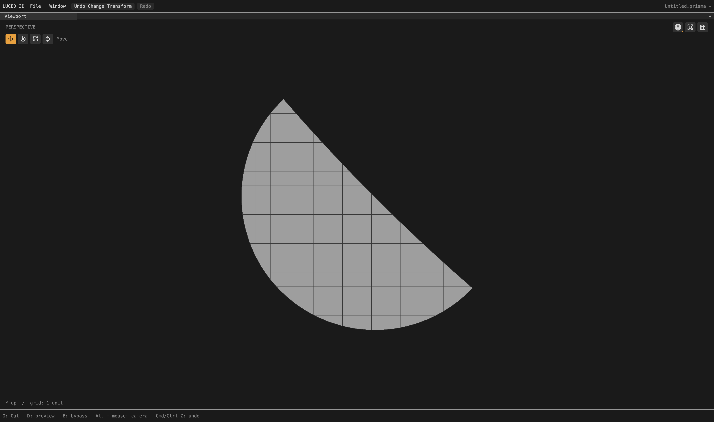

# Preserve separate crossings around a boundary turn

Verified local checkpoint after the thin-triangle distance correction. Camera
plane 722 now uses a regular cut grid, with 102 square interior quads. Twenty-four
constrained patches and several mapped-patch flow defects remain under audit.

## Cause and correction

The exact curve/grid root on edge 1797 was found at approximately
`t=0.999774500498`, beside an existing station `t=0.999789129749`. Physical sample
deduplication discarded the root because it was less than 1% of the model
tolerance from that station. The intervening boundary sample turns back across
the grid line, however: it cannot represent both crossings. The resulting
unsplit segment rejected the cut-grid strategy and triggered constrained meshing.

`trim_layout.separates_crossings` inspects the immutable sampled chart chain.
When a nearby, nonincident interior sample separates the two sides of a return
across a row, the required root bypasses physical sample deduplication. Numerical
parameter deduplication and all station budgets still apply. The intervening
point is retained. This handles shallow analytic extrema as well as a tolerant
CAD endpoint returning behind the last analytic edge sample. It does not force
the neighboring surface to adopt an interior row.

Monotone runs retain the existing representative: its chart coordinate can align
to the grid while its canonical 3D position stays unchanged. Blindly dropping
all close roots and blindly keeping all close roots are both incorrect. Tests
exercise both distinctions. No fixture IDs or surface-kind exceptions are in
the production rule.

Two broader alternatives were rejected. Removing all physical filtering caused
a triangulation failure elsewhere. Removing it only for planar charts affected
95 camera quality records and introduced severe neighboring row aspect ratios
above 100,000. Neither experiment is retained. The turn-aware rule changes only
one quality record.

## Geometry and visual result

Plane 722 changes from 430 quads + 98 triangles to 110 four-corner polygons,
10 triangles and 40 other cut polygons: 160 polygons instead of 528. Of those
110 four-corner polygons, 102 are interior grid quads; their largest edge-length
ratio is 1.000000012. The remaining eight touch the trim and include closely
spaced or nearly collinear canonical boundary samples. They are cut polygons,
not a requirement to continue closely spaced rows through the plane.

All 2,710 native/C quality records match. The other 2,709 records are unchanged.
A separate coordinate comparison finds only two changed patches: 722 and its
neighbor 710. One neighbor polygon grows from 11 to 12 corners, retaining every
old point and adding the shared crossing at approximately
`(18.70785047472, -4.58569250108, 7.84997363354)`. Every other patch's ordered
polygon coordinates are identical to the preceding checkpoint.

- Full camera: 675,888 points; 631,302 polygons comprising 590,565 quads,
  5,265 triangles and 35,472 n-gons. This removes 291 points, 368 polygons and
  88 triangles relative to the preceding checkpoint.
- Strategies: 2,208 mapped / 478 clipped / 24 constrained.
- Zero boundary, nonmanifold, inconsistent-edge and folded-display flags;
  Euler characteristic 46. Actual display area 65,662.60142838546; signed volume
  74,393.20759798626.
- Raw stretched-20 and skewed-0.1 four-corner counts rise to 49,996 and 2,097
  from 49,994 and 2,089. All new flags are the eight boundary cut polygons just
  described; none belongs to an interior grid quad. These counts are reported,
  not hidden by converting polygon classifications or deleting trim vertices.
- Fixed 4,096 OBJ-to-STEP samples remain maximum 0.0259126 and mean squared
  4.68832e-6. STEP-to-OBJ gives maximum 0.0237119 and mean squared 4.5599e-6;
  those sample locations change with mesh indexing, so this is not a paired
  accuracy improvement or a certified bound.
- `sign`, `1p5inR` and `33mm_angle` retain exact exported vertex/face records
  and pass closed-topology audits.

The matched pictures are actual 4,400 × 2,604 native shaded-wire captures,
with patch isolation only after the full global cook. Both use X rotation,
yaw and pitch zero, zoom 0.8, automatic patch center and neutral material.
The first was captured with the new root rule disabled; it was restored before
final gates and the app build.

## Verification and app

The intersection contract now covers 36 tangent cases: three shallow depths,
swapped charts, reversed coedges and three model tolerances. It requires both
roots, unchanged trim positions, positive display triangles, area conservation
and idempotent reconciliation. Six scaled/signed monotone counterexamples
require no extra near-coincident root and two valid cells, with chart-only
alignment preserving canonical positions. There were 12 tangent cases before.

Disabling the turn guard fails the missing-crossings assertion. Forcing the
guard true fails the monotone-duplicate assertion. Both temporary mutations
were removed. Base contracts pass native optimization 0–3 and C debug/release;
the full application suite passes all 28 groups on native and C. The app was
rebuilt with released Luce 0.8.18 and pinned Base at 06:50:15 local on September
28; native smoke exits zero. This is a local checkpoint, not a registry release.

Release CI was rechecked: luced-3d runs 36384734096/36384677699 and luce-ui runs
36384590534/36384590465/36384588970 are completed successfully. No new CI blocker.
No GPU, UI, compiler or luced-2d edits in this correction.

Two full-camera shaded-wire orbit checks used 4,400 × 2,604 frames and 300
callbacks after 35 warm-up frames. The first measured 2.33601 ms mean / 16.318 ms
worst while an independent mesh-analysis process overlapped the run. A repeat
without concurrent analysis measured 2.18754 / 3.172 ms. Background preparation
was 12.3758 and 12.3846 seconds. The earlier distance-fix checkpoint measured
2.46949 / 4.036 ms and 12.2838 seconds. These are individual callback timings,
not GPU-completion or input-to-display latency measurements. The repeat does
not prove the cause of the first outlier or guarantee frame pacing. Logs:
`camera-turn-root-orbit.log` and `camera-turn-root-orbit-repeat.log`.

## Remaining mapped-patch audit

Fallback count alone is not a quality certificate. A separate scan of the full
camera, excluding quads touching their own patch boundary, still identifies
these mapped patches with opposite-edge ratio over 2 or corner sine below 0.1:
2513, 2493, 2485, 2475, 2479, 2477, 2473, 249, 257 and 253. These are the next
interior-flow candidates to inspect; legitimate trim-boundary samples must not
be mistaken for unwanted interior rows.

Evidence: `/private/tmp/camera-turn-root{.obj,-topology.log,-c.txt,-delta.log}`,
`camera-turn-roots-experiment.txt`, `turn-root-{negative.log,
monotone-negative.log,contract-*.log}`, `turn-root-app-{tests-native.log,
tests-c.log,build.log,smoke.log}`. Source contains no diagnostic logging or
disabled guard. Earlier rejected planar/global alternatives remain only in
external diagnostic logs.
