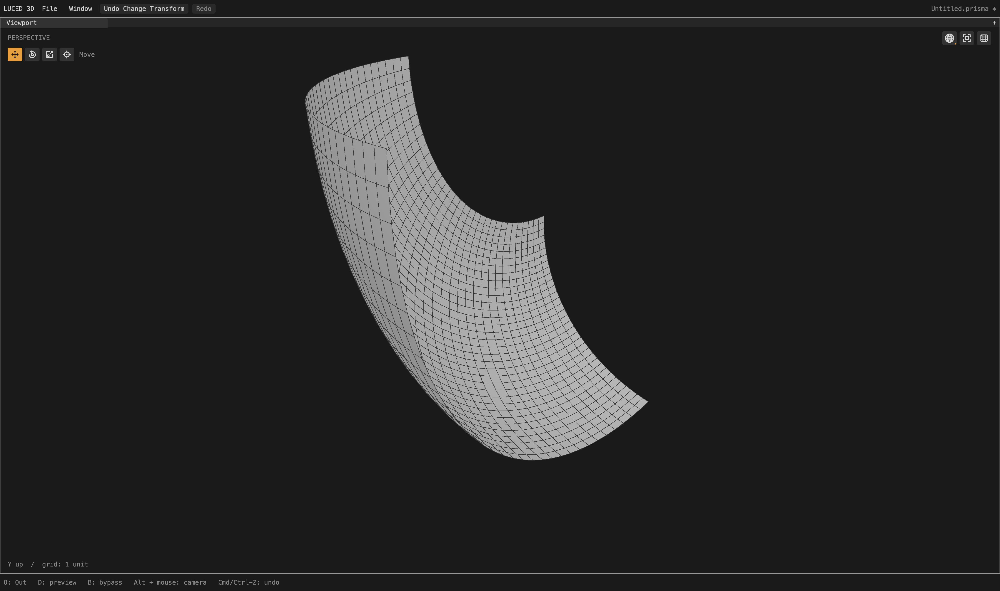
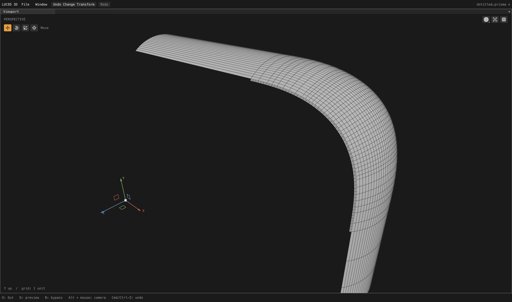
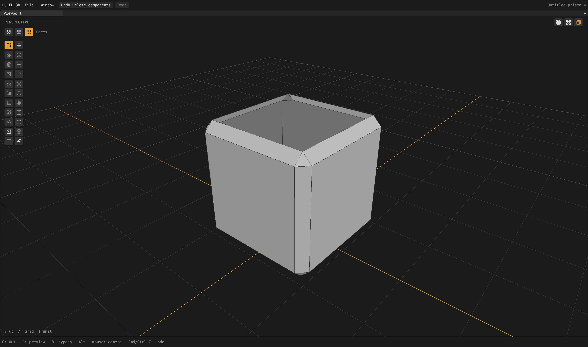

# CAD wire depth: separate rendering artifacts from mesh defects

Follow-up to the [count-feasibility checkpoint](CAD_COUNT_FEASIBILITY_2026-09-28.md).
The goal remains active. This changes rendering, not tessellation, tolerance,
CAD normals, mesh vertices, topology or the set of visible polygon edges.

## Reproduced cause and correction

The Camera 2 face-96 grid had broken/dotted wires before and after the count
correction. Its line renderer expands each edge into a constant-screen-width
strip, but the strip's depth follows its centerline. On a sloping surface,
pixels on one side of the strip can lie behind that same surface. A constant
1e-6 normalized-depth offset did not cover that pixel footprint. A temporary
10x constant offset removed the symptom on this view, confirming the depth
problem; that experiment was reverted rather than retained as the policy.

`Renderer.set_wire_overlay(width)` now reserves the screen-width footprint on
surface fills using the rasterizer's depth slope. The factor is sqrt(2) times
half the logical line width, scaled to backing pixels: raster slope uses the
largest axial depth derivative, while an arbitrarily oriented strip can span
both axes. Zero disables this allowance. The editor enables it only when it
draws the polygon wire overlay or CAD patch boundaries. Cached vertices and
shaders are unchanged; switching modes does not rebuild geometry.

The portable GPU API exposes the same optional `slope_bias` on retained
triangle draws and ordinary `RenderTarget.triangles`. `Canvas.triangles` uses
backing-pixel units. Nonfinite, negative and excessive factors are rejected;
lines cannot request fill slope bias. Metal and Vulkan set the native
rasterizer slope factor and reset it on **every** draw, including wires and UI.
Vulkan uses zero constant offset and zero clamp, requiring no optional
`depthBiasClamp` feature. The existing small line offset remains unchanged.

This is a limited rasterization allowance, not x-ray drawing. Depth testing
remains enabled. Very close intersecting surfaces and silhouette-scale detail
can still be sensitive to any finite-width depth-overlay policy.

## Evidence

Matched actual GPU face-96 captures, 4,400 x 2,604 pixels, following the complete
background cook and then isolation:

The rectangular-looking transition on the left persists. It is a separate
surface/normal/layout concern, not something hidden by the depth change.

The original frame still has uneven row spacing near transitions. Continuous
rendered lines make that easier to inspect; they do not make it a pristine mesh.

A full-model orbit run completed 300 measured callbacks after warm-up at
2.43548 ms mean / 2.773 ms worst callback interval. Background preparation took
13.88 seconds. This is an event-loop/presentation observation, not GPU-only
timing, measured display refresh, input-to-photon latency, or a controlled
before/after speedup. There is no added mesh rebuild or shader expansion work.

## Tests and platform scope

- Real Metal pixel regressions cover horizontal/vertical coplanar lines,
  both depth-slope signs, dynamic and retained fills, genuinely occluded lines,
  and resetting bias before ordinary fills. Both offscreen 1x textures and
  Retina windows are checked. The shared offscreen test also runs from the
  Linux Vulkan test harness.
- All six GPU compiler modes pass: native opt-0/1/2/3 and C debug/release.
  Metal API validation is enabled. Allocation/ownership checks still pass.
- Disabling slope bias makes the new pixel regression fail. Allowing bias to
  leak into subsequent draws also fails. Both negative controls are restored;
  the final production-state portable pixel test passes again.
- All 33 luced-3d regression groups pass native opt-2 and C. Luce-3d's Base and
  Luce consumer suites pass all six modes, including the new draw-state setter.
- The actual portable pixel test emits for Linux and Windows C targets and
  Linux native assembly, including the new Vulkan entry point. No Vulkan
  hardware is available here: this is cross-target validation and an included
  runnable regression, **not** a claim of local Vulkan runtime verification.

The app was rebuilt with the released compiler at **13:54:37 PDT on September
28** and native GPU `--smoke` exits zero. This is a local, unpublished build.
The tracked luced-3d release run `36384734096` and luce-ui run `36458795634`
were separately rechecked and remain successful; they do not cover these local
unpublished changes.

## Source review

Blender's [wire vertex stage](https://github.com/blender/blender/blob/main/source/blender/draw/engines/overlay/shaders/overlay_wireframe_vert.glsl)
and [wire fragment stage](https://github.com/blender/blender/blob/main/source/blender/draw/engines/overlay/shaders/overlay_wireframe_frag.glsl)
show why a single constant depth offset is not its entire overlay policy: it
also accounts for surface orientation or nearby scene depth. We did not copy
its GPL implementation or introduce its depth-buffer sampling passes.

The implementation uses the documented [Vulkan depth-bias command](https://docs.vulkan.org/refpages/latest/refpages/source/vkCmdSetDepthBias.html)
and [Metal depth-bias state](https://developer.apple.com/documentation/metal/mtlrendercommandencoder/setdepthbias(_:slopescale:clamp:)).

Evidence under `/private/tmp`: `wire-depth-{native,c,gpu-final,3d-tests}.log`,
`wire-depth-{negative,reset-negative,restored}.log`,
`wire-depth-app-{build,smoke}.log`, `wire-depth-camera-orbit.log`, and the paired
face-96 capture logs. The CAD geometry and Desktop reference files were not
modified to improve these images.
