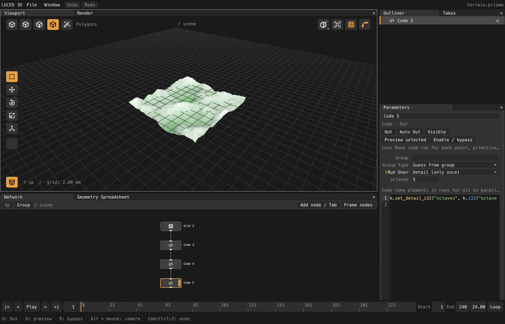

# The Code node

The Code node is luced-3d's Wrangle. You write code for **one element**
(one point, one primitive, one vertex), and the node runs it for every
element in parallel. If you know Houdini's Attribute Wrangle, it works the
same way. The code is [Luce Base](https://luce-base.luciaos.com), so it reads
much like VEX with Python's indentation.



```luce
# Run Over: Points. p is this point.
p.P[1] += math32.sin(p.P[0] * 4.0) * 0.1
```

Add one with Tab or by holding A in the viewport. Example scenes are in
`examples/wrangles/` (File > Open).

## Run Over

The **Run Over** menu says what one run of the code is, and which names the
code gets:

| Run Over | One run is | Names |
|---|---|---|
| Points | one point | `p`, `k` |
| Vertices | one corner of a polygon | `v`, `k` |
| Primitives | one face | `f`, `k` |
| Detail (only once) | the whole geometry, once | `k` |
| Numbers | each number `n` from 0 to Count - 1 | `n`, `k` |

The runs are independent. Each one reads the **input** geometry and writes
only its own element. It never sees what other runs wrote, so neither the
order nor the number of threads changes the result. (Houdini works the same
way.) A **Group** limits which elements run; the rest pass through
unchanged.

## Elements

`p` (Point), `f` (Prim) and `v` (Vertex) have their common attributes as
fields. Three-component values are `f32[4]` vectors whose fourth lane is
ignored, so `+`, `-` and `*` work on whole vectors:

| Field | Point | Prim | Vertex |
|---|---|---|---|
| `P` position | ✓ | | |
| `N` normal | ✓ | | ✓ |
| `Cd` color | ✓ | ✓ | |
| `uv` (`f32[2]`) | ✓ | | ✓ |
| numbers | `ptnum`, `numpt` | `primnum`, `numprim` | `vtxnum`, `numvtx`, `ptnum` |
| measures | | `area()`, `center()`, `normal()` | |

Any other attribute is read and written through accessors named after its
type, as Houdini's `f@`, `v@`, `i@` prefixes do:

```luce
let m = p.f32("mass")            # 0 when the attribute does not exist
p.set_f32("mass", m * 2.0)       # writing creates it
p.set_vec3("velocity", [0.0, 1.0, 0.0, 0.0])
p.set_group("top", p.P[1] > 1.0)
```

The types are `f32`, `f64`, `i32`, `i64`, `vec2`, `vec3`, `vec4`. An
attribute that exists must be read as the type it has.

## Parameters, time and the detail

`k` is the node. A literal call makes a parameter row on the node, Houdini's
spare parameters from `ch()`. The row keeps its value while you edit the
code:

```luce
let amount = k.f32("amount", 0.25)          # a slider, 0.25 to start
let count = k.i32("count", 4)
let target = k.vec3("target", [0.0, 1.0, 0.0, 0.0])
```

`k.frame`, `k.time` and `k.fps` come from the timeline (`f64`). A node that
reads them recooks when the frame changes; other nodes don't. Detail
attributes are `k.detail_f32("name")` and the like. In Detail and Numbers
mode, write them with `k.set_detail_f32("name", v)`.

## Functions

`math32` (`sin`, `cos`, `sqrt`, `floor`, `pi`, ...) and `math` (the same in
`f64`) are imported, and so is the kernel library:

| Family | Functions |
|---|---|
| Vectors | `dot`, `cross`, `length`, `length2`, `distance`, `distance2`, `normalized`; `dot2d`, `length2d`, `distance2d`, `normalized2d`; `f64` forms end in `64` |
| Ranges | `lerp`, `clamp`, `fit`, `fit01`, `smooth`, `degrees`, `radians` |
| Noise | `noise` (0 to 1, around 0.5) and `snoise` (-1 to 1), Perlin, in 1D (`noise1`), 2D, 3D and 4D, `f32` and `f64` |
| Random | `rand(seed)`, `rand3(seed)` (a vector), `rand_stream(seed, stream)`, all repeatable for the same seed |

Helper functions go in the **Header** below the code:

```luce
func fbm(at: f32[4], octaves: i32) -> f32:
    var sum: f32 = 0.0
    var scale: f32 = 1.0
    var weight: f32 = 0.5
    for i in 0..<octaves:
        sum += snoise(at * scale) * weight
        scale *= 2.0
        weight *= 0.5
    return sum
```

## What the language allows

The whole of Base's arithmetic, `if`/`elif`/`else`, `while` and `for` loops,
`match`, `let`/`var`, and casts like `(f32)k.time`. Left out are pointers,
memory allocation, threads, files and calling native code: anything that
could crash the editor. Code that uses them gets an error at its line.

## Errors

A typo or a type mismatch fails the node. The line is underlined in the
editor, and hovering it shows the message. So does an error while running,
such as an index out of range, a division by zero or an `assert`:
`line 7, column 3: index out of bounds (point 1204)` names the line and the
first element where it happened. Nothing partial gets through.

## Speed

The code is checked when you pause typing (about 0.1 ms) and turned into a
column program: each operation runs over thousands of elements at once, on
every core. On a million points, `p.P[1] += math32.sin(p.P[0] * 4.0) * 0.1`
runs in about 0.7 ms on an M4 Max. New parameter values and frames reuse
the program.
