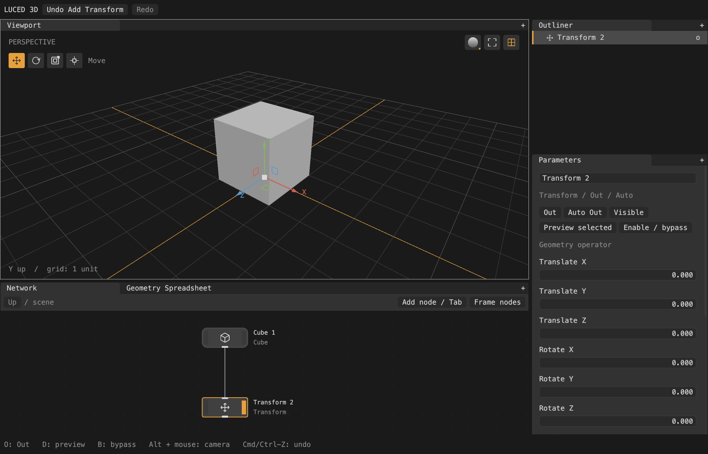

# Editor and engine design

`luced-2d` is the application reference: workspace state is separate from the
viewport, `luce-ui` provides dock panels and controls, and shared `Command`
instances drive keyboard and button actions. Signal connections are retained
and disconnected at shutdown. The theme reproduces its grey/orange palette using
the same linear-light conversion in `luce-color`.

    luced-3d → luce-ui   → luce-3d (SceneView)
             → luce-3d  → luce-gpu
             → luce-cad  → luce-3d
             → luce-step → luce-cad
             → luce-obj, luce-fbx → luce-3d
             → luce-prism

The application implements no native graphics backend. `luce-gpu` owns GPU
resources and submission. `luce-3d` owns topology, geometry operations, cameras,
materials, picking and rendering; it has no UI dependency. `luced-3d` owns the
graph, evaluation policy, operation recipes, selection, interaction and history.
The viewport hosts `luce-ui`'s `SceneView` widget, which connects a `Viewport`
to a `luce-3d` `Renderer`. The Metal observer under `tools/` is only
for test captures, following `luced-2d`'s preview workflow.

## Graph and evaluation

`network.luc` defines stable-ID nodes and ordered geometry input ports. Outputs
can fan out; Merge combines inputs. A proposed connection traverses upstream
dependencies before committing, rejecting self-links and cycles; evaluation also
detects cycles defensively. Missing inputs yield a visible node error. Deletion
disconnects consumers, so no dangling IDs remain. The workspace supports up to
128 nodes and 16 Group levels (see [OUTLINER.md](OUTLINER.md)).

Selected and displayed node IDs are independent. Disabled operators pass through
their first input (including Merge); disabled generators return empty geometry.
An invalid displayed branch clears the old mesh rather than pretending it is the
current output. Grid and lights are viewport helpers outside the user's graph.

The DAG carries `GeometryData`: polygon and CAD components, including mixed
results from Merge, and Group instance branches. Transform preserves analytic
control nets; Null, Switch and bypass preserve the payload. Polygon-only tools
reject untessellated CAD with an explicit conversion message; CAD is never
silently tessellated.

## Background computation

Runtime node evaluation runs on a persistent worker. `Node.compute` receives
resolved inputs; the worker owns its graph mirror, CAD objects and cached results.
The UI never shares Luce objects with it.

- **Stamps** (`stamps.luc`). Before each request the UI stamps every node: a 64-bit
  hash of what its cook reads (kind, bypass, parameters, texts, Edit recipe keys,
  the file epoch and its inputs' stamps). Names, positions, display/output flags,
  visibility, selection and the Edit tool amount are excluded; visibility and
  output flags reach only the parent Group's stamp. An enabled Edit node's stamp
  is its input's stamp plus its recipe keys, so the state before a new recipe is
  already stored under the prefix stamp.
- **Requests** (`compute_request.luc`). The shared graph schema (`project_graph`,
  also used by project files) is framed as a Prism document: every node's header
  and stamp, but a body only when the worker's copy is stale, and each Edit element
  list once by content key. Requests queue in order as deltas; only the newest is
  cooked. A worker that loses its mirror asks for one full resend.
- **Result store** (`result_store.luc`). Cooked results, and failures of a node's
  own recipe, are keyed by stamp with an LRU budget of a quarter of physical
  memory. The displayed and selected stamps, their inputs and the Edit prefix
  before their last recipe are pinned. Renames, visibility toggles, the tool
  amount and undo/redo to an earlier state are store hits. An Edit node applies
  only the recipes after its longest stored prefix; a gizmo drag previews by
  applying its one recipe, one request per pointer move. Parsed files (by path,
  size, mtime, content hash and tolerance) and tessellations (by parsed model and
  options) are cached for the process in `node_evaluation.SourceCache`.
- **Cancellation.** A newer request stops publishing at the next checkpoint and
  cancels a cook only when it no longer wants the stamp being cooked; a
  still-wanted cook finishes into the store. Parsing and individual geometry
  operations are uninterruptible between checkpoints.
- **Publishing** (`display_publisher.luc`). Products are keyed by content: a
  displayed mesh by its stamp and ordinal, or by the identity of a mesh already
  published (an Edit without recipes, a Null or a bypass reuses its input's key).
  A published mesh is a new owner of the worker's immutable storage and its
  lazy caches (atomic owner counts), not a copy. Nothing is warmed for the UI:
  it picks on the GPU. Normal guides are extracted only while Show normals is
  on, as their own keyed products. The publisher keeps the meshes the UI holds (this result's and six
  recent keys), so a held key republishes with no work, and scene objects are
  rebuilt only when the displayed keys change.

Progress shows on nodes, including per-face CAD progress. The UI keeps the
previous scene visible while cooking; a 16 ms timer polls completion while idle.
Shutdown joins the worker.

## Edit recipes and undo

An Edit node stores ordered immutable `EditStep`s (a verb, its group and group
type, its numbers, symmetry and Keep selection); its kind (`edit_kinds.luc`:
Edit Mesh today) runs each step and says what its levels pick on. Each step
guards its input with the pick geometry's 64-bit topology hash. Changing an upstream transform or
dimensions preserves topology and replays edits; incompatible connectivity yields
an error with guidance. The latest extrusion distance can change without adding
an operation. Position-only edits share topology and display triangles with
their input, so Move works on tessellated CAD.

`history.luc` keeps before/after snapshots for up to 64 transactions. Graph
records and selection arrays are copied; immutable meshes and operations are
shared. `Workspace.perform` is the mutation boundary; rejected operations restore
the before snapshot. New commands after undo discard the redo branch. Parameter
scrubs and gizmo/node drags bracket one transaction; Escape or lost capture
cancels. Undo never recooks when the target state is in the result store.

## Gizmos

Cube corner handles resize dimensions while holding the opposite corner.
Transform and Group offer Move, Rotate, Scale and Pivot through viewport icons or
W/E/R/P. Move and Pivot use world axes and XY/XZ/YZ plane handles; Scale follows
the node's rotation; Rotate edits Euler components. Center handles give free
movement and uniform scale. Pivot movement compensates translation to preserve
the geometry, including rotated, non-uniformly scaled nodes.

Shift snaps movement to 0.1 units, rotation to 15 degrees and scale to 0.1
steps; plus/minus resize handles. Hover and active handles are orange; axes use
muted red/green/blue. Axis labels outside the viewport are culled. Gizmo drawing
and picking live in `node_gizmos`/`gizmo_math`, independent of evaluation.

## Viewport and rendering

- `luce-gpu.Geometry` retains immutable vertex and endpoint buffers; camera
  changes send a small parameter block per batch, and a shared vertex shader
  projects geometry and expands constant-pixel-width lines. Large batches split
  below Vulkan's guaranteed 128 MiB storage-buffer range.
- The renderer keeps prepared data per geometry object, so unchanged objects
  survive scene changes; flat and smooth buffers are independent cached views.
  Toggling display modes or wire visibility never evaluates the DAG.
- `WireRenderer` expands endpoint pairs into constant-width triangles in clip
  space, clips the near plane and depth-tests. Surface fills reserve the wire
  footprint with a slope-scaled depth bias (`Renderer.set_wire_overlay`), so
  wires on sloping surfaces stay continuous while front surfaces still hide rear
  wires. Translation handles are drawn on top.
- Edit overlays (`EditOverlay` in luce-3d) keep retained wire, point and selection
  batches in Base; picking uses the retained screen projection confirmed by one
  ray. Edge picking tests the perspective-correct point nearest the pointer.
  With a soft radius the overlay also holds each point's soft weight (geocore's
  `selection_weights`, recomputed only when the selection, mesh or settings
  change) and draws the points it reaches in a falloff ramp.
- Five display modes plus normal guides; Wireframe is transparent line-only,
  Flat ignores `N`, Shaded consumes it. CAD patch boundaries have their own batch.
- Camera clip planes follow orbit distance for depth precision on large parts.
- Picking reads the renderer's GPU id pass (faces; points and edges on the
  picked face), read back once per view. Distance queries use an immutable
  triangle BVH built lazily on first query, shared by snapshots and refitted
  after Moves.
- Selected faces tint in the surface pass from one bit per face; the overlay
  outlines up to 20k of them.

## Imports

| Package | Scope | Not supported |
| --- | --- | --- |
| luce-obj | Shared positions, polygons, positive/negative indices, corner UVs/N; `Obj.write` | MTL/textures, curves, vertex-color extensions |
| luce-fbx | ASCII/binary 7.x raw meshes, compressed arrays, 32/64-bit headers | Scene transforms/hierarchy, instances, UV/material layers, animation |
| luce-step | STEP → CAD: shared edges, conics, rational splines, colors, unique rigid assemblies | General p-curves, repeated/mapped instances, automatic units |
| luce-cad | Analytic topology, NURBS/analytic trims, per-face previews, tessellation | Booleans, disconnected-shell healing, certified deviation |

File has Browse, a path field and explicit Reload; it performs no scaling or
tessellation. STEP produces analytic CAD (`Step.load_model` / `decode_model`;
convert with `CadModel.tessellate`); OBJ/FBX produce polygons. FBX imports
mesh-local definitions, so objects may overlap at their origins. STEP files get
the per-File import tolerance described in
[CAD_TESSELLATION.md](CAD_TESSELLATION.md#tolerances-and-import-uncertainty).
Imports are whole-file (no streaming, no file watching). OBJ import preflights
counts before allocating and attaches attributes during mesh construction.

The node menu (Tab or right-click) is cursor-anchored: empty queries browse
categories, typing searches globally, arrows/Enter choose, Escape or an outside
click dismisses.

## Interaction modules

- `workspace.luc`: the editor's state (network, history, displayed geometry,
  component selection and level) and its transactions (`perform`,
  `begin`/`commit`, undo/redo); it cooks the graph (`rebuild`, locally
  through `local_cook.luc` or on the worker, `poll_compute`) and holds the
  view (`view_state.luc`: camera, display mode and analysis settings) and the
  viewport's line batches (`viewport_batches.luc`). Commands on it live
  beside it, each change one transaction: `node_commands.luc` (nodes, flags,
  wiring, parameters, Groups), `selection_commands.luc` (picking, walking and
  the selection level), `modeling_commands.luc` (tools as Edit steps or verb
  nodes, Tool → Select and Reselect, primitives, knife, moves, gizmo
  previews) and `placing_commands.luc` (placing on surfaces). Language rule:
  modules cannot import each other in a cycle, so commands take the
  Workspace rather than the Workspace holding them.
- `actions.luc`: shared `luce-ui.Command` objects and state-dependent enabling.
- `network_view.luc`: graph coordinates, pointer-centred zoom, pan, port hit
  testing, wiring, flags, node movement and drawing. It accepts Tab so focus
  traversal does not consume node search.
- `inspector.luc`: selected-node properties and Edit operation information,
  without replacing an active field's value while typing.
- `viewport_tools.luc`: component controls, selection overlays and handles,
  enabled by the selected/displayed node's capabilities.
- `view.luc`: navigation, and composition of the scene through `luce-ui`'s
  `SceneView`.
- `panels.luc` / `app.luc`: composition, search palette, refresh and lifecycle.
- `node_catalog.luc`: node kinds, arity, parameter defaults/ranges and inspector
  metadata. `node_evaluation.luc` dispatches operators; `component_groups.luc`
  resolves component groups; `edit_operations.luc` owns replayable recipes;
  `geometry_sheet.luc` virtualizes the spreadsheet.
- Projects and UI persistence: [PROJECTS.md](PROJECTS.md).

## Mesh representation

luce-geocore's `Mesh` separates shared points, polygon corner lists, per-face
normals, unique edges and optional validated display triangles. Topology is
immutable and shared across threads by atomic owner counts; attribute-only and
position-only edits share it. Ear-clipped triangles support concave polygons;
draw, pick and overlays use the same triangulation. Numeric attributes carry
point/face/corner provenance through topology changes (see
[MODELING.md](MODELING.md)). All operators validate inputs and create new
results; failure leaves the input unchanged.

## References

Blender's [geometry evaluation graph](https://github.com/blender/blender/blob/main/source/blender/nodes/NOD_geometry_nodes_lazy_function.hh),
[region extrusion](https://github.com/blender/blender/blob/main/source/blender/bmesh/operators/bmo_extrude.cc),
[draw manager](https://github.com/blender/blender/blob/main/source/blender/draw/intern/draw_manager.hh)
and [mesh batch cache](https://github.com/blender/blender/blob/main/source/blender/draw/intern/draw_cache_impl_mesh.cc)
informed cached demand-driven evaluation, region boundaries and retaining
geometry separately from view state. Houdini's
[network editor](https://www.sidefx.com/docs/houdini/network/nodes.html),
[wiring](https://www.sidefx.com/docs/houdini/network/wire.html),
[flags](https://www.sidefx.com/docs/houdini/network/flags.html),
[attributes](https://www.sidefx.com/docs/houdini/model/attributes.html) and
[Geometry Spreadsheet](https://www.sidefx.com/docs/houdini/ref/panes/geosheet.html)
informed the compact graph, independent selected/displayed/bypassed states,
the four attribute domains and a read-only inspector. Blender's
[mesh toolbar](https://docs.blender.org/manual/en/latest/modeling/meshes/tools/toolbar.html)
informed the component buttons; navigation follows
[Maya's Alt-button mapping](https://help.autodesk.com/cloudhelp/2026/ENU/Maya-Basics/files/GUID-941480C1-9BDA-4DB3-8EA8-113A0D6FAF1F.htm).
All implementations are original; no GPL source was copied or linked.

## Direction

Keep one graph context: subnetworks should package the same graph with exposed
inputs/outputs rather than adding separate modeling/material/animation modes.
Keep topology algorithms and acceleration in luce-3d; editor commands, recipes
and selection in luced-3d. Fields, instances, shader graphs and GPU geometry
processing are future work; current CPU preparation must not be described as
GPU geometry acceleration. Performance work is tracked in
[PERFORMANCE.md](PERFORMANCE.md).
