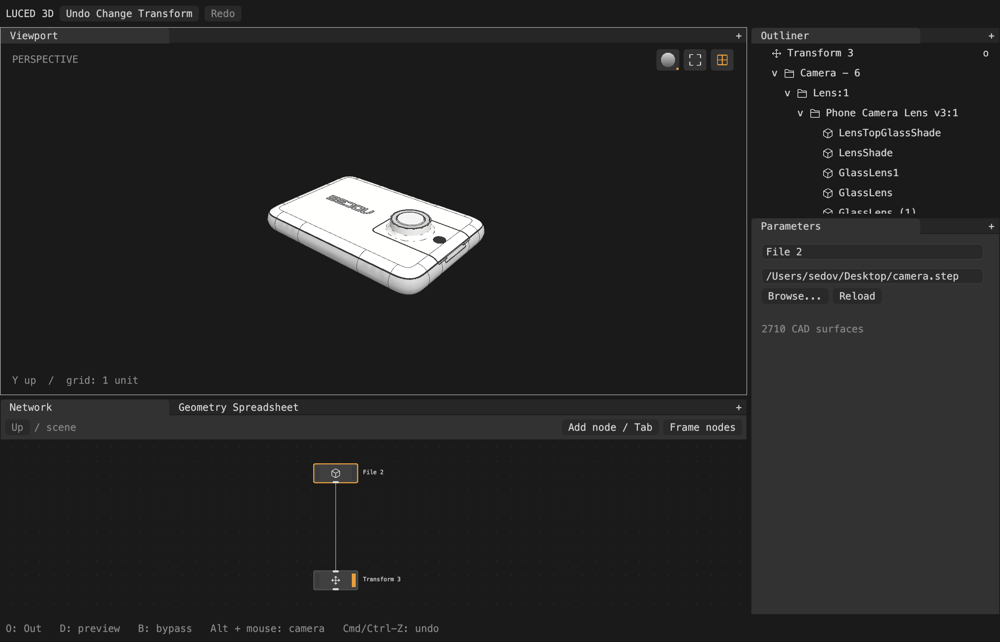
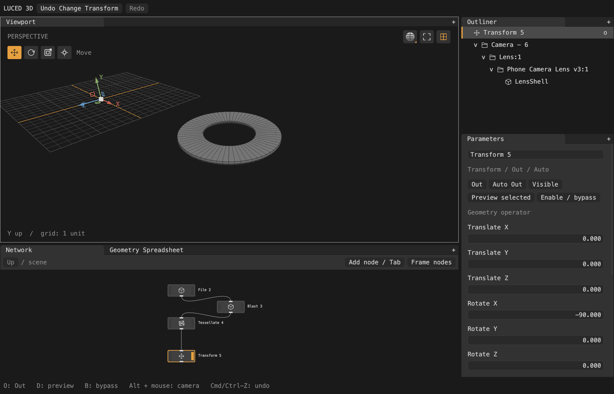

# Imported hierarchy and Blast

Every node's result wraps a luce-geocore `GeometrySet`. Object paths live in
the geometry: CAD faces carry their B-rep path, and polygon faces the text
attribute `path`. Nodes only expose those paths in their evaluation summary. The Outliner projects the paths below each exposed node.
It does not create graph nodes for imported parts or infer ancestry from wires.
Actual Group nodes still own nested networks and transforms.

STEP product names, occurrence names and solid names form paths. For the supplied
camera, one path is `Camera - 6/Lens:1/Phone Camera Lens v3:1/LensShell`.
Unnamed solids use `solid_<STEP entity ID>`. Literal `/` and `%` in names are
encoded as `%2F` and `%25`, so they cannot accidentally add hierarchy levels.
Repeated product instances and STEP Unicode escape decoding remain unsupported;
duplicate sibling labels are not yet disambiguated.

File returns analytic CAD (luce-cad's `cad` family of the set). Tessellate
writes each generated polygon's B-rep path to its `path` attribute, in one pass
over every model. Transform, Merge and every operator that remaps attributes
carry `path` like any other face attribute.

Blast accepts whitespace/comma-separated selectors, quoted names, `*` and `?`.
An exact parent path includes its descendants. `^pattern` subtracts matches from
a preceding positive selection. Empty selection means everything. The default
deletes matches; Delete non-selected / isolate retains them. For example:

```
*/LensShell
'Camera - 6/Lens:1'
* ^*/LensShell
```

CAD extraction copies only referenced topology, preserving colors and placement;
polygon extraction keeps the matching faces with every attribute and removes
unused points (a parallel subset in luce-geocore). Both run inside
the existing background DAG compute. The Outliner receives only a copied path
summary, not worker-owned geometry. Imported rows collapse independently; clicking
one selects its producing node, not yet an individual geometry component.

The interaction follows [Houdini Blast](https://www.sidefx.com/docs/houdini/nodes/sop/blast.html),
but does not implement its complete selection-expression language.

Verified by the portable assembly fixture (including transformed colored CAD,
partial subsets, conversion, wildcard selection, Outliner and async undo), and by
native camera captures: the imported hierarchy, and File → Blast → Tessellate →
Transform.




