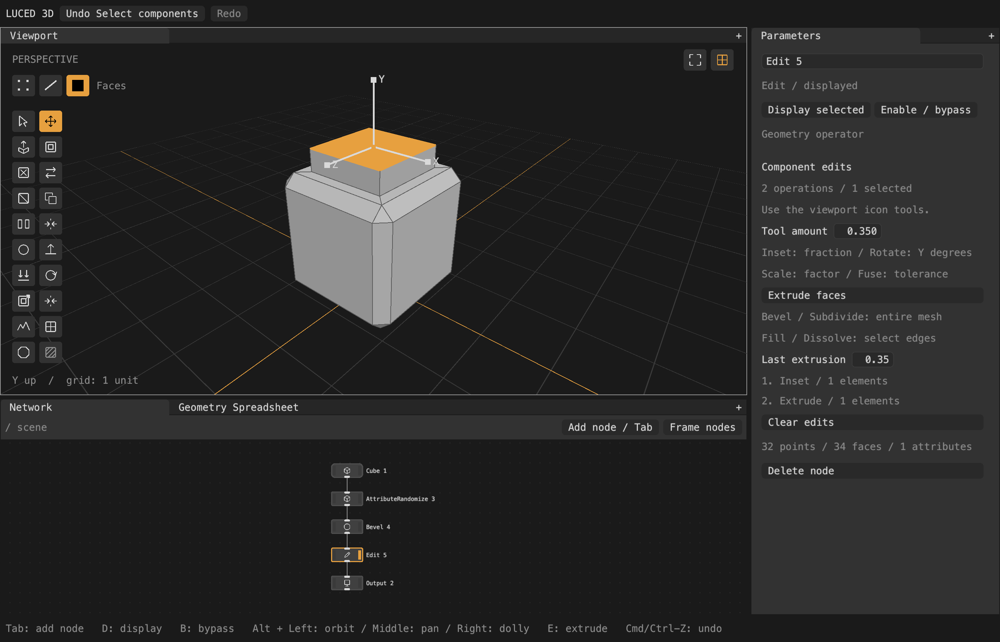

# Modeling capabilities

This is a substantial initial operator set, not Houdini or Blender feature parity.
No placeholder nodes are listed: every registered node evaluates geometry.

## Geometry nodes

| Family | Nodes |
| --- | --- |
| Sources | Cube, Grid, Sphere, Cylinder, Cone, Torus, File |
| Graph | Edit Mesh, Edit CAD, Edit SDF, Merge, Null, Switch, Tessellate, Group, Blast, Cache, Export |
| Transforms/copies | Transform, Mirror, CopyTransform, CopyToPoints, MatchSize |
| Modeling (verbs) | Delete, Reverse, Triangulate, Duplicate, Split, Inset, PolyExtrude, Subdivide, Fuse, Clean, PolyBevel, Loop Cut, Bridge, Fill, Dissolve, Merge Points; Subdivision (display) and Crease |
| Deformation (verbs) | Transform Components, Smooth, Mountain, Peak, Flatten, Snap |
| Curves (set verbs) | Curve Line, Curve Circle, Curve Arc, Curve Spiral, Resample Curve, Trim Curve, Fillet Curve, Reverse Curve, Set Curve Type, Curve to Mesh, Mesh to Curve |
| Volumes (set verbs) | SDF Sphere, SDF Box, SDF Torus, SDF Capsule, SDF Cylinder, SDF Boolean, SDF Modify, SDF to Volume, Mesh to SDF, Volume from Points, Convert to Mesh, Volume Slice |
| Attributes | AttributeCreate, AttributeRandomize, AttributeDelete, AttributeRename, AttributePromote, Selection Group, Normal, Measure, UVProject, Color |

Modeling and deformation nodes are luce-geocore verbs (after Houdini's SOP
verbs): one Base kernel per operation, shared with the Edit node. The node
catalog is generated from the verb registry, so each has the verb's
parameters plus Houdini's **Group** (text) and **Group Type** (Guess from group,
Points, Edges, Primitives, Vertices). An empty group is every element. Groups
use Houdini's group syntax with our functions (see luce-geocore's API):
`0 2-5`, `0-99:2`, `top ^left`, `@P.y>0`, `@name=piece*`, `p3-4-5`,
`grow(top, 2)`, `loop(p5-6)`. A group of another component type converts
(a face is in a point group when all its points are; Delete removes every face
using a deleted point, like Blast). Numbers naming no element match nothing.

A verb carries every attribute and group through its provenance: an element
with one parent copies it; an interpolated one (a subdivision edge point, a
new corner inside a face) averages floats, renormalizes normals, takes the
heaviest parent's integer or text, and keeps group membership only when every
parent is a member. New elements are zero, empty and in no group. Each verb
also returns an output selection (Extrude's front faces, Inset's inner faces,
Fuse's merged points), which the tool flow adopts.

Mesh operators work on the mesh component and pass every other component
through unchanged, as Houdini's SOPs do. That covers verbs, the Edit node and
the attribute nodes. The other components are curves, points, volumes, SDFs
and CAD beside a mesh; they are shared, so passing them costs nothing.

- A set with no polygons of its own passes through with a warning.
- A set of instances has its polygons realized first, as before.
- Attribute nodes also act on curves and point clouds. AttributeCreate,
  AttributeRandomize, Color, AttributeDelete, AttributeRename and Selection
  Group work there: curve vertices are their points, and primitives are
  curves.
- AttributePromote, Normal, Measure and UVProject are mesh-only. They warn
  and pass curves and points through.
- Mirror, CopyTransform, CopyToPoints and MatchSize place the whole set.

Curve nodes are set verbs: they run on the whole geometry set rather than the
realized mesh, and come from the same catalog (luce-geocore's `VerbCatalog`).
Curve points are the point domain and curves the primitive domain, so Group
and Group Type work on curves as they do on meshes. The viewport draws
evaluated curves in every shading mode, and their control hulls (control
polygons, Bezier handles, control points) behind the **Control hulls** toggle;
the hull overlay is generic, for any family's control nets. Curve to Mesh
takes an optional profile curve on its second input.

Volume nodes work on SDFs and sparse level-set or fog volumes, also as set
verbs. The viewport draws each SDF or level set by its surface preview, built
once per component. An SDF's preview lies on the exact surface. A fog volume
is drawn as smoke, as in Houdini's viewport: luce-3d's `FogScene` ray-marches
every `FogVolume` of the view on the GPU, lit by the key light (self-shadowed)
and the sky, veiling the meshes behind it, and ending each pixel's march
exactly at the nearest surface, so a mesh inside the fog is cut smoothly at
any depth. Grids whose boxes overlap march together, up to four a pass,
each sample summing them, so crossing smokes mix rather than one painting
over another, and shadow each other: the key light's and the sky's optical
depth at a sample runs through every grid covering it. Its texels are
made once per cook result (on the worker) and upload on the first frame, so
orbiting redraws without uploading. A **Volume Visualization** node (Houdini's)
sets how it looks, on the grids its Group names (each grid keeps its own
look, as Houdini's volvis attributes are per primitive): density scale,
smoke color, shadow scale, the ray-marching step; emission from a grid named
in its Emission field row, which then glows instead of being drawn as smoke
(the field times the emission scale; values of 0 or below emit nothing), in
one color or through the **Emission color ramp** row along the emission min
and max, read at the values of the grid in the **Emission color field** row
when it names one (Houdini's: temperature picks the color while another field
sets the strength), else at the emission field's; values outside the range,
negative ones too, take the ramp's nearer end; and a Density field row naming
a grid whose values show as the density. The grids' voxels stay shared, so a new look keeps the uploaded
texels; only the viewport's small table of looks and 256-texel ramp strips
goes to the GPU again. The `noise_cloud`,
`fire` (a ramp) and `two_smokes` (two tinted grids in one set) wrangle
examples show them. Convert to
Mesh makes real geometry of that surface. Volume Slice shows a colored plane
through the field: blue inside, orange outside, with contour bands.

Point clouds are drawn too. A cloud with Gaussian splat attributes (`orient`,
`scale`, `opacity`, `Cd`, `sh`; a 3DGS PLY through the File node, or Bake
GSplats) draws as Gaussian splats: luce-3d's `GaussianSplats` projects, culls,
evaluates SH and depth-sorts them on the GPU every time the view changes, and
draws them back to front over the scene, hidden behind meshes in front and
veiling those behind. Any other cloud draws as dots of its `Cd`. A cloud is
packed once per cook result (on the worker) and uploads on its first frame;
orbiting sorts again but uploads nothing. The shading menu's splat rows,
shown while splats are on screen, switch to **Centers** (dots; Wireframe
always shows centers, as Houdini does), cap the **SH degree**, raise the
**Alpha cull** and scale the splats; none of them recooks or uploads.

The **Cache** node (Houdini's File Cache) writes its input's cooked geometry
to a `.prism` file and passes it through. It uses luce-geocore's geometry
codec, which writes every component, attribute and group exactly. With
**Load from disk** it reads the file instead, and nothing upstream cooks.

The file records the node's stamp, and in read mode the node takes the stamp
recorded there. Two things follow:

- switching to read mode keeps every downstream result;
- while it reads, upstream edits stop at the node.

A 700k-face mesh saves in about 4 ms and loads in about 17 ms.

The **Export** node writes its input to the file its path names and passes
the input on. The extension picks the format:

- `.usda`, `.usdc`, `.usd` or `.usdz` (luce-usd): prims split by the `path`
  attribute, with **Root prim** for the rest (empty: `geo`) and **Precise
  points** for double precision;
- `.fbx` (luce-fbx): binary FBX 7.4, one model per `path` (see
  [FBX files](#fbx-files));
- `.obj` (luce-obj): the realized mesh;
- `.prism`: the geometry codec, as the Cache node writes it.

A cook writes the file, and cooks follow the node's stamp. A file is
therefore written when the input or the settings change. What USD cannot
hold, such as untessellated CAD, is left out with a warning.

## USD files

The File node reads `.usd`, `.usda`, `.usdc` and `.usdz` stages through
luce-usd's `Usd.load`, as luce-usd's docs/MAPPING.md describes:

- meshes, intrinsic shapes, curves and points are flattened into one
  component per family, each element carrying its prim path as `path`;
- point instancers become instances.

The USD rows:

- **Import**: *Flatten, keep instancing*, or *Flatten everything* to bake
  the instances;
- **Set time** and **Time**: the time values are read at (off: the stage's
  start time);
- **Render**, **Proxy** and **Guide** purposes;
- **Convert to Y-up meters**;
- **Subdivide as authored**: meshes without a `subdivisionScheme` are
  Catmull-Clark surfaces in USD.

Import warnings, such as dropped faces or skipped prim types, appear as the
node's warning.

## FBX files

The File node reads `.fbx` files (binary and ASCII, FBX 6.1 to 7.7) through
luce-fbx's `Fbx.load`, as luce-fbx's docs/MAPPING.md describes:

- every model's mesh is placed by its full FBX transform (pivots, pre- and
  post-rotation, rotation order, inherit type, geometric transform) and
  merged into one mesh, each face carrying its model's path as `path` and its
  material's name as `material`;
- normals, tangents, UV and color sets, smoothing, creases, holes and edge
  visibility become attributes; lines and NURBS curves become curves;
- animation, blend shapes and skins are evaluated at a chosen frame.

The FBX rows:

- **Import**: *Merge into one mesh*, or *Keep hierarchy* to keep each model's
  mesh in its own space, placed as an instance;
- **Instancing**: a mesh several models share loads once, as instances;
- **Convert to Y-up meters**;
- **Import normals**;
- **Set frame** and **Frame**: the first animation stack evaluated at that
  frame (off: the file's pose as saved);
- **Deform**: blend shapes and skins applied (skinned meshes are placed by
  their bones).

The Export node writes `.fbx` with luce-fbx's `Fbx.save`: the mesh split by
`path` into models (missing ancestors as nulls) with their normals, UV and
color sets, smoothing, creases, holes and edge visibility as layer elements
and `material` as materials; instances as models sharing their prototype's
geometry, placed by translation, rotation and scale; curves as lines and
NURBS curves; the `fbx.*` details (axes, unit, frame rate) as the file's
settings, else Y-up meters. Blender and ufbx read the files back.

## Selection and tools

Components can be selected on whichever node the viewport displays, at a
selection level (keys 1–5): Object (a whole piece: the faces sharing a
`path`, else a connected component), Polygons, Edges, Vertices (points) or
Corners. An Edit node shows its own kind's levels. The selection is a luce-geocore
`Selection` (bits plus the connectivity they index), so select all, invert,
grow, shrink, border, flood, loop and ring are word-parallel Base passes.
Switching the component type carries the selection over (a face stays when
all its points were selected).

Pressing a tool, as with Houdini's shelf tools:

- on the active **Edit node** (Edit Mesh), appends a step to its recipe (see
  below);
- on any other displayed node, creates the tool's verb node after it (between
  it and whatever it fed), with **Group** set to the selection's expression
  (runs such as `0-5 12`, a group's name, or chained edge pairs `p3-4-5`),
  **Group Type** set to the component type, and a **guard**: the connectivity
  hash the group was selected on. Display and the node selection move to it,
  and when it cooks its output selection (Extrude's front faces, Inset's inner
  faces) becomes the viewport selection, switching the component type. The
  Move gizmo on a plain node makes a Transform Components node the same way.
- with nothing selected, the new node waits (Tool → Select): the viewport picks
  on its input, and each change of the selection (a click, Shift to add, Select
  All, Grow) becomes the node's group at once, its result shown; with nothing
  picked the input shows. Enter finishes, Esc removes the node.

If the input's topology later changes, a guarded node fails with "Group was
selected on different topology. Reselect, or Keep IDs." **Reselect** picks on the
input with the group selected, the node's result rewritten and shown as the
selection changes (Enter finishes, Esc restores the old group); **Keep IDs** clears the guard and
applies the numbers as they are (Houdini's behaviour). Typed groups are never
guarded. Very large selections show as a summary in the Group field.

## Edit tools and important limits

- PolyExtrude moves face regions (or each face, with Individual faces) along
  their averaged normals, with an inset across the region's boundary and
  divisions along the walls; each run of faces around a boundary point gets
  its own front point, and a whole closed surface simply moves out. An edge
  group extrudes its edges into quads (outward in the face plane on a mesh
  boundary) and selects the front edges. There is no twist, taper or spine.
- Inset moves the rim of each region (or face) inward by a distance, with an
  optional depth; inner corners blend their face's corners so UVs follow.
  Clamp keeps each move within half of the boundary edges beside it.
- Loop Cut cuts 1–64 loops across the quads of each group edge's ring (or
  only between the group's edges), slid together toward one side; other faces
  on the ring take the new points, and a quad already cut by one ring stops a
  crossing ring. The new loop edges are selected.
- Bridge joins pairs of boundary loops or runs among the group's edges (each
  with the nearest one of its kind) with rows of quads when they have as many
  edges, else with triangles zipped by distance along them. Loops are paired
  facing each other; coplanar holes twist. Twist turns where a loop starts.
- PolyBevel bevels the group's interior edges by a constant offset measured in
  the faces beside them, with 1–64 segments along a profile (0.5 round, 0
  flat) and overlap clamping. Where three or more beveled edges meet, the hole
  becomes one patch face (no grid patch); a lone beveled edge's end vertex
  stays and its strip fans around it. Edges at non-manifold points are skipped
  with a warning.
- Subdivision marks a mesh to be shown as its Catmull-Clark (Loop, bilinear)
  limit surface at a display level; nodes after it still get the cage, and Edit
  edits the cage while the viewport shows the smooth surface. Crease sets USD
  edge sharpness for it. Picking selects cage faces (picked on the cage's
  shape, not the smooth surface).
- Subdivide operates on the whole mesh, Catmull–Clark or linear, with edges used
  by more than two faces kept as creases. There are no crease weights yet.
- Fill caps each closed loop of the group's boundary edges with one face, or
  (Fan) triangles around a new center point. Dissolve joins the faces across
  the group's interior edges, one face per region; a point group dissolves
  every edge at its points and removes points left between two edges.
  Regions with holes or pinches stay as they were.
- Fuse merges the group's points within a distance into the first of them,
  dropping faces that collapse. Merge Points merges them at their center, at
  the first or last, per connected island or by distance.
- A kernel that would make degenerate faces (a bridge between coplanar
  loops, say) passes its input through with a warning.
- CopyToPoints realizes copies at target positions, as many as there are
  points (CopyTransform, as many as asked), joined pairwise so a large count
  stays O(n log n). It does not yet interpret orientation/scale attributes
  or retain instances.

## Edit nodes

An Edit node is a modeling engine in one node: while it is displayed and
selected, every tool appends a step to its recipe instead of creating a node,
and each tool (or each drag) is one undo. There is no operation list to edit.
There is one Edit node per kind of geometry, so each keeps its own levels and
tools: **Edit Mesh** (polygons), **Edit CAD** (analytic models) and **Edit
SDF** (signed distance fields). They share one framework (`edit_types.luc`,
`edit_kinds.luc`): a kind supplies its selection levels, its tools and
primitives, the geometry each level picks on, the geometry its recipe starts
from, and the step executor that gives its verbs meaning; the recipe, undo,
checkpoints, the selection and its hand-off, the tool amount, symmetry, soft
selection and Keep selection, Tool → Select, the inspector rows, the level
switcher and the tool strip are the framework's. The tool strip and the
Create entries come from the kinds themselves: the strip shows what the
active kind offers (Edit Mesh's on other nodes). A kind may also show its
selection through surfaces (Edit SDF).

Edit Mesh's levels are Object, Polygons, Edges, Vertices and Corners. At the
Object level a pick selects a whole piece, and moves, rotations, scales and
Delete act on whole pieces. Besides the modeling verbs its tools include
Knife (drag a stroke across the model, Shift snapping it to 15°: the cut is
the plane through the eye and the stroke, recorded as a Clip with its own
point and normal, cutting the selection or else every face under the stroke),
Connect (the tool amount places the new points), Edge Slide (the tool
amount is how far), PolyMirror (Polygons: across X through the origin,
welded), Spin (Edges: a full turn about Y in 12 steps), Crease (Edges: the
tool amount is the sharpness) and PolyDraw (Vertices: a face through the
selected points, ordered round their centroid and wound like its
neighbours). With nothing selected, PolyDraw draws: each click places a
corner on a point of the mesh (within 11 pixels), else on the surface
under the cursor, else on the ground; a rubber band follows the cursor;
Enter or a click on the first corner makes the face (one step with the
corners' positions), Esc cancels. It creates primitives (Box, Sphere, Cylinder,
Cone, Torus, Grid, Plane) as recipe steps: each new piece gets its own `path`
(`/box1`, `/box2`, …), becomes the selected Object and undoes like any step.
Unconnected, an Edit Mesh starts from nothing.

Edit CAD's levels are Object (a whole model), Faces (a B-rep face), Edges (a
B-rep edge) and CVs (control vertices). Object, Faces and Edges pick on the
models' display tessellations, tagged with their model, face and edge
(luce-cad's `CadEdits.pick_mesh`), so a pick selects a whole model, face or
edge; CVs pick on the control-vertex cloud. Whole models move, rotate, scale
and delete; faces delete (a model losing every face goes); CVs move with the
gizmo, Rotate, Scale, Noise, Flatten and Snap, and only the moved ones
change. A moved boundary CV takes its trims along: they are re-projected
onto the edited surface, and a face whose trims fold is left out with a
warning instead of failing the node. Edges have no tools yet. Its primitives
are luce-cad's analytic solids: Box, Cylinder, Cone, Sphere and Torus.

Edit SDF's one level, Object, picks whole primitives of the SDF program. It
picks on proxies: each primitive's own shape placed by the transforms around
it, tagged `sdf_prim` (luce-geocore's `SdfEdits`). Their topology depends
only on the shapes, so a drag keeps the selection and consecutive moves
merge, and a subtracted primitive stays pickable; the selection also shows,
dimmed, through the surface. Primitives (Sphere, Box, Torus, Capsule,
Cylinder) are steps added to the program by Add. The gizmo moves, rotates
and scales primitives (the move composes into the transform placing each
one); **Add**, **Subtract** and **Intersect** set the boolean joining a
primitive to the shapes before it, **Blend** rounds that join by the tool
amount, and **Delete** removes primitives. A drag's frames show a coarse
surface (40 voxels across); the release shows the full one (128).

The **Sketch** node (inside a CAD node) is a 2D sketch on a plane, as in
Fusion 360: points, lines, circles and arcs held by constraints and
dimensions, solved by luce-cad (`CadSketch`, luce-cad's docs/MODELING.md,
Sketches). It keeps the sketch as text and solves it on every evaluation;
its result is the curves Extrude and Revolve read. **Plane** picks XY (as
from the front), XZ (the ground, as from above), YZ (as from the right) or
**Face**: a flat face of the body connected to its input, picked with
**Pick face** (one click on the body), kept by the face's name so the sketch
follows it as features upstream change the body. **Offset** moves the plane
along its normal; starting to edit (or a new face) looks straight at it.

Selected and displayed, it is edited in the viewport (`sketch_editor.luc`,
`sketch_view.luc`, after docs/research/FUSION-SKETCH-STUDY.md). Its curves
draw blue while free, light when fully constrained and orange as
construction. The toolbar along the bottom has Fusion's **CREATE**, **MODIFY**
and **CONSTRAINTS** menus (tools not built yet show greyed); the squares at
the top left choose what Select picks: Points, Lines or Shapes.

- **Drawing.** Line (L) chains from its last end until Esc, a right click or
  a click on its last point; Rectangle (R) takes two corners and makes its
  sides level and upright; Circle (C) a center and a point on it; Arc (A) a
  center, a start and an end (counterclockwise); Point (P) one click. The
  cursor snaps to points (the new point is that point) and curves (a point
  on the curve), and a line drawn within 3° of level or upright becomes
  horizontal or vertical: the constraints Fusion infers. Cmd (Ctrl
  elsewhere) places freely.
- **Constraints** take their entities in order, the first the reference,
  and apply when they have enough (or at once to a selection): Horizontal/
  Vertical, Coincident, Tangent, Equal, Parallel, Perpendicular, Fix/UnFix,
  MidPoint, Concentric, Collinear and Symmetry. One the sketch cannot hold is
  refused: "Sketch geometry is over constrained".
- **Sketch Dimension** (D) takes a line (its length), a circle (diameter), an
  arc (radius), two points, a point and a line, or two lines (their angle,
  or their distance when parallel), then a click to place it. It measures
  the sketch as it is; one that repeats or contradicts others is driven
  (shown in parentheses). Each dimension is a row of the parameter panel
  (d1, d2, …) in the document's unit; a new value re-solves the sketch.
- **Modify**: Trim (T), Extend and Break act on the curve clicked, where it
  is clicked (Trim takes the piece between its nearest crossings; a
  circle becomes the arc left). Fillet and Chamfer take two lines meeting
  at a corner, or the corner's point; the fillet's radius is then typed in
  its value box. Offset (O) takes the chain a clicked curve is part of,
  then a click to its side, that far away. Move/Copy (M) takes the
  selection (or what is clicked) from one click to the next, Shift copying;
  Sketch Scale takes a base point, a point and where it goes. Blend Curve
  waits for splines.
- **Select** picks entities (Shift adds) and drags points, the sketch solving
  as they move (one undo when released); Delete removes the selection and
  what is drawn on it, X toggles construction.

Each finished action is one undo step: the editor works on a live sketch
read from the node and writes it back.

**Profiles.** Curves that cross split each other: every smallest closed
region is a profile, as in Fusion. Extrude and Revolve take the sketch's
closed shapes by default (holes left empty, overlapping shapes joined), or
the profiles picked with **Pick profiles**: the feature's result shows while
a click in a region adds it or leaves it out (its outline lit); Enter
finishes. Picked profiles are kept by the curves round them, so they hold as
dimensions change; **Closed shapes** forgets them.

**Units.** Lengths are kept in millimeters; the document shows and reads
them in its unit, millimeters or inches (File → Units), kept with the
project. Every length parameter shows its unit and takes typed units
("25.4 mm", "1 in", "10 + 5 mm").

- A step is one verb run: the verb, the group expression and its type, the
  parameter values, the connectivity hash the group was selected on, and the
  node's Symmetry and Keep selection settings at the time.
- The recipe is the truth: undo restores a shorter recipe. The worker keeps
  the results after the last eight steps and every sixteenth (D18), so undo
  and redo inside that window cook nothing, and a deeper undo replays at most
  fifteen steps. Consecutive moves of the same components merge into one step
  (D19); each drag remains its own undo.
- After a topology tool the selection becomes what the tool made (Extrude's
  front faces); with **Keep selection** it is instead the selection carried
  through the tool (a new element is selected when all its parents were).
- **Soft radius** and **Falloff** (linear, quadratic, cubic, smooth) make
  moves, rotations and scales pull the points near the selection, by the
  distance to the nearest selected point. While the radius is on, the
  viewport draws every point it reaches in a ramp from blue (barely moved)
  through yellow to orange (moves fully); the weights come from the same
  Base kernel as the move (luce-geocore's `selection_weights`). Edit Mesh and
  Edit CAD's control vertices honor it.
- **Symmetry** (X, Y or Z) mirrors every tool: the group gains the mirror of
  each member (points, faces, edges and vertices matched by position within a
  ten-thousandth of the model's size), and moved points' mirrors move to the
  mirrored places; points on the plane stay on it.
- An upstream change that alters the input's topology fails the node: "Edit
  input topology changed. Undo the upstream change or clear this node's edits."
  Position-only upstream changes flow through the recipe.

## Attribute contracts

Domains are point=0, vertex/corner=1, primitive/face=2, detail=3 and edge=4.
Numeric tuples have 1–4 components, float or integral values; text attributes
index a shared string table; groups are flagged boolean attributes. Names are
unique within a domain; `P` is reserved for built-in positions. Matrices and
arbitrary field sockets are not implemented.

Topology builders carry output-to-input parent maps (see the verbs above).
Extrusion walls inherit the originating face. Merge unions
schemas and zero-fills absent attributes; conflicting types fail and the left
detail value wins. Promotion averages contributing floating values; integer
promotion chooses the first contributor. Original-domain attributes are retained.

`Cd` and `uv` are consumed by rendering with corner > point > primitive > detail
precedence. Shaded display consumes corner `N` when present (CAD tessellation
writes analytic normals); Flat uses face normals. Generic numeric vector attributes are not automatically transformed
as directions/normals. UVProject is planar XZ projection, not UV unwrapping.

The Geometry Spreadsheet is virtualized, horizontally/vertically scrollable,
sortable, filterable and pinnable. It displays selected-node geometry separately
from the display flag. Its Detail tab shows the mesh's counts and detail
attributes and the set's own detail attributes (one row, with or without a
mesh). It is an inspector/selection surface, not a direct cell editor;
modify attributes with nodes.

## Operator fidelity

Houdini's [Subdivide](https://www.sidefx.com/docs/houdini/nodes/sop/subdivide.html),
[Fuse](https://www.sidefx.com/docs/houdini/nodes/sop/fuse.html),
[PolyBevel](https://www.sidefx.com/docs/houdini/nodes/sop/polybevel.html) and
[Smooth](https://www.sidefx.com/docs/houdini/nodes/sop/smooth.html) are the
references for these operators, and each is broader than ours: Subdivide
motivated separate topology/position handling and linear attribute interpolation;
Fuse shows that merging points needs explicit attribute ownership (ours keeps the
first representative, and Clean is separate); PolyBevel also offers point
bevels, per-edge offsets and patterned corner patches, where ours makes one
patch face per corner; Smooth has more controls than our amount-and-iterations neighbor relaxation. The
limits above document these differences rather than claiming SOP equivalence.
Fields should arrive as a deliberate type-system addition, not ad-hoc
expressions inside widgets.

## Remaining modeling milestones

Robust booleans, remeshing, UV unwrap, multi-node selection, wire insertion and
subnets remain future work.
