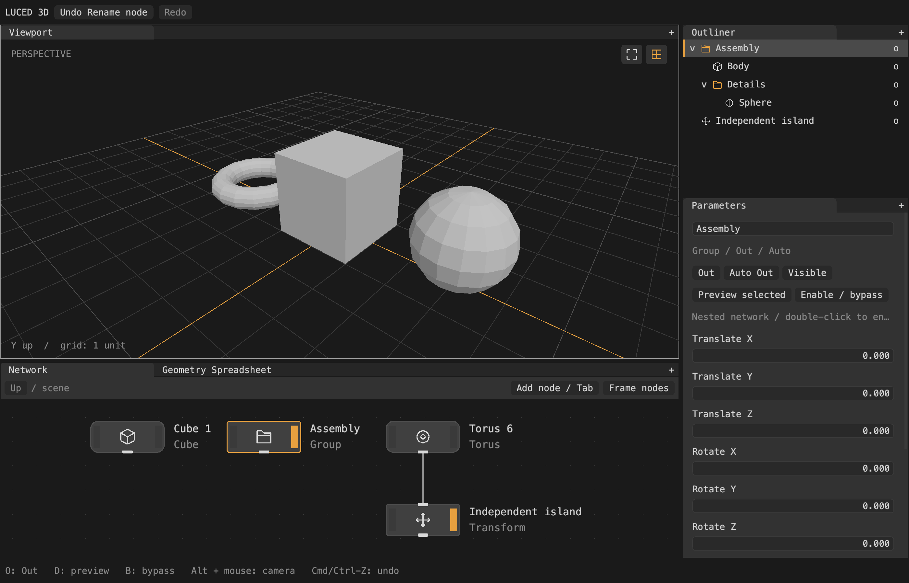

# Outliner and nested scene networks

The Outliner is a projection of exposed graph nodes, not a second editable copy
of scene ownership. Wires express data dependencies; Group containment gives
each node one parent. IDs remain stable through renaming, navigation and undo.

## Output rules

Each node has an Out setting: Auto (default), On or Off. For each connected
island at a network level:

- If any nodes are explicitly On, those nodes are its exposed outputs.
- Otherwise, terminal nodes with Auto are exposed. A terminal has no consumers
  at that level. A branching island can have several terminals.
- Off always excludes that node. An upstream node can be explicitly On while
  also feeding an exposed downstream node; both results are then displayed.

The orange right-hand node strip and `O` toggle exposure. `Auto Out` restores
automatic behavior. Visibility is independent: hidden results stay in the
Outliner and can still feed consumers. Bypass changes evaluation, not exposure.
`D` toggles an isolated preview without changing Out flags or Outliner membership.
There is no dedicated Output operator. The starter network contains only a Cube,
automatically exposed as a terminal. Null remains an optional pass-through.

## Groups and navigation

`Group` owns a nested network and has translation, XYZ rotation in degrees,
scale and visibility. Double-click it in either Network or Outliner to enter;
the Network's Up button returns to its parent. The breadcrumb shows the scope.
The old attribute-mask Group operator is now named `Selection Group`.

Only exposed children appear beneath an exposed Group. Visibility is inherited
for scene display, but does not remove rows. Collapse arrows only affect tree
presentation. Clicking a name reveals its containing graph and selects it;
clicking the right-hand visibility control hides/shows the result.

Inside a Group the viewport edits that level in **local coordinates**, labeled
GROUP / LOCAL. At the parent level, Group transforms compose hierarchically.
This avoids applying world-space modeling deltas to local-space topology.
Entering hidden Groups still allows local editing. Navigation/collapse are not
history commands; graph edits, flags, visibility, transforms and recursive
deletion are undoable. Undo restores the editing scope captured with that edit.

## Evaluation and rendering

Group results retain separate `GeometryInstance` branches in `GeometryData`.
Their child CAD/polygon payloads remain shared. The renderer creates engine
Groups with transforms; moving a Group does not regenerate child meshes.
Invalidation ascends containing Groups and then follows their data consumers.
Framing uses transformed bounding-box corners rather than merged geometry.

Merge, Transform, Tessellate and pass-through nodes preserve instance branches.
Polygon-only operators explicitly realize the branches when requesting a mesh;
they still reject untessellated CAD. Visibility is presentation state and does
not remove geometry from that realization. CAD is never silently tessellated.

## Current boundaries

- 128 total graph nodes; up to 16 containment levels.
- Wires cannot cross Group boundaries. A Group exposes its aggregate result to
  its parent, but configurable Group inputs/outputs are not implemented yet.
- Create new nodes inside a Group; moving existing islands between scopes or
  drag-reparenting in the Outliner is not implemented yet.
- No dedicated Instance/reference authoring node, render visibility flag or
  object-level viewport picking yet. Select exposed objects in the Outliner.
- The spreadsheet reports Group branches; it does not silently flatten them.
- A failed child causes its Group result to fail. Other top-level outputs still
  render. Parent transforms preserve child evaluation caches.

Tests cover island terminal rules, multiple explicit outputs, hidden rows,
nested evaluation, transform cache reuse, cross-scope rejection, deletion/undo,
preview independence, graph/Outliner double-click navigation and collapse.
`tools/preview.py --scene outliner` captures the native multi-output scene:

