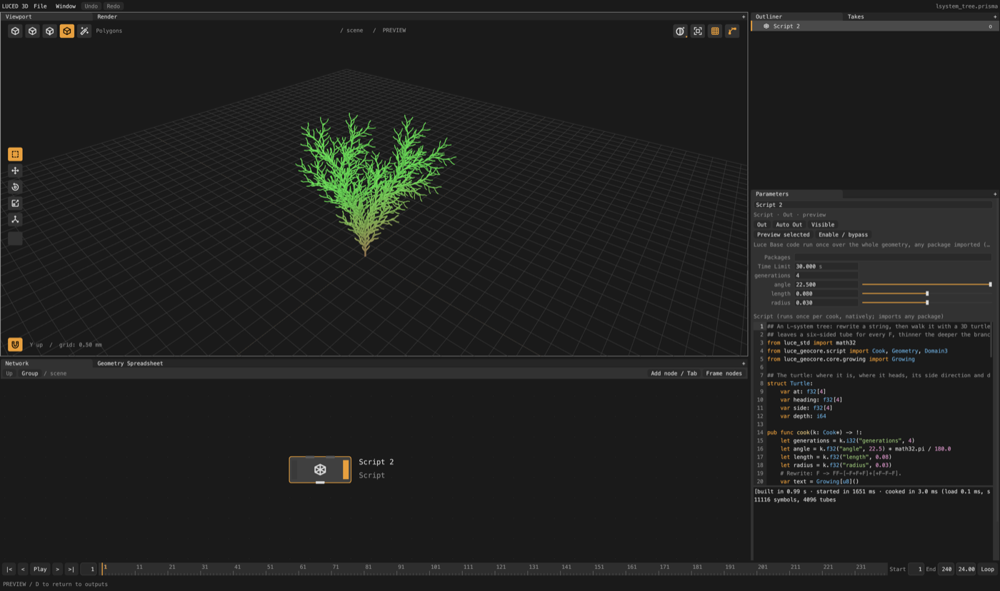

# The Script node

The Script node is luced-3d's Python SOP. You write one function, `cook`,
that runs **once per cook over the whole geometry**: read files, loop over
anything, keep structs and lists, call verbs, and build or edit points,
polygons, curves and attributes. The code is [Luce Base](https://luce-base.luciaos.com),
compiled by the real compiler into a native program, so loops run at the
speed of C, and it may import any Luce package as it is.



```luce
## Lift the input (input 0) by a parameter.
from luce_geocore.script import Cook

pub func cook(k: Cook*) -> !:
    let lift = k.f32("lift", 0.5)
    let positions = try k.geometry().positions()
    for i in 0..<positions.length:
        positions[i].y += lift
```

Add one with Tab (Utility). Example scenes are in `examples/scripts/`
(File > Open).

## Script or Code?

| | Code node (Wrangle) | Script node (Python SOP) |
|---|---|---|
| Runs | once per element, all in parallel | `cook(k)` once, over everything |
| Language | a safe subset of Base | all of Base: structs, pointers, recursion, threads |
| Imports | none | any Luce package |
| After an edit | about a millisecond | a build: about a second the first time, then cached |

Use a Code node for per-point math every frame; use a Script node to read a
file, run an algorithm that needs the whole mesh, or chain verbs. A Script
node that reads a JPEG and a Code node after it that animates the result
work well together.

## How a cook runs

The node's code is the module `script.lucb` of a small tool that luc builds.
The build is kept under a key of the code, the packages and the toolchain, so
an unchanged script never builds twice, and an undo finds its build. While a
build runs the node shows *Building script*; a build error underlines its line
in the editor.

The tool runs in a child process: a script that crashes, traps on an index
out of range or loops forever fails the node, never the editor. Each cook
starts fresh, as Houdini's Python SOP does with Maintain State off: module
`var`s start at their initial values every time. (The editor keeps the next
process started, so a cook does not wait for one.)

The geometry crosses to the child and back as `.prism` files: about 35 ms
for a million quads, under 3 ms for small meshes. The console starts with a
status line, for example `[built in 0.55 s · cooked in 3.5 ms (load 0.1 ms,
save 0.3 ms)]`.

On macOS the first start of a newly built tool can take a second or more
while the system checks it; allowing the editor (or the Terminal you start it
from) under System Settings > Privacy & Security > Developer Tools avoids it.

## The cook: `k`

`k.geometry()` is the output, which starts as a copy of input 0 (empty when
nothing is wired). Replace it whole with `k.set_geometry(g)`.

| Call | Is |
|---|---|
| `k.input(i)`, `k.connected(i)` | input 0 or 1, read-only (`copy()` one to change it) |
| `k.f32("name", 0.5)`, `k.f64`, `k.i32` | a number parameter |
| `k.toggle("name", true)` | an on/off parameter |
| `k.vec3("name", [x, y, z, 0.0])`, `k.color(...)` | a vector or color parameter |
| `k.menu("name", "Low\|High", 1)` | a menu: the chosen index |
| `k.text("name", "hi")`, `k.file("name", "image.jpg")` | text; a file with a picker, relative to the project's folder |
| `k.ramp("name", t)`, `k.ramp_color("name", t)` | a ramp parameter at `t` |
| `k.frame()`, `k.time()`, `k.fps()` | the timeline; reading one makes the node follow it (see Time Dependent below) |
| `k.warning(f"...")` | a warning on the node; the cook goes on |
| `try k.error(f"...")` | fails the node at this line |
| `k.progress(0.4)` | how far the cook is, on the node |
| `print(...)` | the console under the code |

As in the Code node, a literal call such as `k.f32("height", 0.3)` makes a
row on the node, starting at 0.3. A tuned value survives edits to the code.

**Time Dependent** (a row on the node): on *Auto*, the node cooks again when
the frame changes if its code calls `k.frame()`, `k.time()` or `k.fps()`.
*On* and *Off* override that, for code that reads the clock some other way
(through a helper that names `k` differently) or reads it without needing to
follow it.

## Geometry

`Geometry` is a geometry set opened for editing (luce-geocore's `script`
module). Making one: `Geometry.empty()`, `grid(size, divisions)`,
`sphere(radius, segments)`, `cube(size)`, `load("file.prism")`.

| Call | Is |
|---|---|
| `add_point(p)`, `add_points(list)` | new points; their number |
| `add_polygon(points)` | a polygon through point numbers |
| `remove_points(list)`, `remove_prims(list, remove_points)` | removal; numbers after them move down |
| `position(i)`, `set_position(i, p)`, `prim_size(f)`, `prim_point(f, n)` | one element |
| `positions()` | every position as a writable `Float3[]` (`.x`, `.y`, `.z`): the fast path |
| `point_count()`, `prim_count()`, `vertex_count()`, `bounds()` | sizes |
| `set_f32(Domain3.point, i, "mass", v)`, `value_f32(...)` | attributes, one element (also `vec3`, `i32`, `text`); writing makes them |
| `set_point_f32`, `point_vec3`, ... | point shorthands |
| `f32s(domain, name)`, `vec3s(...)`, `i32s(...)`, `point_vec3s("Cd")` | a whole attribute as a writable span |
| `set_detail_f64`, `set_detail_vec3`, `set_detail_text` | detail (global) attributes |
| `add_to_group(Domain3.prim, "top", f)`, `in_group(...)`, `group_flags(...)` | groups, named as group expressions name them |
| `prim_points(f)` | polygon `f`'s point numbers, to read |
| `set_prim_points(f, points)`, `set_prim_point(f, n, point)` | give a polygon new points, or one corner a new point |
| `insert_vertex(f, n, point)`, `remove_vertex(f, n)` | add a corner before corner `n`, or remove one (3 must stay) |
| `set_f32_array(Domain3.point, i, "w", values)`, `f32_array(...)` | array attributes (Houdini's `f[]@`); also `i32` and `vec3`, and `array_length` |
| `add_polyline(points, closed)`, `add_curve(points, degree, closed)` | curves (degree 5 by default) |
| `make_cloud()`, `cloud_count()`, `cloud_position(i)`, `cloud_value(i, name)` | the point cloud |
| `merge(&other)`, `transform(t, r, s)`, `add_instance(&child, t, r, s)` | whole sets; instances are packed copies |
| `copy()`, `save(path)` | a copy; a `.prism` file |

Positions in spans are relative to `origin()`, which is zero unless the
input set one. A span stays valid until points or polygons are added or
removed.

A corner keeps its vertex attributes when it stays in its polygon; a new
corner starts at zero, and a polygon whose points changed is triangulated
again. An array read stays valid until that attribute is written again.

## Volumes

A volume is named grids of voxels, as the Volume node makes them and a Code
node's Voxels mode runs over them: *fog* (densities) or a *level set*
(signed distances, negative inside). Voxels sit in 8×8×8 leaves.

```luce
# The Volume node: a box of voxels 0.05 apart, every one active (dense).
let fog = try g.add_volume("density", VolumeClass.fog, [0.0, 0.0, 0.0, 0.0], [2.0, 2.0, 2.0, 0.0], voxel = 0.05)
let values = try fog.values()          # every voxel, in leaf order: the Voxels mode's lanes
for lane in 0..<fog.count():
    if fog.active(lane):
        let p = fog.position(lane)     # the voxel's center
        values[(usize)lane] = 1.0 - p[1]
```

| Call | Is |
|---|---|
| `add_volume(name, class, center, size, voxel, background, initial, dense)` | a new grid (replacing one of that name); `dense = false` starts with no voxels |
| `voxel_grid(name)` | an existing grid ("" the first, "#2" the third); an input's read only |
| `volume_count()`, `volume_name(i)`, `remove_volume(name)` | the volume's grids |
| `values()`, `values_view()`, `count()` | every voxel's value by lane (writable, or to read) |
| `index(lane)`, `position(lane)`, `active(lane)`, `set_active(lane, on)` | a lane's voxel |
| `get(i, j, k)`, `set(i, j, k, value)`, `active_at(i, j, k)` | by voxel index; `set` makes a leaf where there is none (sparse growth) |
| `sample(p)`, `to_index(p)`, `index_position(i, j, k)` | world space: trilinear samples and conversions |
| `voxel_size()`, `background()`, `is_level_set()`, `active_count()` | what the grid is |

A grid is read where it is until the first write copies it. `values()` stays
valid until `set` adds a leaf or the geometry is replaced (a verb, `merge`,
`transform`, `set_geometry`). A `VoxelGrid` handle lives as long as its
geometry: after a replacement it reads the new geometry's grid of its name,
and when there is none it reads as empty and a write fails, naming the grid.
How the viewport draws a fog grid is its look, which the Volume
Visualization node sets and a script can too: `fog.set_look(density = 8.0,
shadow = 0.4, smoke = tint, emission = 2.0, emission_field = "heat")`, and
`fog.set_emission_ramp(numbers, low, high)` for an emission color ramp
(luce-std ramp numbers). `fog.look()` reads it back.

## Verbs

Every node of the menu that luce-geocore runs is a verb, as in Houdini's
`hou.Geometry.execute`:

```luce
var subdivide = try Verb.named("Subdivide")
try subdivide.parm("Levels", 2.0)
var smooth = try subdivide.run(k.geometry())
try smooth.apply("Subdivide")   # in place, with defaults
```

`parm` takes the label the node's row shows (case, spaces and underscores do
not matter); a wrong label fails with the verb's labels. `group("@P.y>1",
GroupKind.prims)` sets the Group and Group Type rows.

## Packages

The **Packages** row names what the script imports, apart by spaces:
`luce-image`, `owner/name@^1.2`, or a folder (`../my-reader`). luce-geocore
and luce-std are always there. A registry package is locked when it is added,
and the lock is kept in the project, so the script builds the same anywhere;
a build needs the packages downloaded once, then works offline.

A script builds against the packages the editor itself was built with, so
one package never comes in twice. Run from a workspace of checkouts, a
package the editor uses, or one checked out beside luce-geocore, is taken from
that checkout whatever version the entry names; a released editor takes
everything from the registry.

## The build cache

Built tools and the projects they are built in live under
`~/.luce/scripts`. Past `cache_megabytes` in `~/.luce/scripts/settings.prisma`
(2048 by default; the file is written the first time), the least recently
used go first. Each cook's inputs are sent as files; an input that has not
changed since the node's last cook is not written again (the status line says
*input kept*).

## Errors

While you type, a pause runs a check of the code (`luc check`, about 0.1 s)
in the background: an error is underlined at its line and the node does not
build or cook until the code checks clean (Cmd/Ctrl+Enter, or leaving the
editor, sends it anyway).

A build error, a trap (`index out of bounds`), `k.error` and an error the
script raises itself (`error(code, "...")`) name the line and column of the
script, and the editor underlines it. An error a package raised and `try`
passed up underlines the script's line that called into the package
(luce-base's `failure.called_at`) and says where it was raised: *line 4,
column 5: the file could not be opened (raised at luce_geocore/src/...)*.

## Not yet

- Completion and hover: the editor's help reads the Code node's API; it
  cannot see a script's imports until luce-base's `embed.Library` checks
  package modules.
